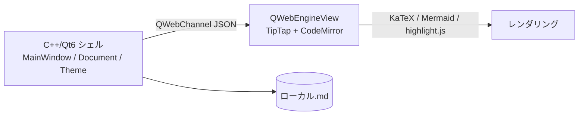

# Colason — Claude Code briefing

Typora 風 WYSIWYG Markdown エディタ。**C++20 + Qt6 + QWebEngine + TipTap (Vite)** ハイブリッド。
DevOps Hub (CreaNest) の監視対象 7 本目 / L3 / ideation。

## リポジトリ構成

```
.
├── CMakeLists.txt           # トップレベル (vcpkg または apt の Qt6 を find_package で検出)
├── CMakePresets.json
├── vcpkg.json               # ローカル Mac/Win 開発用の依存マニフェスト
├── src/                     # C++ ネイティブシェル (MainWindow / Manager 群 / Bridge)
├── editor/                  # Vite + TS WYSIWYG (TipTap / CodeMirror / KaTeX / Mermaid)
│   ├── package.json
│   └── src/
├── resources/               # アイコン・テーマ
├── tests/                   # GoogleTest
├── docs/                    # 設計書
└── .devcontainer/           # GitHub Codespaces 用 Qt6 環境 (apt ベース、~3GB)
```

## 開発の前提

- 言語: C++20 / TypeScript
- コミット/PR メッセージ: 日本語可
- UI 文言: 日本語優先
- ライセンス: 未定

## Codespaces (推奨開発環境)

ローカル Mac に Qt6 + Chromium を入れる必要なし。

1. <https://github.com/SakakitaniJunya/Colason-markdown-editor> → **Code → Codespaces → Create**
2. `.devcontainer/post-create.sh` が自動で:
   - Qt6 base/webengine/svg を apt で導入 (~1.5GB、Chromium ビルド不要)
   - editor/ の npm install
   - CMake configure (Ninja, Debug)
   - Claude Code CLI を導入
3. `claude` でエージェント起動

無料枠: 個人 60h/月 (2-core 4GB)。開発しないときは `gh codespace stop` で時間節約。

## ローカル開発 (Mac/Windows)

vcpkg + Qt6 + QtWebEngine ソースビルド。容量 15-25GB かかるため非推奨。
Codespaces で開発し、リリースビルドは GitHub Actions で 3 OS マトリクス、が現状の正攻法。

## ビルド

```bash
# Codespaces / Linux (apt 版 Qt6)
cmake -S . -B build -G Ninja -DCMAKE_BUILD_TYPE=Debug
cmake --build build
ctest --test-dir build --output-on-failure
```

```bash
# ローカル Mac (vcpkg 版)
export VCPKG_ROOT=$HOME/vcpkg
cmake -S . -B build -G Ninja
cmake --build build
```

## 依存ライブラリ

| ライブラリ | 用途 | 入手方法 |
|---|---|---|
| Qt6 Base/Widgets/Gui | ネイティブシェル UI | apt: `qt6-base-dev` / vcpkg: `qtbase` |
| Qt6 WebEngine + WebChannel | エディタ WebView + ブリッジ | apt: `qt6-webengine-dev` / vcpkg: `qtwebengine` |
| nlohmann_json | 設定/状態シリアライズ | apt: `nlohmann-json3-dev` |
| spdlog | ログ | apt: `libspdlog-dev` |
| GoogleTest | 単体テスト | apt: `libgtest-dev` |

## アーキテクチャ概要



- C++ 側はファイル I/O・テーマ・自動保存・エクスポートを担当
- Web 側は WYSIWYG 編集体験のみに集中
- ブリッジは双方向の JSON メッセージ (EditorBridge / OutlineBridge / SearchBridge / ThemeBridge)

## Claude Code 運用ガイド

- 大きな C++ 変更は **`src/` 単位でコミット** (Document / Theme / Bridge 等の境界を尊重)
- editor/ 側の TS 変更は **components 単位でコミット**
- C++ と TS にまたがる変更は **「Bridge メッセージの形」を最初に確定** してから両端を順番に編集
- テストは GoogleTest で `tests/` に追加

## DevOps Hub との連携

- 親パイプライン: <https://github.com/SakakitaniJunya/devops-hub>
- 監視対象として登録 (mock-data の `colason-markdown-editor`)
- 事業性は未検証 (L3 ideation)。実装が進んだら DevOps Hub の Pipeline Hub UI に表示される
