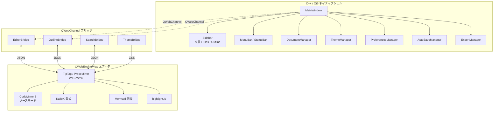

# Colason

Typora風 WYSIWYG Markdownエディタ。C++20 / Qt6 + QWebEngine ハイブリッドアーキテクチャ。

## アーキテクチャ



## 前提条件

- CMake 3.25+
- Qt 6.8+ (Core / Gui / Widgets / WebEngine / WebChannel)
- Node.js (エディタビルド用)
- 任意: vcpkg (依存解決に使用)

### Windows (MSVC)

- Visual Studio 2026 (MSVC)
- Qt 6.8.3 (`c:/Qt/6.8.3/msvc2022_64`)
- vcpkg (`c:/Users/junya.sakakitani/source/vcpkg`)

### macOS / Linux

- Ninja
- Qt6 開発パッケージ
- `cmake --preset macos-debug` または `cmake --preset linux-debug` を使用

## ビルド & 起動

```bash
# エディタ (TypeScript) ビルド
cd editor && npm install && npm run build && cd ..

# CMake configure
"c:/Program Files/Microsoft Visual Studio/18/Community/Common7/IDE/CommonExtensions/Microsoft/CMake/CMake/bin/cmake.exe" \
  -S . -B build \
  -G "Visual Studio 18 2026" -A x64 \
  -DCMAKE_TOOLCHAIN_FILE="c:/Users/junya.sakakitani/source/vcpkg/scripts/buildsystems/vcpkg.cmake" \
  -DVCPKG_TARGET_TRIPLET=x64-windows \
  -DVCPKG_MANIFEST_MODE=OFF \
  -DCMAKE_PREFIX_PATH="c:/Qt/6.8.3/msvc2022_64;c:/Users/junya.sakakitani/source/vcpkg/installed/x64-windows"

# ビルド
"c:/Program Files/Microsoft Visual Studio/18/Community/Common7/IDE/CommonExtensions/Microsoft/CMake/CMake/bin/cmake.exe" \
  --build build --config Release

# 起動
./build/src/Release/colason.exe
```

## ビルド & 起動 (ワンライナー)

```bash
"c:/Program Files/Microsoft Visual Studio/18/Community/Common7/IDE/CommonExtensions/Microsoft/CMake/CMake/bin/cmake.exe" --build build --config Release && ./build/src/Release/colason.exe
```

## ビルド & 起動 (macOS ローカル)

**前提: Homebrew がインストール済み**

```bash
# 1. 依存をインストール（初回のみ）
brew install qt ninja node

# 2. エディタ (TypeScript) をビルド
cd editor
npm install
npm run build
cd ..

# 3. CMake configure
cmake -S . -B build-macos \
  -G Ninja \
  -DCMAKE_BUILD_TYPE=Release \
  -DCMAKE_PREFIX_PATH="$(brew --prefix qt)"

# 4. ビルド
cmake --build build-macos -j4

# 5. 起動（デバッグ用、ローカルテスト）
./build-macos/src/colason

# または、.app/.dmg を生成（配布用）
APP_PATH="./build-macos/src/colason.app"
"$(brew --prefix qt)/bin/macdeployqt" "$APP_PATH" -always-overwrite

# シンボル削除（軽量化）
find "$APP_PATH" -name "*.dSYM" -exec rm -rf {} + 2>/dev/null || true

# DMG 作成（アップロード用）
hdiutil create \
  -volname "Colason" \
  -srcfolder "$(dirname $APP_PATH)" \
  -ov -format UDZIPPIG \
  "Colason-macOS.dmg"
```

### サイズ最適化のコツ

- `macdeployqt` の `-always-overwrite` で不完全なリンク警告を無視
- `find ... -name "*.dSYM" -delete` でデバッグシンボルを削除
- `strip` で更にバイナリを最適化: `strip -r "$APP_PATH/Contents/MacOS/colason"`
- DMG は `UDZIPPIG` 形式で自動圧縮

## ビルド & 起動 (Linux)

```bash
# Configure
cmake --preset linux-debug

# Build
cmake --build --preset linux-debug

# Run
./build/linux-debug/src/colason
```

## ライセンス / License

Colason は **GNU General Public License v3.0 (GPLv3)** で公開されています。
全文は [`LICENSE`](./LICENSE) を参照してください。

### Qt について (LGPLv3)

Colason は [Qt 6](https://www.qt.io/) framework を **動的リンク**して利用しています
（Qt は別個の共有ライブラリ / framework として同梱され、実行ファイルに静的結合されません）。
利用している Qt モジュールはすべて **LGPL-3.0** で提供されるものに限られ、GPL-only /
商用専用モジュールは使用していません。

LGPLv3 の義務に従い、配布物には以下が同梱されます（詳細は
[`THIRD_PARTY_NOTICES.md`](./THIRD_PARTY_NOTICES.md)）:

- **再リンクの権利**: 同梱の Qt ライブラリを互換・改変版 Qt に差し替えて Colason を
  利用できます（macOS: `Colason.app/Contents/Frameworks` / Windows: `colason.exe` と同階層の DLL）。
- **Qt ソースの入手先**: 同梱 Qt バージョンの完全な対応ソースは
  https://download.qt.io/archive/qt/ から入手できます。入手できない場合は
  legal@creanest.co への書面請求で提供します。
- **Chromium**: Qt WebEngine は Chromium (BSD-3-Clause ほか) を内包し、その第三者
  ライセンス一覧は Qt WebEngine リソースおよび上記 Qt ソースに含まれます。

### Web エディタ部 (npm)

アプリ内エディタは Qt WebEngine 上で動作する web bundle で、TipTap / CodeMirror /
KaTeX / mermaid / marked / highlight.js (BSD-3-Clause) ほか、いずれも MIT / BSD 系の
OSS から構成されています。各ライセンスは [`THIRD_PARTY_NOTICES.md`](./THIRD_PARTY_NOTICES.md) を参照。

### 商用利用について

著作権者 (CreaNest) は本ソフトウェアの 100% の著作権を保有しており、GPLv3 の義務を
負わない形での利用を希望する場合の**商用ライセンス**を別途提供可能です
（お問い合わせ: legal@creanest.co）。なお GPLv3 で配布されたバイナリ／ソースは
GPLv3 の条件下で自由に再配布できます。

