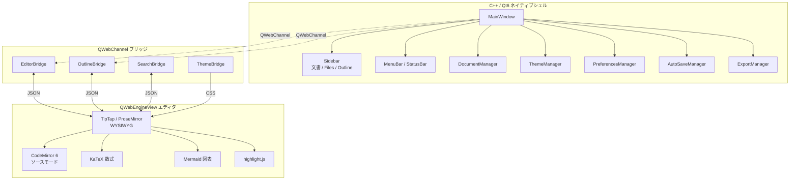

# Colason

> **SPEC 駆動開発時代の、Markdown 専用 WYSIWYG エディタ / リーダー。**
> A Markdown-only WYSIWYG editor for the spec-driven dev era — Typora-style, native C++20 / Qt6.


AI が生成する設計書・SPEC・ADR を **「読む / 直す」** ことに最適化した、Typora 風の
WYSIWYG Markdown エディタです。Mermaid 図・KaTeX 数式・コードブロックをソースと同じ
見た目で編集でき、執筆中も文書構造 (Outline) が常に見えます。Electron 不使用、
C++20 / Qt6 ネイティブシェルで、仕様書を一日中開いておくための軽量・高速な作業環境。

クラウド不要・ローカルファイル完結・データはすべて手元に。

> **ステータス**: `v0.1.0` 早期公開版。コア編集体験は実用段階ですが、コード署名・
> 自動更新・プラグインは今後対応します。フィードバック歓迎 →
> [Issues](https://github.com/SakakitaniJunya/Colason-markdown-editor/issues)。

---

## ダウンロード

最新のビルド済みアプリは [Releases](https://github.com/SakakitaniJunya/Colason-markdown-editor/releases) から:

| OS | ファイル |
|----|---------|
| macOS (Apple Silicon) | `Colason-macOS.dmg` |
| Windows (x64) | `Colason-Windows-x64.zip` |

ソースからビルドしたい場合は [ビルド手順](#ビルド手順-開発者向け) を参照してください。

### macOS で「開けません」と表示される場合

Colason はまだ Apple のコード署名を取得していないため、初回起動時に Gatekeeper の
警告が出ます。以下のいずれかで起動できます（初回のみ）:

1. **Finder で `Colason.app` を右クリック → 「開く」→ ダイアログで「開く」**
2. もしくはターミナルで隔離属性を解除:
   ```bash
   xattr -dr com.apple.quarantine /Applications/Colason.app
   ```

将来のリリースで署名・notarization 対応を予定しています。

---

## できること

- 📝 **WYSIWYG 編集** (TipTap / ProseMirror) ↔ **ソースモード** (CodeMirror 6) 切替
- 🧮 **KaTeX 数式** ・ **Mermaid 図** ・ コードハイライト (highlight.js) をネイティブ描画
- 🗂 **アウトライン** / ファイルツリー / **分割ペイン** (Split Right / Down) / ワイドモード
- 🎨 **テーマ切替** (Light / Dark / Sepia / System 追従)
- 📤 PDF / HTML エクスポート、オートセーブ
- ⚡ C++20 / Qt6 ネイティブシェルによる軽快な動作 (ブラウザタブではなく独立アプリ)

---

## スクリーンショット

| Light | Dark | Sepia |
|:---:|:---:|:---:|
|  |  |  |

---

## アーキテクチャ

C++ / Qt6 ネイティブシェルが、QWebEngine 上で動く Web エディタ (TipTap) を
QWebChannel ブリッジ経由で制御するハイブリッド構成です。



---

## ビルド手順 (開発者向け)

### 前提条件

- CMake 3.25+
- Qt 6.8+ (Core / Gui / Widgets / WebEngine / WebChannel)
- Node.js 20+ (エディタアセットのビルド用)
- 任意: vcpkg (依存解決に使用)

> 以下のコマンド例の `<vcpkg-root>` は各自の vcpkg のパスに読み替えてください。

### macOS (Homebrew)

```bash
# 1. 依存をインストール（初回のみ）
brew install qt ninja node

# 2. エディタ (TypeScript) をビルド
cd editor && npm install && npm run build && cd ..

# 3. CMake configure & build
cmake -S . -B build-macos -G Ninja \
  -DCMAKE_BUILD_TYPE=Release \
  -DCMAKE_PREFIX_PATH="$(brew --prefix qt)"
cmake --build build-macos -j4

# 4. 起動（ローカルテスト）
./build-macos/src/colason

# 5. 配布用 .app / .dmg を生成
APP_PATH="./build-macos/src/colason.app"
"$(brew --prefix qt)/bin/macdeployqt" "$APP_PATH" -always-overwrite
hdiutil create -volname "Colason" -srcfolder "$(dirname $APP_PATH)" \
  -ov -format UDZO "Colason-macOS.dmg"
```

### Windows (MSVC)

- Visual Studio 2022+ (MSVC) / Qt 6.8+ (`msvc2022_64`) / vcpkg

```bash
cd editor && npm install && npm run build && cd ..

cmake -S . -B build -G "Ninja" -DCMAKE_BUILD_TYPE=Release \
  -DCMAKE_PREFIX_PATH="<your-qt-path>/msvc2022_64;<vcpkg-root>/installed/x64-windows"
cmake --build build --config Release
./build/src/colason.exe
```

### Linux

```bash
cmake --preset linux-debug
cmake --build --preset linux-debug
./build/linux-debug/src/colason
```

> CI による自動ビルド・配布は [`.github/workflows/release.yml`](.github/workflows/release.yml)
> を参照（tag `vX.Y.Z` を push すると macOS / Windows バイナリを生成）。

---

## ライセンス / License

Colason は **GNU General Public License v3.0 (GPLv3)** で公開されています。
全文は [`LICENSE`](./LICENSE) を、第三者コンポーネントは
[`THIRD_PARTY_NOTICES.md`](./THIRD_PARTY_NOTICES.md) を参照してください。

### Qt について (LGPLv3)

Colason は [Qt 6](https://www.qt.io/) framework を **動的リンク**して利用しています
（Qt は別個の共有ライブラリ / framework として同梱され、実行ファイルに静的結合されません）。
利用している Qt モジュールはすべて **LGPL-3.0** で提供されるものに限られ、GPL-only /
商用専用モジュールは使用していません。LGPLv3 の義務に従い、配布物には LICENSE +
THIRD_PARTY_NOTICES + LGPL/GPL 全文 (`licenses/`) を同梱し、Qt ライブラリの差し替え
（再リンク）を許容しています。同梱 Qt の対応ソースは
https://download.qt.io/archive/qt/ から入手できます。

### 商用利用について

著作権者 (CreaNest) は Colason **本体コード**の 100% の著作権を保有しており、GPLv3 の
義務を負わない形での利用を希望する場合の**商用ライセンス**を別途提供可能です
（お問い合わせ: legal@creanest.co）。

> ⚠️ 商用ライセンスは Colason 本体コードに対してのみ適用されます。Qt6 (LGPLv3) および
> Qt WebEngine が内包する Chromium 等、第三者 OSS の義務は引き続き各ライセンスに従います
> （CreaNest が解除できるものではありません）。GPLv3 で配布されたバイナリ／ソースは
> GPLv3 の条件下で自由に再配布できます。

---

Built by [CreaNest](https://creanest.co).
