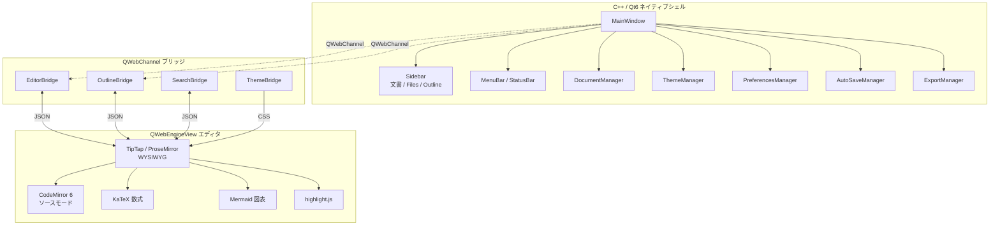

# Colason

Typora風 WYSIWYG Markdownエディタ。C++20 / Qt6 + QWebEngine ハイブリッドアーキテクチャ。

## アーキテクチャ



## 前提条件

- CMake 3.25+
- Qt 6.8+ (Core / Gui / Widgets / WebEngine / WebChannel)
- Node.js (エディタビルド用)
- 任意: vcpkg (依存解決に使用)

### Windows (MSVC)

- Visual Studio 2026 (MSVC)
- Qt 6.8.3 (`c:/Qt/6.8.3/msvc2022_64`)
- vcpkg (`c:/Users/junya.sakakitani/source/vcpkg`)

### macOS / Linux

- Ninja
- Qt6 開発パッケージ
- `cmake --preset macos-debug` または `cmake --preset linux-debug` を使用

## ビルド & 起動

```bash
# エディタ (TypeScript) ビルド
cd editor && npm install && npm run build && cd ..

# CMake configure
"c:/Program Files/Microsoft Visual Studio/18/Community/Common7/IDE/CommonExtensions/Microsoft/CMake/CMake/bin/cmake.exe" \
  -S . -B build \
  -G "Visual Studio 18 2026" -A x64 \
  -DCMAKE_TOOLCHAIN_FILE="c:/Users/junya.sakakitani/source/vcpkg/scripts/buildsystems/vcpkg.cmake" \
  -DVCPKG_TARGET_TRIPLET=x64-windows \
  -DVCPKG_MANIFEST_MODE=OFF \
  -DCMAKE_PREFIX_PATH="c:/Qt/6.8.3/msvc2022_64;c:/Users/junya.sakakitani/source/vcpkg/installed/x64-windows"

# ビルド
"c:/Program Files/Microsoft Visual Studio/18/Community/Common7/IDE/CommonExtensions/Microsoft/CMake/CMake/bin/cmake.exe" \
  --build build --config Release

# 起動
./build/src/Release/colason.exe
```

## ビルド & 起動 (ワンライナー)

```bash
"c:/Program Files/Microsoft Visual Studio/18/Community/Common7/IDE/CommonExtensions/Microsoft/CMake/CMake/bin/cmake.exe" --build build --config Release && ./build/src/Release/colason.exe
```

## ビルド & 起動 (macOS / Linux)

```bash
# エディタ (TypeScript) ビルド
cd editor && npm install && npm run build && cd ..

# Configure
cmake --preset macos-debug   # Linux は linux-debug

# Build
cmake --build --preset macos-debug

# Run
./build/macos-debug/src/colason
```
