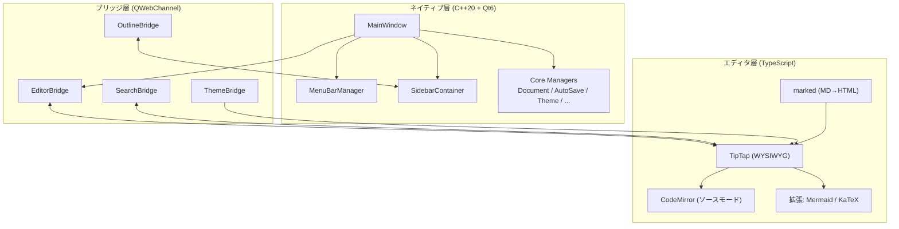

# 1. プロジェクト概要

**Colason** は Typora クローンの WYSIWYG Markdown エディタ。

- **ネイティブ部分**: C++20 + Qt6 (ウィンドウ、メニュー、サイドバー、ファイル I/O)
- **エディタ部分**: TypeScript + TipTap (WYSIWYG) + CodeMirror (ソースモード)
- **接続**: Qt の QWebEngine でブラウザエンジンを埋め込み、QWebChannel で通信
- **ターゲット**: Windows 11 (将来的に macOS/Linux 対応可)

Typora のように「見たまま編集」できるMarkdownエディタを目指している。

## なぜハイブリッド構成なのか?

- **WYSIWYG Markdown エディタ**を C++ だけで作るのは極めて困難
- TipTap/ProseMirror は Web 技術のリッチテキストエディタで、Typora のような体験を実現できる
- Qt の QWebEngine で Chromium エンジンを埋め込み、C++ ↔ JS の通信は QWebChannel で行う
- ファイル I/O やOS統合はネイティブ C++ が適している

## 技術スタック

| レイヤー | 技術 | 役割 |
|---------|------|------|
| ネイティブ UI | C++20 + Qt 6.8.3 | ウィンドウ、メニュー、サイドバー |
| エディタ UI | TypeScript + TipTap | WYSIWYG Markdown 編集 |
| ソースモード | CodeMirror 6 | Markdown テキスト直接編集 |
| ブラウザエンジン | QWebEngine (Chromium) | Web エディタの表示 |
| 通信 | QWebChannel | C++ ↔ TypeScript 双方向通信 |
| MD → HTML | marked | Markdown パーサー |
| 構文ハイライト | highlight.js (lowlight) | コードブロック |
| 図 | Mermaid | フローチャート等 |
| 数式 | KaTeX | LaTeX 数式レンダリング |
| ビルド | CMake + Vite | C++ / TypeScript それぞれ |

---

[次へ: 環境構築とビルド手順 →](02-setup.md)