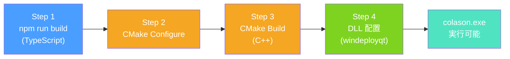

# 2. 環境構築とビルド手順

## 必要ツール

| ツール | バージョン | 用途 |
|--------|-----------|------|
| Visual Studio 2026 | Community or Professional | C++ コンパイラ (MSVC) |
| CMake | VS同梱のもの | ビルドシステム |
| Qt 6.8.3 | aqtinstall で導入 | GUI フレームワーク |
| vcpkg | 最新 | C++ パッケージマネージャ (spdlog, nlohmann_json 用) |
| Node.js | 18+ | TypeScript エディタのビルド |
| npm | Node.js 同梱 | パッケージ管理 |
| Git | 最新 | バージョン管理 |

## Qt のインストール

```bash
# Python の pip で aqtinstall をインストール
pip install aqtinstall

# Qt 6.8.3 をインストール (WebEngine モジュール含む)
python -m aqt install-qt windows desktop 6.8.3 win64_msvc2022_64 \
  --outputdir c:/Qt \
  --modules qtwebengine qtwebchannel
```

インストール先: `c:/Qt/6.8.3/msvc2022_64`

含まれるモジュール:
- Core, Gui, Widgets (基本UI)
- WebEngineWidgets, WebChannel (ブラウザエンジン + JS通信)
- Svg, PrintSupport, Concurrent (エクスポート、並行処理)
- Qml, Quick, Network, OpenGL (WebEngine の依存)

## vcpkg のセットアップ

```bash
git clone https://github.com/microsoft/vcpkg.git c:/Users/<user>/source/vcpkg
cd c:/Users/<user>/source/vcpkg
.\bootstrap-vcpkg.bat

# 環境変数の設定
set VCPKG_ROOT=c:/Users/<user>/source/vcpkg
```

## Node.js 依存のインストール

```bash
cd editor
npm install
```

---

## ビルド手順



### 変数の準備

```bash
CMAKE="c:/Program Files/Microsoft Visual Studio/18/Community/Common7/IDE/CommonExtensions/Microsoft/CMake/CMake/bin/cmake.exe"
VCPKG_ROOT="c:/Users/<user>/source/vcpkg"
QT_DIR="c:/Qt/6.8.3/msvc2022_64"
```

### Step 1: TypeScript エディタのビルド

```bash
cd editor
npm run build    # tsc && vite build → editor/dist/ に出力
```

出力される `editor/dist/` には `index.html` と JS/CSS バンドルが入る。
C++ 側はこの `dist/index.html` を QWebEngine で読み込む。

### Step 2: CMake Configure

```bash
"$CMAKE" -S . -B build \
  -G "Visual Studio 18 2026" -A x64 \
  -DCMAKE_TOOLCHAIN_FILE="$VCPKG_ROOT/scripts/buildsystems/vcpkg.cmake" \
  -DVCPKG_TARGET_TRIPLET=x64-windows \
  -DVCPKG_MANIFEST_MODE=OFF \
  -DCMAKE_PREFIX_PATH="$QT_DIR;$VCPKG_ROOT/installed/x64-windows"
```

### Step 3: CMake Build

```bash
"$CMAKE" --build build --config Release
```

### Step 4: 実行時 DLL の配置

ビルド後、`build/src/Release/colason.exe` の隣に以下を配置:

```
colason.exe の隣に必要なもの:
├── Qt6Core.dll, Qt6Gui.dll, Qt6Widgets.dll ...
├── Qt6WebEngineCore.dll, Qt6WebChannel.dll ...
├── QtWebEngineProcess.exe              ← WebEngine の子プロセス
├── platforms/qwindows.dll              ← Qt プラットフォームプラグイン
├── resources/                          ← WebEngine リソース (icudtl.dat 等)
├── translations/                       ← WebEngine 翻訳ファイル
└── qt.conf                             ← 内容: [Paths]\nPlugins = .
```

> **ヒント**: Qt の `windeployqt` ツールを使うと自動配置できる:
> ```bash
> c:/Qt/6.8.3/msvc2022_64/bin/windeployqt.exe build/src/Release/colason.exe
> ```

## CMake の構成

### ルート CMakeLists.txt

- C++20 標準、AUTOMOC / AUTORCC 有効
- `find_package` で Qt6 モジュールを検出
- WebEngine が見つからなくてもビルドは通る (フォールバック UI)

### src/CMakeLists.txt

- `GLOB_RECURSE` で .cpp / .h を自動収集 → 新ファイル追加時に CMake 変更不要
- `HAS_WEBENGINE` コンパイル定義で条件付きコンパイル
- オプショナル依存: spdlog (`HAS_SPDLOG`), nlohmann_json
- Windows 固有: ole32, oleaut32, shell32, dwmapi リンク

---

[← 前へ: プロジェクト概要](01-overview.md) | [次へ: C# 経験者向け C++/Qt 入門 →](03-cpp-for-csharp-devs.md)