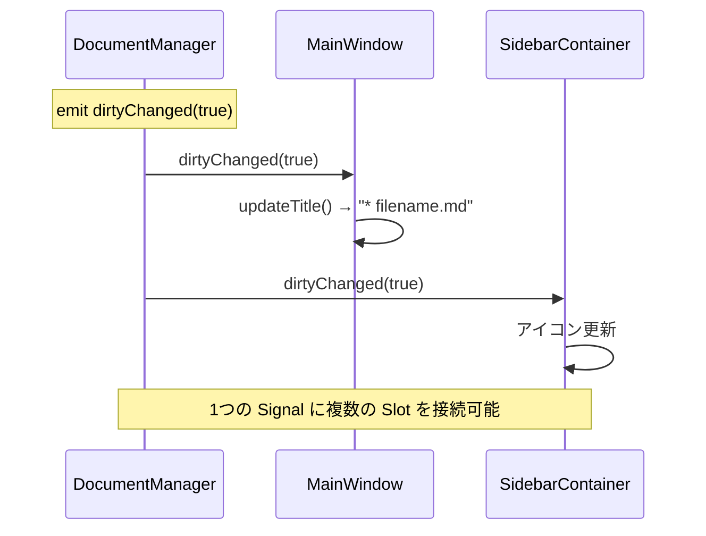
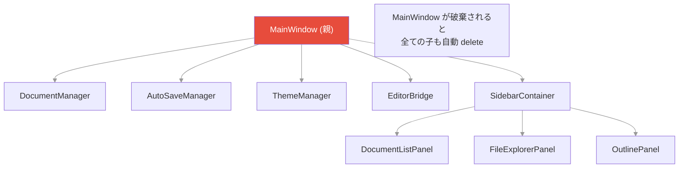

# 3. C# 経験者向け C++/Qt 入門

## C# → C++ 対応表

| 概念 | C# | C++ (Qt) |
|------|-----|----------|
| 文字列 | `string` | `QString` |
| リスト | `List<T>` | `QList<T>` / `QStringList` |
| 辞書 | `Dictionary<K,V>` | `QMap<K,V>` |
| null | `null` | `nullptr` |
| プロパティ | `get; set;` | `Q_PROPERTY` マクロ |
| イベント | `event Action<T>` | `signals:` + `emit` |
| イベント購読 | `obj.Event += handler` | `connect(obj, &Class::signal, ...)` |
| using/dispose | `using`, `IDisposable` | Qt の親子関係で自動解放 |
| クラス宣言 | 1ファイル | `.h` (宣言) + `.cpp` (実装) に分割 |
| インターフェース | `interface` | 純粋仮想クラス (`= 0`) |
| 継承 | `:` | `: public BaseClass` |
| override | `override` | `override` (同じ) |
| async/await | `async Task` | Qt では Signal/Slot やコールバック |
| NuGet | パッケージマネージャ | vcpkg / CMake `find_package` |

---

## ヘッダファイル (.h) と実装ファイル (.cpp)

C# では1ファイルにクラス全体を書くが、C++ では **宣言と実装を分離する**。

```cpp
// DocumentManager.h ── 宣言 (C# でいう interface + フィールド定義)
#pragma once          // ← C# の暗黙のインクルードガードに相当

#include <QObject>    // ← C# の using に相当

class DocumentManager : public QObject   // ← C# の class : BaseClass
{
    Q_OBJECT          // ← Qt のマクロ。signals/slots を使うクラスに必須

public:
    explicit DocumentManager(QObject* parent = nullptr);
    bool openDocument(const QString& filePath);  // 宣言だけ

signals:              // ← C# の event に相当
    void documentChanged();

private:
    QString m_filePath;   // ← m_ プレフィックスはメンバ変数の慣習
    bool m_dirty = false;
};
```

```cpp
// DocumentManager.cpp ── 実装
#include "DocumentManager.h"
#include <QFile>

DocumentManager::DocumentManager(QObject* parent)
    : QObject(parent)    // ← 基底クラスのコンストラクタ呼び出し
{
}

bool DocumentManager::openDocument(const QString& filePath)
{
    // 実装...
    emit documentChanged();  // ← C# の Event?.Invoke() に相当
    return true;
}
```

---

## Qt の Signal/Slot システム (最重要)

**C# のイベントに相当するが、より強力。** このプロジェクトの通信は全て Signal/Slot。



```cpp
// C# 的に書くと:
// public event Action<bool> DirtyChanged;
// ↓ C++/Qt だとこう:

// 宣言 (.h)
signals:
    void dirtyChanged(bool dirty);

// 発火 (.cpp)
emit dirtyChanged(true);   // ← C# の DirtyChanged?.Invoke(true)

// 接続 (C# の obj.DirtyChanged += handler に相当)
connect(docManager, &DocumentManager::dirtyChanged,
        this, [this](bool dirty) {
            updateTitle();   // ← ラムダで受信
        });
```

**connect の書き方:**

```cpp
// 1. ラムダ (最もよく使う)
connect(sender, &Sender::signal, this, [this](int value) {
    // 処理
});

// 2. メンバ関数
connect(sender, &Sender::signal, receiver, &Receiver::slot);

// 3. 1回だけ接続 (connectして1回呼ばれたら自動切断)
connect(sender, &Sender::signal, receiver, &Receiver::slot,
        Qt::SingleShotConnection);
```

---

## メモリ管理 ─ GC はないが Qt の親子関係がある

C# には GC があるが、C++ にはない。ただし **Qt の親子関係** が自動解放を提供する。



```cpp
// parent を指定すると、parent が破棄されるとき子も自動 delete される
auto* manager = new DocumentManager(this);  // this が親
// → this (MainWindow) が閉じられるとき manager も自動解放

// C# でいう using (...) に近い概念
// ただし、親がないオブジェクトは手動で delete するか
// スマートポインタ (std::unique_ptr) を使う
```

**ルール**: Qt オブジェクトを `new` するときは必ず親を渡す。
本プロジェクトでは全て `this` を親にしているので、メモリリークの心配はない。

---

## QString の操作

```cpp
// C# の string とほぼ同じ
QString path = "hello";
path.isEmpty();          // == string.IsNullOrEmpty
path.contains("ell");    // == string.Contains
path.replace("h", "H");  // == string.Replace
path.split("/");          // == string.Split
path.toStdString();       // → std::string への変換

// フォーマット (C# の $"..." に相当)
QString title = QString("File: %1 (line %2)").arg(fileName).arg(lineNum);
// C# だと: $"File: {fileName} (line {lineNum})"
```

---

## 条件付きコンパイル

C# の `#if` と同じだが、CMake で定義する。

```cpp
#ifdef HAS_WEBENGINE        // CMake で -DHAS_WEBENGINE=1 されたとき
    m_editorView = new QWebEngineView(this);
#else
    // WebEngine なしのフォールバック
    m_editorPlaceholder = new QWidget(this);
#endif
```

本プロジェクトでは `HAS_WEBENGINE` が最重要の条件分岐。
WebEngine が見つからない環境ではプレースホルダーが表示される。

---

## Q_OBJECT と MOC

Qt の `signals:` / `slots:` / `Q_PROPERTY` を使うクラスには `Q_OBJECT` マクロが必要。
CMake の `CMAKE_AUTOMOC ON` 設定で、Qt の **MOC (Meta-Object Compiler)** が自動的にメタ情報コードを生成する。

**覚えるべきこと**: `QObject` を継承して signals/slots を使うクラスには必ず `Q_OBJECT` を書く。
書き忘れると「undefined reference to vtable」エラーになる。

---

[← 前へ: 環境構築](02-setup.md) | [次へ: アーキテクチャ全体像 →](04-architecture.md)