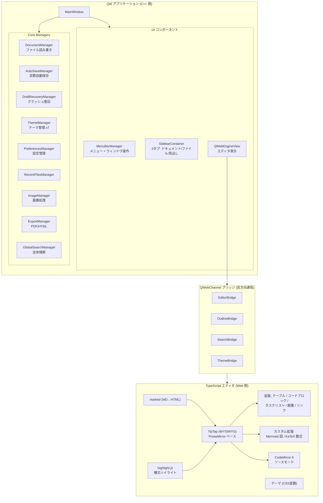
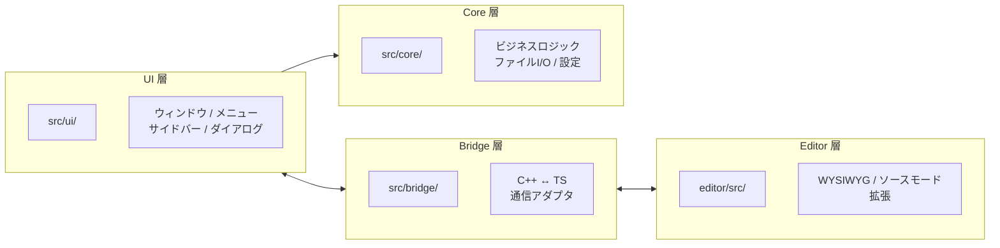

# 4. アーキテクチャ全体像とディレクトリ構成

## アーキテクチャ図



---

## ディレクトリ構成

```
colason/
├── CMakeLists.txt                   ← ルート CMake (プロジェクト設定, Qt発見)
├── docs/
│   └── catchup/                     ← このドキュメント群
├── src/                             ← C++ ソースコード
│   ├── CMakeLists.txt               ← ソース/ライブラリ定義
│   ├── main.cpp                     ← エントリポイント (20行)
│   ├── ui/                          ← UI コンポーネント
│   │   ├── MainWindow.h / .cpp      ← メインウィンドウ (最も重要)
│   │   ├── MenuBarManager.h / .cpp  ← メニューバー
│   │   ├── StatusBarManager.h / .cpp
│   │   ├── QuickOpenDialog.h / .cpp ← Ctrl+P クイックオープン
│   │   └── sidebar/
│   │       ├── SidebarContainer.h / .cpp   ← タブ付きサイドバー
│   │       ├── OutlinePanel.h / .cpp       ← 見出し一覧パネル
│   │       ├── FileExplorerPanel.h / .cpp  ← ファイルツリー
│   │       ├── DocumentListPanel.h / .cpp  ← 開いたドキュメント一覧
│   │       └── FileIconProvider.h / .cpp   ← ファイルアイコン
│   ├── bridge/                      ← QWebChannel ブリッジ
│   │   ├── EditorBridge.h / .cpp    ← エディタ操作ブリッジ
│   │   ├── OutlineBridge.h / .cpp   ← 見出しナビゲーション
│   │   ├── SearchBridge.h / .cpp    ← 検索/置換
│   │   └── ThemeBridge.h / .cpp     ← テーマ適用
│   └── core/                        ← ビジネスロジック
│       ├── DocumentManager.h / .cpp
│       ├── AutoSaveManager.h / .cpp
│       ├── DraftRecoveryManager.h / .cpp
│       ├── ThemeManager.h / .cpp
│       ├── PreferencesManager.h / .cpp
│       ├── RecentFilesManager.h / .cpp
│       ├── ImageManager.h / .cpp
│       ├── ExportManager.h / .cpp
│       └── GlobalSearchManager.h / .cpp
├── editor/                          ← TypeScript / Web エディタ
│   ├── package.json                 ← npm 依存定義
│   ├── tsconfig.json                ← TypeScript 設定
│   ├── vite.config.ts               ← Vite バンドラー設定
│   ├── index.html                   ← エディタ HTML エントリ
│   ├── src/
│   │   ├── index.ts                 ← JS エントリポイント
│   │   ├── editor.ts                ← TipTap エディタ生成
│   │   ├── bridge.ts                ← QWebChannel + グローバル API
│   │   ├── source-mode.ts           ← CodeMirror + MD変換
│   │   ├── keybindings.ts           ← キーバインド (default/vim)
│   │   ├── table-context-menu.ts    ← テーブル右クリックメニュー
│   │   ├── qwebchannel.ts           ← Qt QWebChannel プロトコル実装
│   │   ├── themes/
│   │   │   └── base.css             ← エディタ基本スタイル
│   │   └── extensions/
│   │       ├── mermaid-block.ts     ← Mermaid 図拡張
│   │       ├── katex-block.ts       ← KaTeX 数式ブロック
│   │       └── katex-inline.ts      ← KaTeX インライン数式
│   └── dist/                        ← ビルド出力 (git 管理外)
└── resources/
    └── colason.qrc                  ← Qt リソースファイル (アイコン等)
```

### レイヤー別の責務



| レイヤー | ディレクトリ | 責務 |
|---------|-------------|------|
| **UI** | `src/ui/` | ウィンドウ、メニュー、サイドバー、ダイアログ |
| **Bridge** | `src/bridge/` | C++ ↔ TypeScript の通信アダプタ |
| **Core** | `src/core/` | ビジネスロジック (ファイルI/O、設定、テーマ等) |
| **Editor** | `editor/src/` | WYSIWYG エディタ、ソースモード、拡張 |
| **Resources** | `resources/` | アイコン等の静的リソース |

---

[← 前へ: C++/Qt 入門](03-cpp-for-csharp-devs.md) | [次へ: C++ 側の詳細 →](05-cpp-details.md)