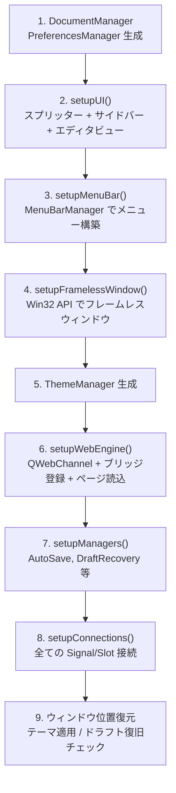
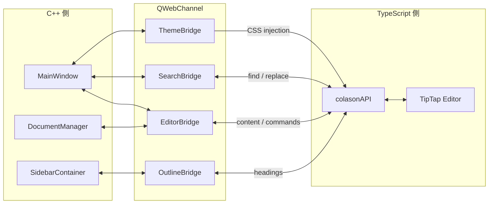

# 5. C++ 側の詳細

## main.cpp ─ エントリポイント

```cpp
int main(int argc, char* argv[])
{
    QApplication app(argc, argv);
    app.setApplicationName("Colason");

    MainWindow window;
    window.show();

    return app.exec();    // ← イベントループ開始 (C# の Application.Run に相当)
}
```

`QApplication::exec()` はアプリが終了するまでブロックする。
全ての UI イベント (クリック、キー入力、タイマー) はこのイベントループで処理される。

---

## MainWindow ─ 全体の司令塔

**最も重要なファイル。** `src/ui/MainWindow.h` と `src/ui/MainWindow.cpp`。

C# でいう `Form` クラスに相当。コンストラクタで全てをセットアップする:



### 主要メソッド

| メソッド | 説明 |
|---------|------|
| `newDocument()` | 新規文書作成 |
| `openFile()` | ファイルダイアログで .md を開く |
| `saveFile()` | JS から getMarkdown() でMDを取得→保存 |
| `saveFileAs()` | 名前を付けて保存 |
| `executeEditorCommand(cmd, args)` | JS側にエディタコマンドを送る |
| `setEditorMarkdown(md)` | JS側にMarkdownを渡して表示 |
| `setEditorHtml(html)` | JS側にHTMLを渡して表示 |
| `applyTheme(name, css, qss)` | テーマ適用 (CSS + QSS + タイトルバー色) |
| `toggleSidebar()` | サイドバー表示切替 |
| `toggleSourceMode()` | WYSIWYG ↔ ソースモード |
| `zoomIn() / zoomOut() / resetZoom()` | ズーム操作 |
| `quickOpen()` | Ctrl+P でファイルクイックオープン |

### setupConnections() の主な接続

```
EditorBridge::contentChanged    → DocumentManager::setContent
EditorBridge::documentDirty     → DocumentManager::setDirty + updateTitle
OutlineBridge::headingsChanged  → SidebarContainer::updateOutline
AutoSaveManager::getContentReq  → JS getContent → save
DraftRecoveryManager::getContent→ JS getContent → saveDraft
ThemeManager::themeChanged      → MainWindow::applyTheme
PreferencesManager::*Changed    → 各設定反映
SidebarContainer::fileSelected  → openDocument + setEditorMarkdown
QStyleHints::colorSchemeChanged → OS テーマ自動追従
```

---

## Core Managers

### DocumentManager (ファイル I/O)

ファイル: `src/core/DocumentManager.h / .cpp`

```
newDocument()       → m_filePath をクリア、documentChanged シグナル発火
openDocument(path)  → ファイル読込 → m_filePath, m_content 更新
saveDocument(content) → m_filePath に UTF-8 書込
saveDocumentAs(path, content) → 新パスに保存
```

C# でいう FileStream + StreamReader/Writer。
Qt の `QFile` + `QTextStream` で UTF-8 読み書きする。

### AutoSaveManager (自動保存)

ファイル: `src/core/AutoSaveManager.h / .cpp`

- 内部タイマー (デフォルト5分間隔)
- タイマー発火 → `getContentRequested` シグナル → MainWindow がJSからコンテンツ取得 → 保存
- 有効/無効、間隔は `PreferencesManager` で設定

### DraftRecoveryManager (クラッシュ復旧)

ファイル: `src/core/DraftRecoveryManager.h / .cpp`

- `~/.colason/drafts/` にドラフトを定期保存
- 起動時にドラフトがあればリカバリダイアログ表示
- 正常終了時にドラフト削除
- 7日以上古いドラフトは自動クリーンアップ

### ThemeManager (テーマ管理)

ファイル: `src/core/ThemeManager.h / .cpp`

7テーマ内蔵: Light, Dark, GitHub Light, GitHub Dark, Sepia, Nord, Dracula

各テーマは2つのスタイルを持つ:
- `editorCSS`: CSS カスタムプロパティ (Web エディタ用)
- `appQSS`: Qt スタイルシート (ネイティブ UI 用)

詳細は [09-theme-system.md](09-theme-system.md) を参照。

### PreferencesManager (設定管理)

ファイル: `src/core/PreferencesManager.h / .cpp`

`QSettings` (Windows のレジストリ) に永続化。管理する設定:
- テーマ名、テーマ自動検出
- キーバインドモード (default / vim / emacs)
- フォント、自動保存、画像保存フォルダ

### RecentFilesManager (最近のファイル)

ファイル: `src/core/RecentFilesManager.h / .cpp`

- 最大10件のファイル/フォルダ履歴
- `QSettings` に永続化

### ImageManager (画像処理)

ファイル: `src/core/ImageManager.h / .cpp`

- 画像ファイルのドラッグ&ドロップ → assets サブフォルダにコピー
- 一意なファイル名を生成
- エディタには相対パスを返す

### ExportManager (エクスポート)

ファイル: `src/core/ExportManager.h / .cpp`

- PDF: Qt の印刷API使用
- HTML: テーマCSS付きの完全なHTMLファイル
- PNG: WebEngine のスクリーンショット

### GlobalSearchManager (プロジェクト全体検索)

ファイル: `src/core/GlobalSearchManager.h / .cpp`

- ファイルパターンフィルタ (デフォルト: `*.md`)
- 大文字小文字区別/正規表現対応
- 非同期検索、キャンセル可能
- 結果: ファイルパス、行番号、マッチ位置

---

## Bridge クラス

**C++ と TypeScript の橋渡し。** 全て `QObject` を継承し、QWebChannel で JS に公開される。



### EditorBridge (メインの通信チャネル)

ファイル: `src/bridge/EditorBridge.h / .cpp`

```
C++ → JS (requestXxx メソッド → シグナル発火 → JS が受信):
  requestSetContent(html)          → エディタにHTMLをセット
  requestSetMarkdown(md)           → エディタにMarkdownをセット
  requestGetContent()              → エディタからHTMLを要求
  requestExecuteCommand(cmd, args) → エディタコマンド実行
  requestToggleSourceMode()        → ソースモード切替

JS → C++ (JS が invoke → C++ のシグナル発火):
  contentChanged(html)             → エディタ内容変更通知
  wordCountChanged(words, chars)   → 文字数通知
  documentDirty(dirty)             → 未保存状態通知
  cursorPositionChanged(line, col) → カーソル位置通知
  contentReceived(html)            → getContent の応答
```

### OutlineBridge

ファイル: `src/bridge/OutlineBridge.h / .cpp`

```
C++ → JS: scrollToHeading(id)      → 見出しにスクロール
JS → C++: headingsChanged(json)    → 見出し一覧更新
           activeHeadingChanged(id) → アクティブ見出し通知
```

### SearchBridge

ファイル: `src/bridge/SearchBridge.h / .cpp`

```
C++ → JS: find, replace, findNext, findPrevious
JS → C++: searchResultsChanged(count, index)
```

### ThemeBridge

ファイル: `src/bridge/ThemeBridge.h / .cpp`

```
C++ → JS: setTheme(css) → エディタにCSSを注入
```

---

## UI コンポーネント

### MenuBarManager

ファイル: `src/ui/MenuBarManager.h / .cpp`

- File メニュー (新規、開く、保存、エクスポート)
- Edit メニュー (元に戻す、やり直し、切取、コピー、貼付)
- Paragraph メニュー (見出しレベル、リスト、引用)
- Format メニュー (太字、斜体等)
- View メニュー (サイドバー切替、フォーカスモード)
- ハンバーガーボタン + ピン固定 + ウィンドウ操作ボタン (最小化/最大化/閉じる)

### SidebarContainer

ファイル: `src/ui/sidebar/SidebarContainer.h / .cpp`

3つのタブを管理:
1. **DocumentListPanel** - 開いたドキュメント一覧
2. **FileExplorerPanel** - QFileSystemModel を使ったファイルツリー
3. **OutlinePanel** - エディタから受け取った見出し階層を QTreeWidget で表示

### QuickOpenDialog

ファイル: `src/ui/QuickOpenDialog.h / .cpp`

Ctrl+P で開くファイル検索ダイアログ。

### フレームレスウィンドウ

`MainWindow::nativeEvent` で Win32 メッセージを直接処理:
- `WM_NCCALCSIZE`: クライアント領域の計算 (タスクバー対応)
- `WM_NCHITTEST`: ドラッグ可能領域の判定 (タイトルバー、リサイズ枠)
- `WM_GETMINMAXINFO`: 最大化時のサイズ制限

これは Win32 API の知識が必要な部分。変更する場合は慎重に。

---

[← 前へ: アーキテクチャ](04-architecture.md) | [次へ: TypeScript 側の詳細 →](06-typescript-details.md)