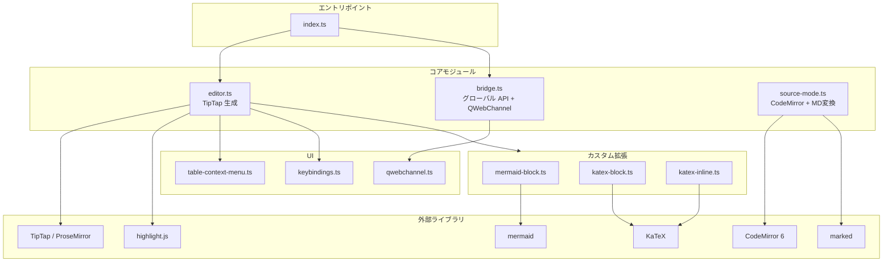
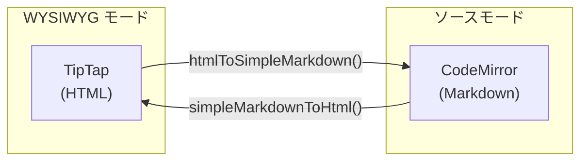

# 6. TypeScript 側の詳細

## 依存ライブラリ

| ライブラリ | 役割 |
|-----------|------|
| **TipTap** (@tiptap/*) | WYSIWYG エディタコア (ProseMirror のラッパー) |
| **CodeMirror** (@codemirror/*) | ソースモード (Markdown テキスト編集) |
| **marked** | Markdown → HTML 変換 |
| **highlight.js** (lowlight) | コードブロックのシンタックスハイライト |
| **mermaid** | Mermaid 図のレンダリング |
| **KaTeX** | LaTeX 数式のレンダリング |
| **Vite** | バンドラー (開発サーバー + 本番ビルド) |

---

## モジュール構成



## エントリポイント (index.ts)

```typescript
import { createEditor } from './editor';
import { initBridge, setupGlobalAPI } from './bridge';

const el = document.getElementById('editor')!;
const editor = createEditor(el);     // TipTap エディタ生成
setupGlobalAPI(editor);               // window.colasonAPI 公開
await initBridge(editor);             // QWebChannel 接続
```

---

## editor.ts ─ TipTap エディタ

`createEditor()` で TipTap エディタインスタンスを生成。

### 有効な拡張

- **StarterKit** (基本: 段落, 見出し, リスト, 太字, 斜体 etc.)
- **CodeBlockLowlight** (コードブロック + シンタックスハイライト)
- **TaskList / TaskItem** (チェックボックスリスト、ネスト対応)
- **Table / TableRow / TableCell / TableHeader** (テーブル、リサイズ対応)
- **Image** (画像、Base64 対応)
- **Link** (リンク、自動リンク対応)
- **Underline, Subscript, Superscript, Highlight, Typography**
- **MermaidBlock** (Mermaid 図カスタム拡張)
- **KaTeXBlock, KaTeXInline** (数式カスタム拡張)

### イベントハンドラ

- `onUpdate`: 内容変更 → C++ に通知 (contentChanged, wordCount, headings)
- `onSelectionUpdate`: カーソル移動 → C++ に通知 (cursorPosition)
- `paste` イベント: Markdown テキストの貼り付けを自動検出してHTML変換

### Markdown 貼り付け自動検出

`looksLikeMarkdown()` 関数で以下のパターンを検出:
- `# 見出し`, ` ``` ` コードブロック, `- ` リスト, `> ` 引用
- `[link](url)`, `**太字**`, ``, テーブル (`| ... |`)

検出したら `simpleMarkdownToHtml()` で変換してから挿入。

---

## bridge.ts ─ グローバル API

`window.colasonAPI` として公開される全 API:

| API | 説明 |
|-----|------|
| `setContent(html)` | HTML をエディタにセット |
| `setMarkdown(md)` | Markdown を変換してセット |
| `getContent()` | 現在の HTML を返す |
| `getMarkdown()` | HTML → Markdown 変換して返す |
| `executeCommand(cmd, args)` | エディタコマンド実行 |
| `toggleSourceMode()` | WYSIWYG ↔ ソースモード切替 |
| `toggleFocusMode()` | フォーカスモード |
| `toggleTypewriterMode()` | タイプライターモード |
| `scrollToHeading(id)` | 見出しにスクロール |
| `setTheme(css)` | テーマ CSS 注入 |
| `setZoom(percent)` | ズーム率変更 |
| `find(query, caseSensitive, regex)` | 検索 |
| `replace(from, to, all)` | 置換 |
| `setKeybinding(mode)` | キーバインド切替 |

### 対応コマンド一覧 (`executeCommand` の第1引数)

```
テキスト書式: toggleBold, toggleItalic, toggleStrike, toggleUnderline,
              toggleHighlight, toggleSuperscript, toggleSubscript, clearFormat
ブロック:     setHeading({level}), setParagraph, toggleBulletList,
              toggleOrderedList, toggleTaskList, toggleBlockquote, setCodeBlock
テーブル:     insertTable, addRowBefore/After, deleteRow,
              addColumnBefore/After, deleteColumn, deleteTable,
              mergeCells, splitCell, toggleHeaderRow/Column
特殊:         insertHorizontalRule, insertImage, insertMermaid,
              insertMathBlock, insertMathInline
操作:         undo, redo, selectAll
```

### C++ へのシグナル通知関数

```typescript
notifyContentChanged(html)    // エディタ内容変更
notifyCursorPosition(line, col) // カーソル位置
notifyWordCount(words, chars)  // 文字数
notifyDocumentDirty(dirty)     // 未保存状態
notifyHeadingsChanged(headings) // 見出し一覧
notifyActiveHeading(id)         // アクティブ見出し
notifySearchResults(count, idx) // 検索結果
```

### 検索/置換の実装

`bridge.ts` 内に実装:
- `performSearch()`: ドキュメントノードを走査し、正規表現でマッチ
- `navigateSearch()`: マッチ間を移動、スクロール
- `performReplace()`: 全置換 (逆順で位置ズレ防止) or 単一置換

### 見出し Observer

`IntersectionObserver` でスクロール位置を監視し、現在表示中の見出しを C++ に通知。
サイドバーの見出しアウトラインと連動する。

---

## source-mode.ts ─ ソースモードと MD 変換

### 2つの変換関数

- `simpleMarkdownToHtml(md)`: `marked` ライブラリ使用。カスタム拡張で `==highlight==`, `^superscript^`, `~subscript~` に対応。タスクリストは TipTap 互換の `data-type="taskItem"` 属性付き HTML を生成。
- `htmlToSimpleMarkdown(html)`: DOMParser で HTML をパースし、ノードを再帰的に Markdown に変換。テーブル、Mermaid ブロック、各種インライン書式に対応。

### ソースモード切替



1. **WYSIWYG → ソース**: TipTap HTML → `htmlToSimpleMarkdown()` → CodeMirror に表示
2. **ソース → WYSIWYG**: CodeMirror テキスト → `simpleMarkdownToHtml()` → TipTap にセット

### CodeMirror の構成

- markdown 言語モード + 複数言語のシンタックスハイライト
- history (Undo/Redo)
- bracketMatching, highlightSelectionMatches
- キーバインド切替 (`Compartment` で動的再構成)

---

## カスタム拡張

### mermaid-block.ts

ファイル: `editor/src/extensions/mermaid-block.ts`

```
コードブロック (language: mermaid) → Mermaid 図に変換
- 編集可能な textarea + リアルタイムプレビュー
- 300ms デバウンスで自動再レンダリング
- エラー表示付き
```

### katex-block.ts / katex-inline.ts

ファイル: `editor/src/extensions/katex-block.ts`, `katex-inline.ts`

```
$$ ... $$ → ブロック数式
$ ... $ → インライン数式
- KaTeX でレンダリング
- エラー時はフォールバック表示
```

---

## table-context-menu.ts

ファイル: `editor/src/table-context-menu.ts`

テーブルセル上で右クリック → コンテキストメニュー表示:
- 行の追加/削除 (上/下)
- 列の追加/削除 (左/右)
- セルの結合/分割
- ヘッダ行/列の切替

メニュー項目は日本語。

---

## keybindings.ts

ファイル: `editor/src/keybindings.ts`

- **default**: 標準キーバインド
- **vim**: `@replit/codemirror-vim` による Vim エミュレーション
- **emacs**: 未実装 (プレースホルダー)

CodeMirror の `Compartment` で動的にキーバインドを切替可能。

---

## qwebchannel.ts

ファイル: `editor/src/qwebchannel.ts`

Qt の QWebChannel プロトコルの TypeScript 実装。
C++ 側の `registerObject` で登録されたオブジェクトに JS からアクセスするための通信層。

---

[← 前へ: C++ 側の詳細](05-cpp-details.md) | [次へ: ブリッジ通信 →](07-bridge.md)