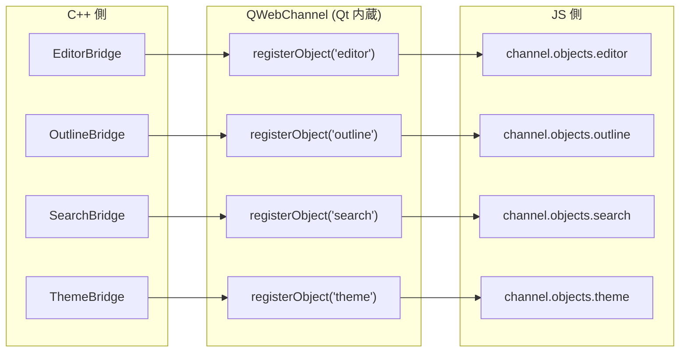
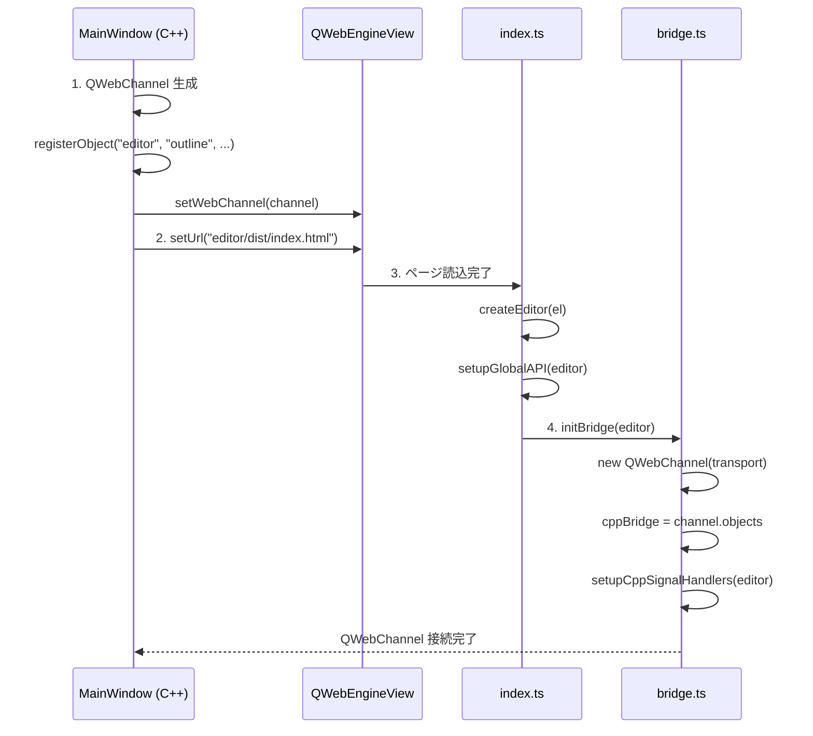

# 7. C++ ↔ TypeScript ブリッジ通信

## 仕組み



QWebChannel は Qt 内蔵の仕組みで、C++ のオブジェクト (QObject) を JavaScript にそのまま公開する。
JS 側からは `channel.objects.<名前>` でアクセスでき、メソッド呼び出しとシグナル受信が可能。

---

## C++ → JS の呼び出し方法

### 方法1: Signal 経由 (ブリッジ使用)

```cpp
// C++: シグナル発火
m_editorBridge->requestSetMarkdown(markdown);
// → 内部で emit setMarkdownRequested(markdown) が発火
// → JS 側の connect で受信:
// cppBridge.editor.setMarkdownRequested.connect((md) => { ... })
```

### 方法2: runJavaScript 直接呼び出し (MainWindow で多用)

```cpp
// C++: JS を直接実行
m_editorView->page()->runJavaScript("colasonAPI.setZoom(120)");

// 戻り値を受け取る場合 (コールバック)
m_editorView->page()->runJavaScript(
    "colasonAPI.getMarkdown()",
    [this](const QVariant& result) {
        QString markdown = result.toString();
        m_docManager->saveDocument(markdown);
    }
);
```

> **注意**: `runJavaScript` のコールバックは **非同期** で呼ばれる。
> C# の `async/await` に近いが、ラムダキャプチャで書く。

### 使い分け

| 方法 | 使い所 |
|------|-------|
| Signal 経由 | 定型的な通信 (型安全、双方向) |
| runJavaScript | 戻り値が必要なとき、または単発の呼び出し |

本プロジェクトでは **runJavaScript を多用** している。
理由: Signal 経由だと QWebChannel のセットアップ完了を待つ必要があるが、
runJavaScript は `colasonAPI` がグローバルに存在すれば即座に呼べるため。

---

## JS → C++ の呼び出し方法

```typescript
// JS: C++ のシグナルを直接発火
cppBridge.editor.contentChanged(html);
cppBridge.editor.documentDirty(true);
cppBridge.outline.headingsChanged(JSON.stringify(headings));

// C++ 側で connect して受信:
connect(m_editorBridge, &EditorBridge::contentChanged,
        this, [this](const QString& html) { ... });
connect(m_outlineBridge, &OutlineBridge::headingsChanged,
        this, [this](const QString& json) { ... });
```

JS から C++ のシグナルを「発火」すると、C++ 側の `connect` で接続されたスロット/ラムダが呼ばれる。

---

## JS 文字列のエスケープ

C++ から JS に文字列を渡すとき、特殊文字のエスケープが必要。
本プロジェクトでは **JSON エンコード** で安全に渡す:

```cpp
// 安全な方法 (本プロジェクトの標準パターン)
QJsonArray arr;
arr.append(markdown);
QString jsonStr = QString::fromUtf8(QJsonDocument(arr).toJson(QJsonDocument::Compact));
QString safeStr = jsonStr.mid(1, jsonStr.size() - 2); // ["..."] → "..."

QString js = QString("colasonAPI.setMarkdown(%1)").arg(safeStr);
m_editorView->page()->runJavaScript(js);
```

**なぜこの方法?**
- Markdown テキストには改行、引用符、バックスラッシュなど JS 文字列リテラルを壊す文字が含まれる
- `QJsonDocument` の JSON エンコードはこれらを全て正しくエスケープする
- `["..."]` の外側の括弧を除去して、JSON 文字列リテラル `"..."` を取り出す

---

## QWebChannel の初期化フロー



### スタンドアロンモード

`window.qt` が undefined の場合 (ブラウザで直接開いた場合)、QWebChannel 接続をスキップ。
`window.colasonAPI` はそのまま動作するので、エディタ単体のテストが可能。

---

[← 前へ: TypeScript 側](06-typescript-details.md) | [次へ: データフロー図解 →](08-data-flows.md)