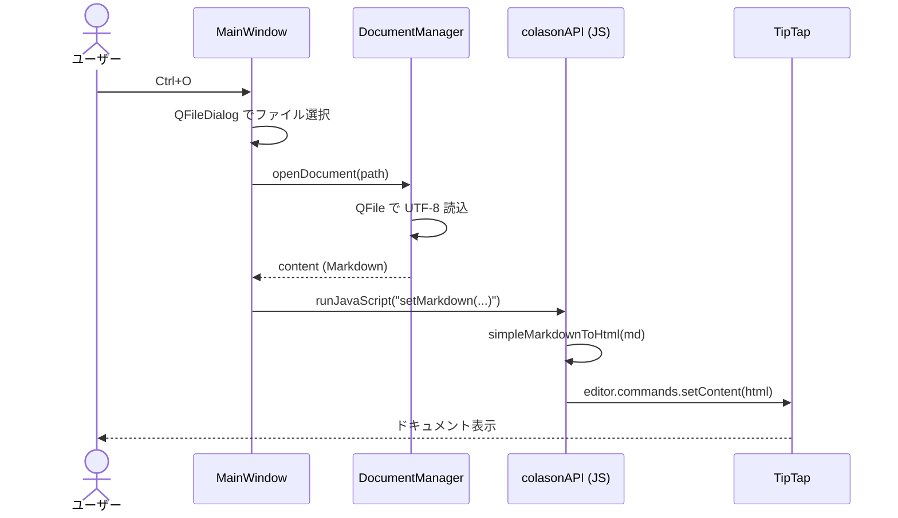
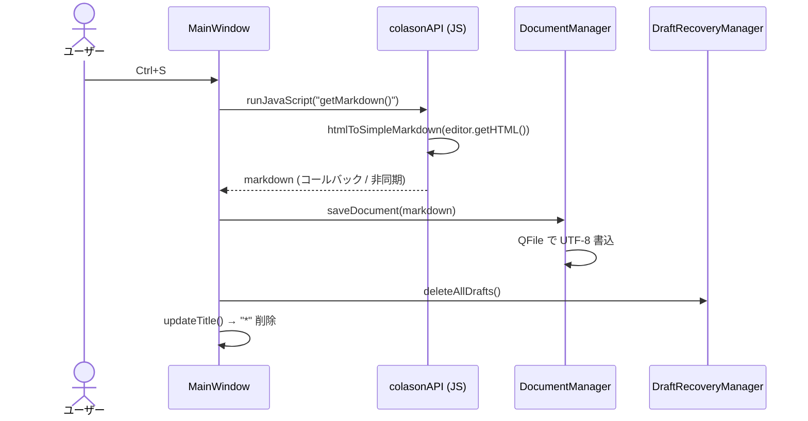
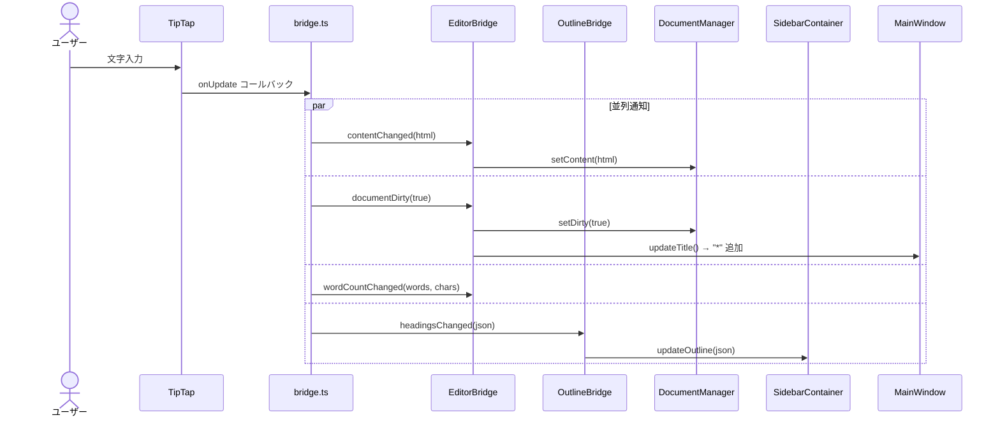
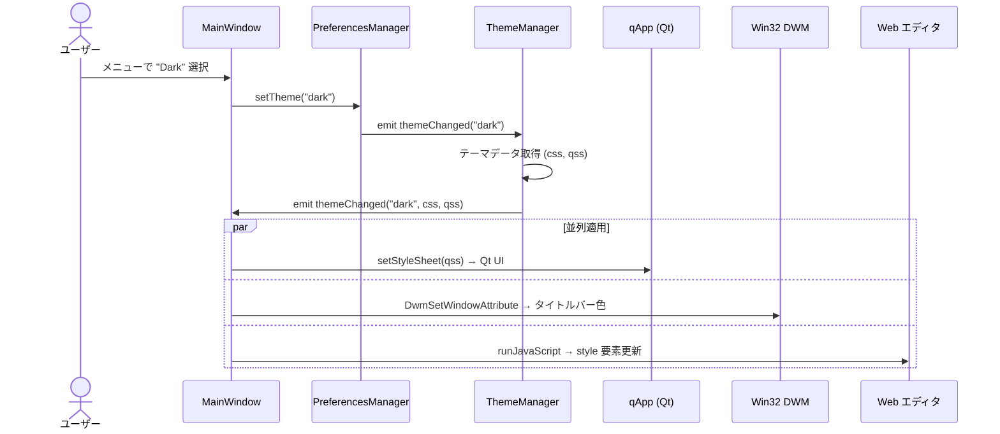
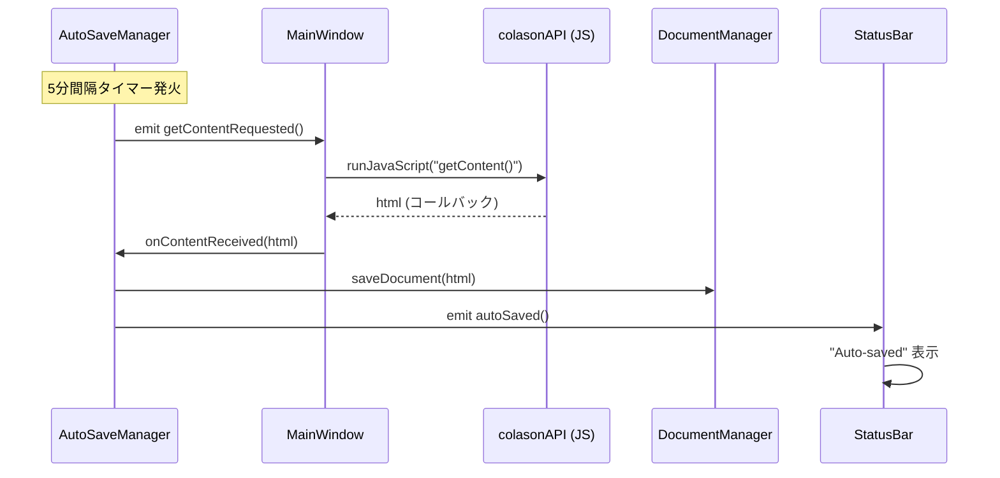
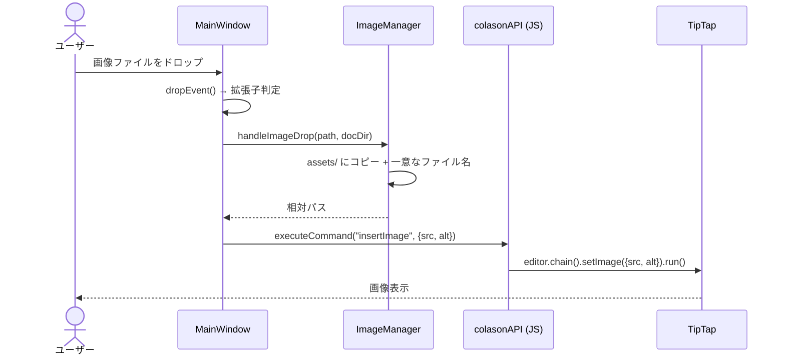
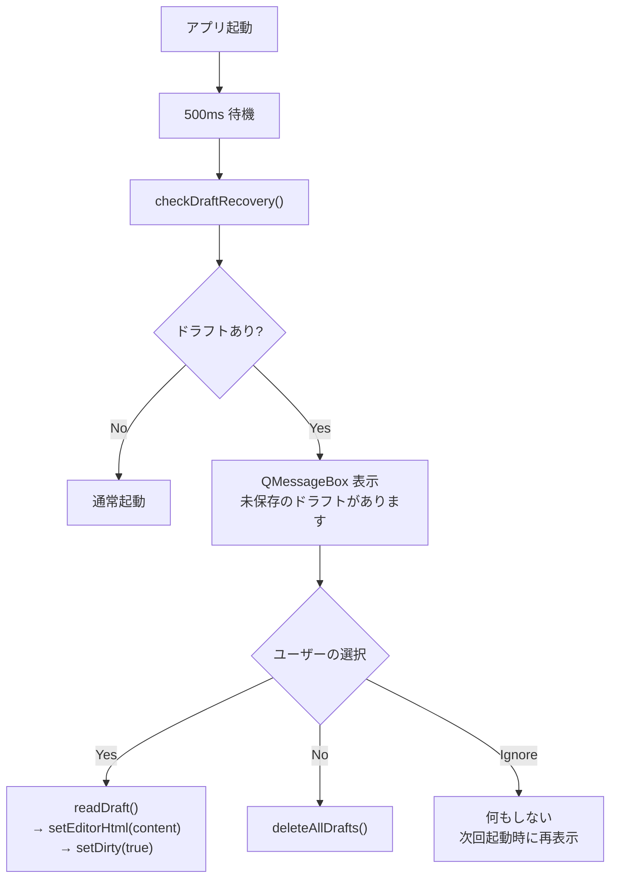

# 8. データフロー図解

## ファイルを開く

---

## ファイルを保存する

---

## エディタ内容変更時

---

## テーマ変更

---

## 自動保存

---

## 画像ドラッグ&ドロップ

---

## 起動時のドラフト復旧

---

[← 前へ: ブリッジ通信](07-bridge.md) | [次へ: テーマシステム →](09-theme-system.md)
