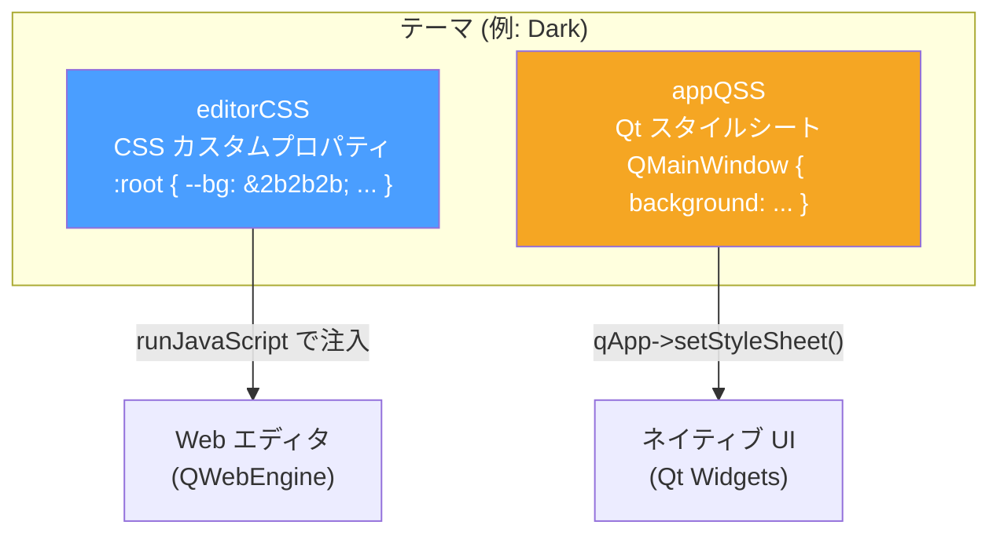
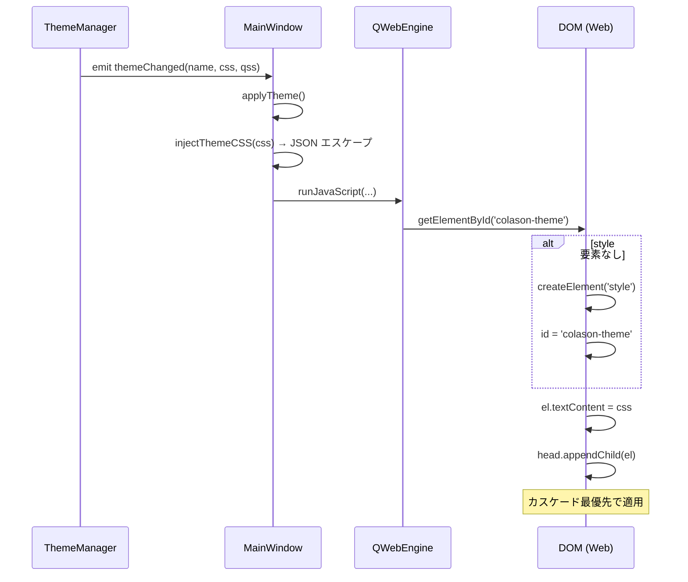

# 9. テーマシステム

## 構造

各テーマは **2つのスタイルセット** を持つ:



### 1. editorCSS (CSS カスタムプロパティ) → Web エディタ用

```css
:root {
  --bg: #2b2b2b;
  --fg: #c8c8c8;
  --link: #6cb6ff;
  --code-bg: #363636;
  --hljs-keyword: #c586c0;
  /* ... 50以上の変数 */
}
```

`editor/src/themes/base.css` でこれらの変数を参照してスタイルを定義。
テーマ切替時は `:root` の変数を上書きするだけで全体の見た目が変わる。

### 2. appQSS (Qt スタイルシート) → ネイティブ UI 用

```css
QMainWindow { background: #2b2b2b; }
QMenuBar { background: #2b2b2b; color: #bbb; }
QTreeView::item:selected { background: #37373d; }
/* ... */
```

Qt の QSS (Qt Style Sheet) は CSS に似た構文だが、Qt ウィジェット専用。
`qApp->setStyleSheet(qss)` で適用する。

---

## CSS 注入メカニズム



---

## FOUC (Flash of Unstyled Content) 防止

ページ読込前にテーマCSS を `QWebEngineScript` (DocumentReady タイミング) で注入。
加えて `page->setBackgroundColor()` で背景色をプリセット。

```cpp
// setupWebEngine() 内:
m_editorView->page()->setBackgroundColor(isDark ? QColor("#1e1e1e") : QColor("#ffffff"));

QWebEngineScript script;
script.setInjectionPoint(QWebEngineScript::DocumentReady);
script.setSourceCode(/* <style id="colason-theme"> を挿入する JS */);
m_editorView->page()->scripts().insert(script);
```

---

## 内蔵テーマ一覧

| キー | 名前 | ダーク |
|-----|------|--------|
| `light` | Light | No |
| `dark` | Dark (Typora風) | Yes |
| `github-light` | GitHub Light | No |
| `github-dark` | GitHub Dark | Yes |
| `sepia` | Sepia | No |
| `nord` | Nord | Yes |
| `dracula` | Dracula | Yes |

---

## テーマを追加するには

### Step 1: ThemeManager にテーマデータ追加

`src/core/ThemeManager.cpp` の `registerBuiltinThemes()` に追加:

```cpp
m_themes["my-theme"] = {
    "My Theme",       // displayName
    // editorCSS (CSS カスタムプロパティ)
    ":root {"
    "  --bg: #...; --fg: #...; --link: #...;"
    "  /* base.css の全変数を定義 */"
    "}",
    // appQSS (Qt スタイルシート)
    "QMainWindow { background: #...; }"
    "QMenuBar { background: #...; color: #...; }"
    "/* 他の Qt ウィジェット */",
    true   // isDark
};
```

### Step 2: タイトルバー色の追加

`src/ui/MainWindow.cpp` の `applyTheme()` 内のタイトルバー色セクションに追加:

```cpp
} else if (themeName == "my-theme") {
    captionColor = RGB(r, g, b);
    textColor = RGB(r, g, b);
    useDarkMode = TRUE;  // ダークテーマの場合
}
```

### Step 3: カスタムテーマファイルから読み込む場合

```cpp
m_themeManager->loadCustomTheme("path/to/my-theme.css");
// → "custom-<filename>" というキーで自動登録される
// ただし appQSS (ネイティブ UI) のスタイルは含まれない
```

---

## CSS 変数一覧 (base.css で使用)

| カテゴリ | 変数 |
|---------|------|
| 基本 | `--bg`, `--fg`, `--fg-muted`, `--fg-subtle` |
| 境界・面 | `--border`, `--border-light`, `--surface`, `--surface-alt` |
| リンク・見出し | `--link`, `--heading`, `--heading-border` |
| コード | `--code-bg`, `--code-border`, `--code-fg`, `--pre-bg`, `--pre-border`, `--pre-fg` |
| 引用 | `--bq-border`, `--bq-fg` |
| テーブル | `--th-bg`, `--td-border`, `--tr-alt-bg` |
| マーク・HR | `--mark-bg`, `--mark-fg`, `--hr-border`, `--strike-fg` |
| 選択・プレースホルダー | `--selection-bg`, `--placeholder-fg` |
| スクロールバー | `--scrollbar-thumb`, `--scrollbar-thumb-hover` |
| 構文ハイライト | `--hljs-fg`, `--hljs-keyword`, `--hljs-string`, `--hljs-comment`, `--hljs-number`, `--hljs-function`, `--hljs-builtin` |
| Mermaid | `--mermaid-border`, `--mermaid-bg`, `--mermaid-code-bg/fg`, `--mermaid-err-*` |
| KaTeX | `--katex-border`, `--katex-bg`, `--katex-code-bg/fg`, `--katex-hover-bg` |
| タスクリスト | `--task-done-fg` |

---

[← 前へ: データフロー](08-data-flows.md) | [次へ: Markdown 機能一覧 →](10-markdown-features.md)
