# 11. 開発タスク別ガイドと既知の課題

## 開発ワークフロー概要

```mermaid
graph TD
    subgraph AddCmd["エディタコマンド追加"]
        A1["bridge.ts に case 追加"] --> A2["MenuBarManager に<br/>メニュー項目追加"]
    end

    subgraph AddExt["TipTap 拡張追加"]
        B1["extensions/ にファイル作成"] --> B2["editor.ts の extensions に追加"] --> B3["npm run build"]
    end

    subgraph AddMgr["Core Manager 追加"]
        C1["src/core/ に .h/.cpp 作成"] --> C2["MainWindow メンバに追加"] --> C3["setupConnections() で接続"] --> C4["CMake 再 configure"]
    end

    subgraph AddBridge["ブリッジ追加"]
        D1["src/bridge/ に .h/.cpp 作成"] --> D2["setupWebEngine() で<br/>QWebChannel 登録"] --> D3["bridge.ts で JS 側接続"]
    end
```



## 新しいエディタコマンドを追加する

1. **bridge.ts** の `executeEditorCommand` 関数に `case` を追加:
   ```typescript
   case 'myCommand':
     chain.myCustomMethod(args).run();
     break;
   ```

2. **MenuBarManager** にメニュー項目を追加 (C++ 側):
   ```cpp
   auto* myAction = menu->addAction(tr("My Command"));
   connect(myAction, &QAction::triggered, m_mainWindow, [this]() {
       m_mainWindow->executeEditorCommand("myCommand", R"({"key":"value"})");
   });
   ```

---

## 新しい TipTap 拡張を追加する

1. `editor/src/extensions/` にファイル作成
2. `editor/src/editor.ts` の `extensions` 配列に追加
3. `npm run build` で再ビルド

参考: `mermaid-block.ts` や `katex-block.ts` が良いテンプレート

---

## 新しい Core Manager を追加する

1. `src/core/` に `.h` / `.cpp` ファイル作成
2. `QObject` を継承し、`Q_OBJECT` マクロを書く
3. MainWindow のメンバに追加し、コンストラクタで生成 (`new MyManager(this)`)
4. `setupConnections()` で Signal/Slot 接続
5. CMake は `GLOB_RECURSE` なので新ファイルは自動で追加される (再 configure が必要)

---

## 新しいブリッジを追加する

1. `src/bridge/` に `.h` / `.cpp` ファイル作成 (EditorBridge をテンプレートに)
2. MainWindow の `setupWebEngine()` で QWebChannel に登録:
   ```cpp
   m_myBridge = new MyBridge(this);
   m_channel->registerObject("myBridge", m_myBridge);
   ```
3. `bridge.ts` の `setupCppSignalHandlers` で JS 側を接続:
   ```typescript
   cppBridge.myBridge?.someSignal?.connect((data: string) => {
       // ハンドラ
   });
   ```

---

## TypeScript の開発サーバーで確認する

```bash
cd editor
npm run dev    # → http://localhost:5173 で開発サーバー起動
```

ブラウザで直接アクセスすると QWebChannel なしのスタンドアロンモードで動く。
エディタの見た目や挙動のみをテストしたい場合に便利。

---

## テーマを追加する

[09-theme-system.md](09-theme-system.md) の「テーマを追加するには」を参照。

---

## サイドバーにパネルを追加する

1. `src/ui/sidebar/` に新パネルクラスを作成 (`QWidget` 継承)
2. `SidebarContainer` のコンストラクタで `addTab(myPanel, "My Panel")` を追加
3. `setupConnections()` で必要なシグナル接続を追加

---

## 既知の課題と TODO

### 優先度高

- [ ] `src/CMakeLists.txt` 12行目: `WIN32` フラグが無効 (デバッグ用にコンソール表示中)
  - リリース時は `add_executable(colason WIN32 ...)` に戻す
- [ ] HTML → Markdown 変換が簡易実装 (CommonMark 完全準拠ではない)
  - `source-mode.ts` の `htmlToSimpleMarkdown()` が手動パース

### 優先度中

- [ ] Emacs キーバインド (keybindings.ts にプレースホルダーのみ)
- [ ] GlobalSearchManager で QtConcurrent を使った並行検索

### 改善案

- [ ] 設定ダイアログ UI (現在はコードから直接設定)
- [ ] プラグインシステム
- [ ] macOS / Linux 対応

---

[← 前へ: Markdown 機能](10-markdown-features.md) | [次へ: トラブルシューティング →](12-troubleshooting.md)
