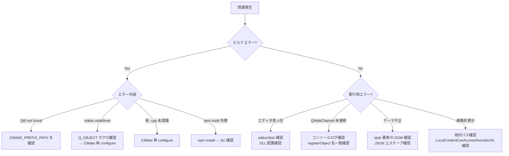

# 12. トラブルシューティング



## ビルドエラー: "Qt6 not found"

```
CMake が Qt を見つけられない場合:
-DCMAKE_PREFIX_PATH="c:/Qt/6.8.3/msvc2022_64" を確認
```

---

## ビルドエラー: "undefined reference to vtable"

```
Q_OBJECT マクロの書き忘れ、または MOC が実行されていない。
→ ヘッダに Q_OBJECT を追加し、CMake を再 configure する
   (build ディレクトリを削除して再生成するのが確実)
```

---

## ビルドエラー: 新しい .cpp ファイルが認識されない

```
GLOB_RECURSE は CMake configure 時にファイルを収集する。
→ cmake を再 configure する (cmake -S . -B build ...)
```

---

## 実行時: エディタが真っ白

```
1. editor/dist/ が存在するか確認 → cd editor && npm run build
2. DLL が正しく配置されているか確認 (特に QtWebEngineProcess.exe)
3. デバッグコンソールで JS エラーを確認 (WIN32 無効なのでコンソール出力あり)
4. index.html のパスが正しいか確認 (EDITOR_DIST_DIR の値)
```

---

## 実行時: QWebChannel 接続されない

```
1. ブラウザコンソールで "[Colason] QWebChannel connected" が出るか確認
2. qwebchannel.ts がバンドルに含まれているか確認
3. registerObject の名前が bridge.ts 側と一致しているか確認
4. window.qt が undefined でないか確認 (QWebEngine 内で動作しているか)
```

---

## テーマが適用されない / ちらつく

```
1. injectThemeCSS が呼ばれているか確認
2. JSON エスケープが正しいか確認 (CSS に改行や引用符があると壊れる)
3. <style id="colason-theme"> が DOM に存在するか DevTools で確認
4. FOUC: setupWebEngine() で QWebEngineScript が正しく挿入されているか確認
```

---

## npm run build が失敗する

```
1. cd editor && npm install で依存を再インストール
2. TypeScript エラーの場合は tsc --noEmit で型チェック
3. Node.js バージョンが 18 以上か確認
4. node_modules を削除して npm install し直す
```

---

## 保存したファイルの内容がおかしい

```
1. 保存時は getMarkdown() で HTML → Markdown 変換してから保存している
2. htmlToSimpleMarkdown() は簡易実装なので、複雑な構造は壊れる可能性がある
3. ソースモードで Markdown を直接確認して比較する
```

---

## 画像が表示されない

```
1. 画像パスが相対パスになっているか確認
2. QWebEngine の LocalContentCanAccessRemoteUrls が true になっているか確認
3. 画像ファイルが assets フォルダに正しくコピーされているか確認
```

---

## デバッグ方法

### C++ 側

- Visual Studio のデバッガを使用 (F5 でデバッグ実行)
- `qDebug() << "message"` でコンソール出力 (WIN32 無効時のみ表示)
- `#ifdef HAS_WEBENGINE` 内のコードは WebEngine が利用可能な場合のみ動作

### TypeScript 側

- `npm run dev` でブラウザの DevTools を使用
- `console.log()` で QWebEngine のコンソールに出力
- QWebEngine の DevTools: `QTWEBENGINE_REMOTE_DEBUGGING=9222` 環境変数で有効化

```bash
# WebEngine のリモートデバッグを有効にして起動
set QTWEBENGINE_REMOTE_DEBUGGING=9222
colason.exe
# → Chrome で http://localhost:9222 にアクセスして DevTools 使用
```

---

[← 前へ: 開発ガイド](11-dev-guide.md) | [次へ: 付録 →](13-appendix.md)
