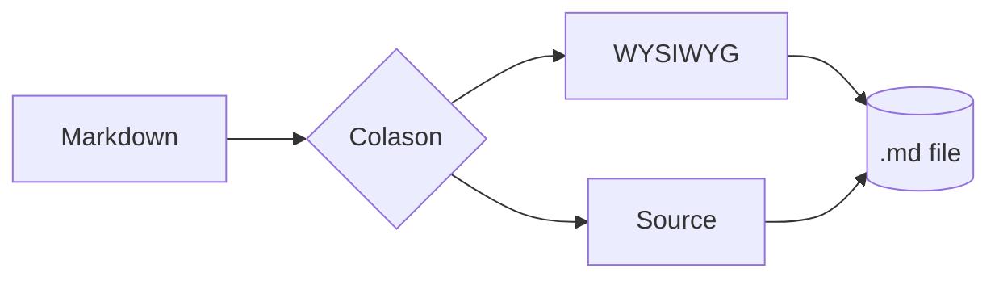

# Colason

**SPEC 駆動開発時代の、Markdown 専用 WYSIWYG エディタ。** 設計書・ADR・仕様書を、
ソースと同じ見た目で「読む / 直す」ための軽量ネイティブアプリです。

> Typora 風のリアルタイム WYSIWYG を、Electron ではなく C++20 / Qt6 ネイティブで。

## できること

- **WYSIWYG ↔ ソースモード** をワンキーで切替
- **テーマ**: Light / Dark / Sepia / System 追従
- **数式・図・コード** をその場でレンダリング
- アウトライン・分割ペイン・PDF / HTML エクスポート

## タスク

- [x] テーマ切替 (Light / Dark / Sepia)
- [x] 分割ペイン (Split Right / Down)
- [ ] コード署名 + 自動更新
- [ ] プラグイン API

## 数式 (KaTeX)

ガウス積分はインライン $\int_{-\infty}^{\infty} e^{-x^2}\,dx = \sqrt{\pi}$ で書けます。
ブロック表示も:

$$
f(x) = \frac{1}{\sigma\sqrt{2\pi}}\, e^{-\frac{(x-\mu)^2}{2\sigma^2}}
$$

## 図 (Mermaid)



## コード

```ts
export function greet(name: string): string {
  return `Hello, ${name} — welcome to Colason.`;
}
```

## 表

| 機能 | Colason | 汎用ノートアプリ |
|------|:------:|:----------------:|
| ローカルファイル完結 | ✅ | △ |
| 数式・Mermaid ネイティブ | ✅ | △ |
| 起動の速さ | ✅ | ✕ |

---

> データはすべて手元に。クラウド不要。
