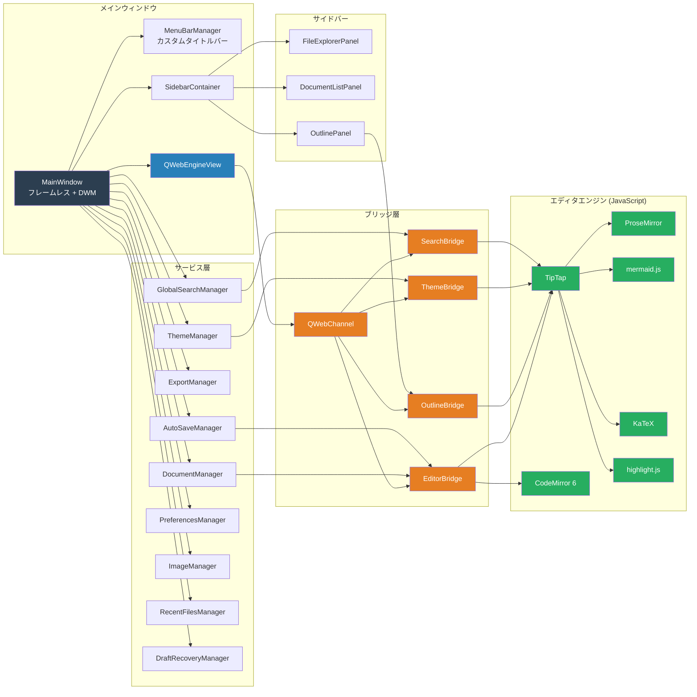
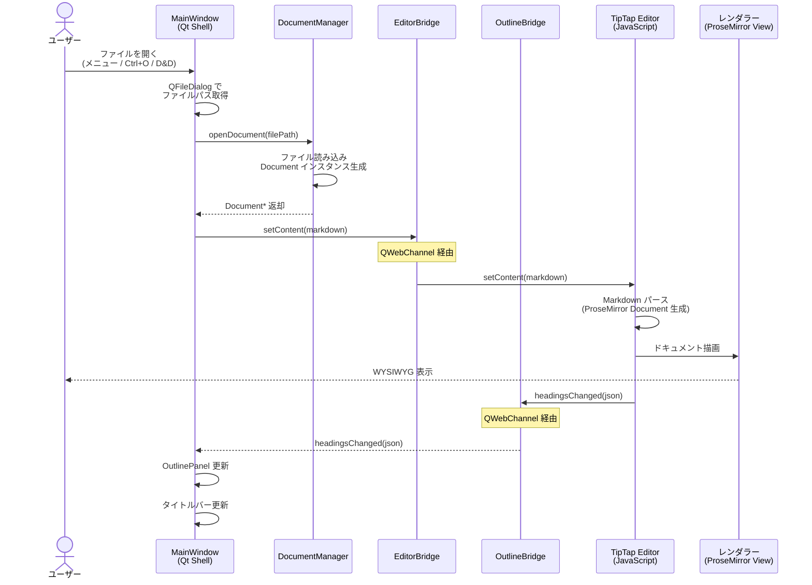
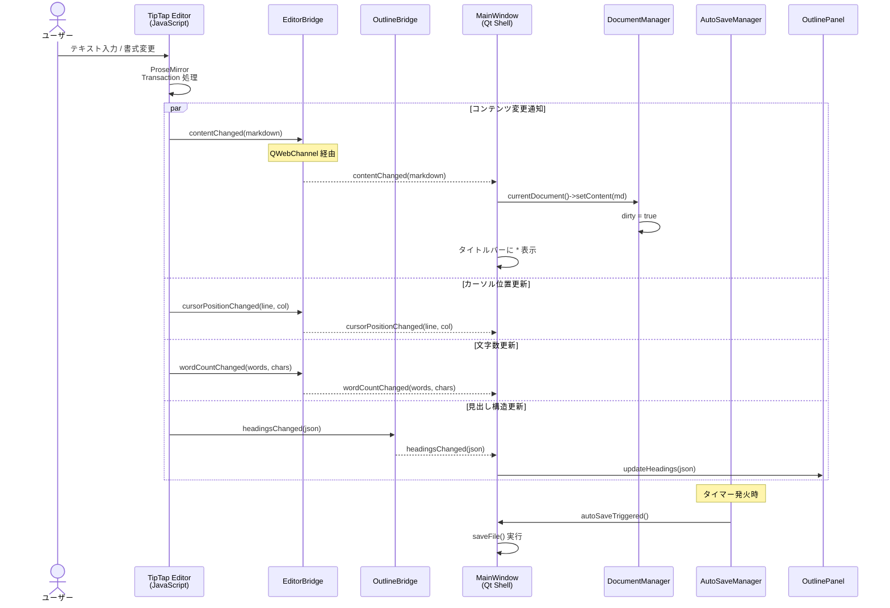
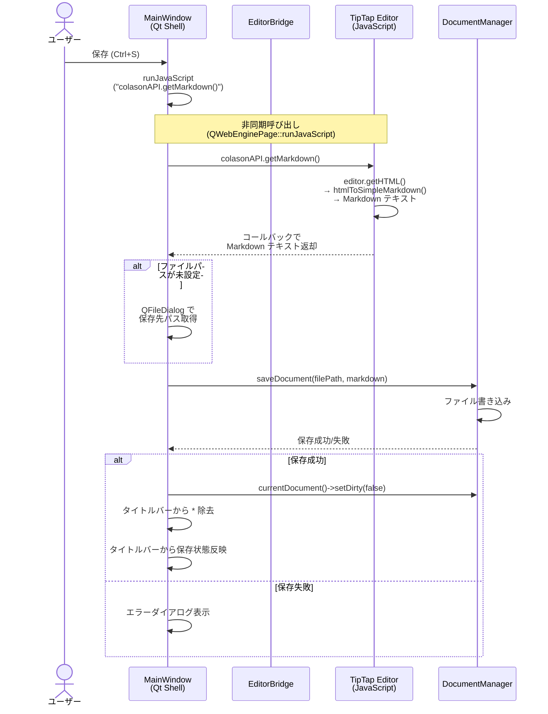
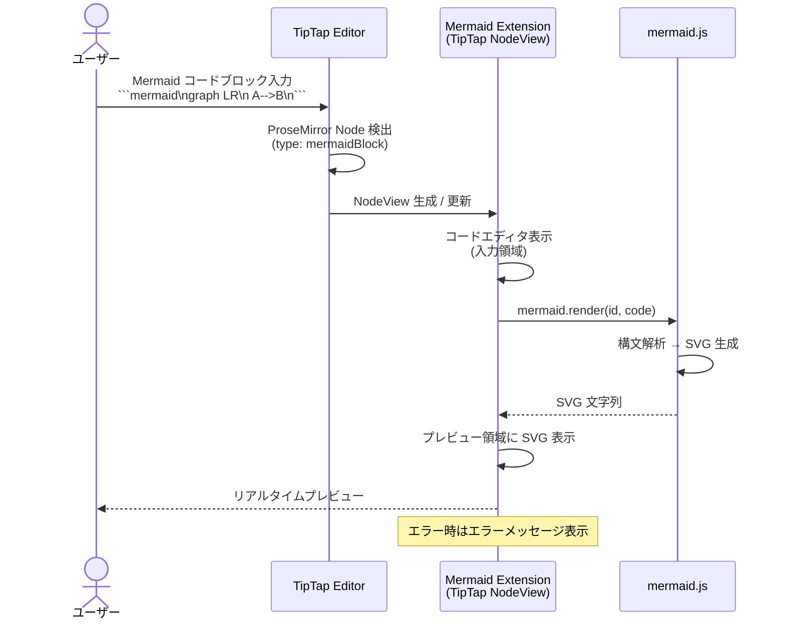
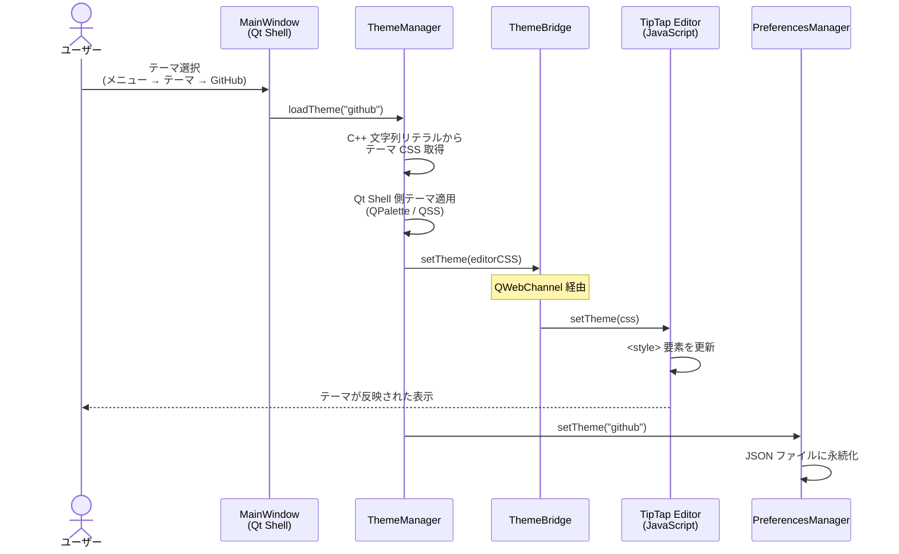
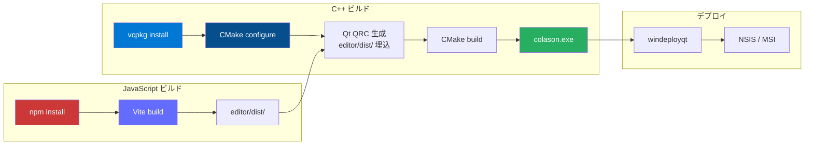
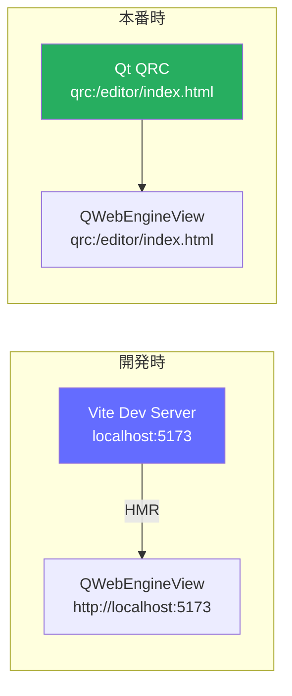
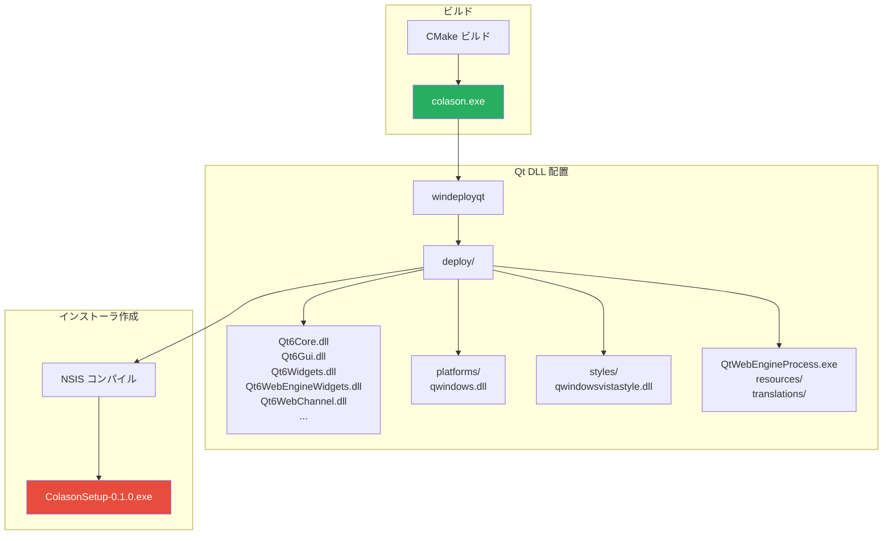

# Colason アーキテクチャ設計書

## 1. システム概要

### 1.1 プロジェクト情報

| 項目 | 内容 |
|------|------|
| プロジェクト名 | **Colason** |
| 概要 | Typora クローンの WYSIWYG Markdown エディタ |
| 目的 | 高速かつ直感的なリアルタイム Markdown 編集体験の提供 |
| プラットフォーム | Windows (将来的に macOS / Linux 対応) |
| ライセンス | MIT License |

### 1.2 技術スタック概要

| カテゴリ | 技術 | バージョン |
|----------|------|-----------|
| ネイティブシェル | C++ / Qt6 (Widgets, WebEngine, WebChannel) | Qt 6.8+ |
| エディタエンジン | TipTap / ProseMirror | 最新安定版 |
| ソースモード | CodeMirror 6 | 最新安定版 |
| 数式レンダリング | KaTeX | 最新安定版 |
| 図表レンダリング | mermaid.js | 最新安定版 |
| コードハイライト | highlight.js | 最新安定版 |
| ビルドシステム (C++) | CMake + vcpkg | CMake 3.25+ |
| ビルドシステム (JS) | npm + Vite | Vite 6.x |
| パッケージ管理 | vcpkg (C++), npm (JavaScript) | - |

### 1.3 アーキテクチャ方針

Colason はハイブリッドアーキテクチャを採用する。

- **ネイティブ C++ シェル**: Qt6 Widgets + DWM API によるフレームレス MainWindow、カスタムタイトルバー（ハンバーガーメニュー + メニューバー + ウィンドウ制御ボタン）、サイドバー（ファイルエクスプローラ、アウトラインツリー）、ダイアログを構成する
- **Web エディタ**: QWebEngineView (Chromium) 上で TipTap/ProseMirror ベースの WYSIWYG Markdown エディタを動作させ、CodeMirror 6 によるソースモードも提供する
- **ブリッジ**: QWebChannel を介した C++ と JavaScript の双方向通信により、ネイティブシェルと Web エディタを密に連携させる

---

## 2. レイヤードアーキテクチャ

Colason のシステムは以下の 5 層で構成される。各層は下位層にのみ依存し、上位層への依存は持たない。

```mermaid
graph TB
    subgraph "Layer 4: プレゼンテーション層"
        L4_1[Qt Widgets<br/>MainWindow / Sidebar / Dialog / Menu]
        L4_2[QWebEngineView<br/>WYSIWYG エディタ画面]
    end

    subgraph "Layer 3: アプリケーション層"
        L3_1[DocumentManager]
        L3_3[ThemeManager]
        L3_4[ExportManager]
        L3_5[GlobalSearchManager]
        L3_6[AutoSaveManager]
        L3_7[PreferencesManager]
        L3_9[ImageManager]
        L3_10[RecentFilesManager]
        L3_11[DraftRecoveryManager]
    end

    subgraph "Layer 2: ブリッジ層"
        L2_1[QWebChannel]
        L2_2[EditorBridge]
        L2_3[OutlineBridge]
        L2_4[ThemeBridge]
        L2_5[SearchBridge]
    end

    subgraph "Layer 1: エディタエンジン層"
        L1_1[TipTap / ProseMirror]
        L1_2[CodeMirror 6]
        L1_3[mermaid.js]
        L1_4[KaTeX]
        L1_5[highlight.js]
    end

    subgraph "Layer 0: プラットフォーム層"
        L0_1[Qt6 Core / GUI / Widgets]
        L0_2[Qt6 WebEngine / WebChannel]
        L0_3[ファイルシステム]
        L0_4[OS 統合<br/>クリップボード / D&D / 通知]
    end

    L4_1 --> L3_1
    L4_1 --> L3_3
    L4_2 --> L2_1

    L3_1 --> L2_2
    L3_3 --> L2_4
    L3_5 --> L2_5
    L3_6 --> L2_2

    L2_1 --> L2_2
    L2_1 --> L2_3
    L2_1 --> L2_4
    L2_1 --> L2_5

    L2_2 --> L1_1
    L2_2 --> L1_2
    L2_3 --> L1_1
    L2_4 --> L1_1
    L2_5 --> L1_1

    L1_1 --> L1_3
    L1_1 --> L1_4
    L1_1 --> L1_5

    L3_1 --> L0_3
    L4_1 --> L0_1
    L4_2 --> L0_2
    L2_1 --> L0_2

    style L4_1 fill:#4a90d9,color:#fff
    style L4_2 fill:#4a90d9,color:#fff
    style L3_1 fill:#7b68ee,color:#fff
    style L3_3 fill:#7b68ee,color:#fff
    style L3_4 fill:#7b68ee,color:#fff
    style L3_5 fill:#7b68ee,color:#fff
    style L3_6 fill:#7b68ee,color:#fff
    style L3_7 fill:#7b68ee,color:#fff
    style L3_9 fill:#7b68ee,color:#fff
    style L3_10 fill:#7b68ee,color:#fff
    style L3_11 fill:#7b68ee,color:#fff
    style L2_1 fill:#e67e22,color:#fff
    style L2_2 fill:#e67e22,color:#fff
    style L2_3 fill:#e67e22,color:#fff
    style L2_4 fill:#e67e22,color:#fff
    style L2_5 fill:#e67e22,color:#fff
    style L1_1 fill:#27ae60,color:#fff
    style L1_2 fill:#27ae60,color:#fff
    style L1_3 fill:#27ae60,color:#fff
    style L1_4 fill:#27ae60,color:#fff
    style L1_5 fill:#27ae60,color:#fff
    style L0_1 fill:#95a5a6,color:#fff
    style L0_2 fill:#95a5a6,color:#fff
    style L0_3 fill:#95a5a6,color:#fff
    style L0_4 fill:#95a5a6,color:#fff
```



### 2.1 各層の責務

| 層 | 名称 | 責務 |
|----|------|------|
| Layer 4 | プレゼンテーション層 | ユーザーインターフェースの描画とユーザー操作の受付。Qt Widgets によるネイティブ UI と QWebEngineView によるエディタ画面を含む |
| Layer 3 | アプリケーション層 | ビジネスロジックの実装。ドキュメント管理、ファイル I/O、テーマ管理、エクスポート、検索、自動保存などの Manager クラス群 |
| Layer 2 | ブリッジ層 | C++ と JavaScript 間の双方向通信を担う。QWebChannel を介した QObject ベースのブリッジクラス群 |
| Layer 1 | エディタエンジン層 | Markdown の WYSIWYG 編集およびソースコード編集の実行エンジン。TipTap/ProseMirror、CodeMirror 6、各種レンダリングライブラリ |
| Layer 0 | プラットフォーム層 | OS およびフレームワークの基盤機能。Qt6 のコアモジュール、ファイルシステム、OS 固有の統合機能 |

---

## 3. コンポーネント構成図

以下の図は、Colason を構成する主要コンポーネントとその依存関係を示す。



### 3.1 コンポーネント概要

#### メインウィンドウ群

| コンポーネント | 責務 |
|---------------|------|
| MainWindow | アプリケーションのメインウィンドウ (フレームレス)。DWM API による WM_NCCALCSIZE / WM_NCHITTEST / WM_GETMINMAXINFO ハンドリング。全コンポーネントのライフサイクル管理とイベントルーティング。サイドバーのデフォルト幅 220px (最小 160px、最大 400px) |
| MenuBarManager | カスタムタイトルバー兼メニューバーの構築と QAction の管理。ハンバーガーメニュー(≡)、メニューバー (File/Edit/Paragraph/Format/View/Help)、ピンボタン、ウィンドウ制御ボタン (−/□/×) を含む。Segoe MDL2 Assets フォントアイコン使用 |
| SidebarContainer | サイドバー領域の管理。タブバー (常時表示) による各パネルの切替とリサイズ。openFolderRequested シグナルによるフォルダオープン要求 |
| QWebEngineView | Chromium ベースの Web ビュー。TipTap エディタのホスト |

#### サイドバー群

| コンポーネント | 責務 |
|---------------|------|
| FileExplorerPanel | フォルダツリーの表示。QTreeView + QFileSystemModel による再帰的なディレクトリ表示。FileIconProvider (カスタム QAbstractFileIconProvider、SVG アイコン) によるファイルアイコン表示。QStackedWidget でプレースホルダページ (フォルダ未選択時) とエクスプローラページを切替。フォルダ名ヘッダー付き |
| DocumentListPanel | 選択フォルダ内の Markdown ファイル一覧表示。フィルタリング・ソート機能付き |
| OutlinePanel | ドキュメントの見出し構造をツリー表示。クリックで該当箇所へスクロール |

#### ブリッジ群

| コンポーネント | 責務 |
|---------------|------|
| EditorBridge | エディタの主要通信。コンテンツの送受信、書式コマンドの発行、モード切替 |
| OutlineBridge | 見出し構造の同期。見出し一覧の受信とスクロール指示 |
| ThemeBridge | テーマ CSS の適用指示 |
| SearchBridge | 検索・置換コマンドの送受信 |

#### サービス群

| コンポーネント | 責務 |
|---------------|------|
| DocumentManager | Document インスタンスのライフサイクル管理。開く、閉じる、切替 |
| ThemeManager | テーマの読み込みと管理。6 テーマ (Light, Dark, GitHub, Sepia, Nord, Dracula) 全てに hljs/mermaid/katex スタイルを含む完全な editorCSS を提供。QSS にはカスタムブランチシェブロンインジケータを含む |
| ExportManager | PDF / HTML エクスポート機能 |
| GlobalSearchManager | グローバル検索のロジック管理 (QThread::create 使用) |
| AutoSaveManager | 自動保存のタイマー管理と実行 |
| PreferencesManager | 設定の読み書き（QSettings ベース） |
| ImageManager | 画像のコピー、ドロップ、パス解決処理 |
| RecentFilesManager | 最近開いたファイルの履歴管理 |
| DraftRecoveryManager | 未保存ドラフトの自動保存・復元 |

---

## 4. クラス階層図

以下は、Colason の主要クラスとその関係を示すクラス図である。

```mermaid
classDiagram
    class main {
        <<function>>
        QApplication app
        MainWindow window
    }

    class MainWindow {
        -QWebEngineView* m_webView
        -SidebarContainer* m_sidebarContainer
        -MenuBarManager* m_menuBarManager
        -DocumentManager* m_documentManager
        -ThemeManager* m_themeManager
        -ExportManager* m_exportManager
        -GlobalSearchManager* m_globalSearchManager
        -AutoSaveManager* m_autoSaveManager
        -ImageManager* m_imageManager
        -RecentFilesManager* m_recentFilesManager
        -DraftRecoveryManager* m_draftRecoveryManager
        -PreferencesManager* m_preferencesManager
        -EditorBridge* m_editorBridge
        -OutlineBridge* m_outlineBridge
        -ThemeBridge* m_themeBridge
        -SearchBridge* m_searchBridge
        +MainWindow(QWidget* parent)
        +openFile(filePath: QString) void
        +saveFile() void
        +saveFileAs() void
        +newFile() void
        +closeFile() void
        #closeEvent(QCloseEvent*) void
        #dragEnterEvent(QDragEnterEvent*) void
        #dropEvent(QDropEvent*) void
    }

    class EditorBridge {
        <<Q_OBJECT>>
        -bool m_sourceMode
        -bool m_focusMode
        -bool m_typewriterMode
        +setContent(markdown: QString) void
        +getContent() QString
        +executeCommand(cmd: QString, args: QJsonObject) void
        +toggleSourceMode() void
        +toggleFocusMode() void
        +toggleTypewriterMode() void
        +isSourceMode() bool
        +isFocusMode() bool
        +isTypewriterMode() bool
        +contentChanged(markdown: QString)* signal
        +cursorPositionChanged(line: int, col: int)* signal
        +wordCountChanged(words: int, chars: int)* signal
        +documentDirty(dirty: bool)* signal
        +imageDropped(data: QString)* signal
        +linkClicked(url: QString)* signal
    }

    class OutlineBridge {
        <<Q_OBJECT>>
        +scrollToHeading(id: QString) void
        +headingsChanged(json: QString)* signal
        +activeHeadingChanged(id: QString)* signal
    }

    class ThemeBridge {
        <<Q_OBJECT>>
        +setTheme(css: QString) void
        +themeApplied()* signal
    }

    class SearchBridge {
        <<Q_OBJECT>>
        +find(text: QString, opts: QJsonObject) void
        +replace(from: QString, to: QString) void
        +replaceAll(from: QString, to: QString) void
        +clearSearch() void
        +matchesFound(count: int)* signal
    }

    class DocumentManager {
        -QList~Document*~ m_documents
        -Document* m_currentDocument
        +openDocument(filePath: QString) Document*
        +closeDocument(doc: Document*) void
        +currentDocument() Document*
        +setCurrentDocument(doc: Document*) void
        +documents() QList~Document*~
        +documentOpened(doc: Document*)* signal
        +documentClosed(doc: Document*)* signal
        +currentDocumentChanged(doc: Document*)* signal
    }

    class Document {
        -QString m_filePath
        -QString m_content
        -bool m_dirty
        -QJsonArray m_headings
        -QString m_encoding
        -QString m_lineEnding
        +filePath() QString
        +setFilePath(path: QString) void
        +content() QString
        +setContent(content: QString) void
        +isDirty() bool
        +setDirty(dirty: bool) void
        +headings() QJsonArray
        +setHeadings(headings: QJsonArray) void
        +encoding() QString
        +lineEnding() QString
        +dirtyChanged(dirty: bool)* signal
        +contentChanged()* signal
    }

    class SidebarContainer {
        -FileExplorerPanel* m_fileExplorerPanel
        -DocumentListPanel* m_documentListPanel
        -OutlinePanel* m_outlinePanel
        -QStackedWidget* m_stackedWidget
        -QTabBar* m_tabBar
        +showFileExplorer() void
        +showFileList() void
        +showOutline() void
        +toggleVisibility() void
        +currentPanel() QWidget*
        +openFolderRequested()* signal
    }

    class FileExplorerPanel {
        -QTreeView* m_treeView
        -QFileSystemModel* m_fileSystemModel
        -FileIconProvider* m_iconProvider
        -QStackedWidget* m_stackedWidget
        -QString m_rootPath
        +setRootPath(path: QString) void
        +rootPath() QString
        +fileSelected(filePath: QString)* signal
        +folderSelected(folderPath: QString)* signal
    }

    class FileIconProvider {
        <<QAbstractFileIconProvider>>
        +icon(type: IconType) QIcon
        +icon(info: QFileInfo) QIcon
    }

    class OutlinePanel {
        -QTreeWidget* m_treeWidget
        +updateHeadings(json: QJsonArray) void
        +setActiveHeading(id: QString) void
        +headingClicked(id: QString)* signal
    }

    class ThemeManager {
        -QString m_currentThemeName
        -QMap~QString_QString~ m_themes
        +loadTheme(name: QString) void
        +currentThemeName() QString
        +availableThemes() QStringList
        +themeCSS(name: QString) QString
        +editorCSS(name: QString) QString
        +themeChanged(name: QString)* signal
    }
    note for ThemeManager "6テーマ: Light, Dark, GitHub, Sepia, Nord, Dracula\neditorCSS に hljs/mermaid/katex スタイル含む\nQSS にカスタムブランチシェブロン含む"

    class ExportManager {
        +exportToPDF(doc: Document*, outputPath: QString) bool
        +exportToHTML(doc: Document*, outputPath: QString) bool
        +exportFinished(success: bool)* signal
    }

    class AutoSaveManager {
        -QTimer* m_timer
        -int m_intervalMs
        -bool m_enabled
        +start() void
        +stop() void
        +setInterval(ms: int) void
        +setEnabled(enabled: bool) void
        +autoSaveTriggered()* signal
    }

    class GlobalSearchManager {
        -QString m_currentQuery
        -QJsonObject m_currentOptions
        +search(text: QString, opts: QJsonObject) void
        +replaceNext(from: QString, to: QString) void
        +replaceAll(from: QString, to: QString) void
        +clear() void
    }

    class RecentFilesManager {
        -QStringList m_recentFiles
        +addFile(filePath: QString) void
        +recentFiles() QStringList
        +clear() void
    }

    class DraftRecoveryManager {
        +saveDraft(filePath: QString, content: QString) void
        +hasDraft(filePath: QString) bool
        +recoverDraft(filePath: QString) QString
        +removeDraft(filePath: QString) void
    }

    class PreferencesManager {
        -QString m_keybinding
        -int m_fontSize
        -QString m_fontFamily
        -bool m_autoSaveEnabled
        -int m_autoSaveIntervalMs
        -QString m_theme
        +load() void
        +save() void
        +keybinding() QString
        +setKeybinding(keybinding: QString) void
        +fontSize() int
        +setFontSize(size: int) void
        +autoSaveEnabled() bool
        +setAutoSaveEnabled(enabled: bool) void
        +theme() QString
        +setTheme(theme: QString) void
        +toJson() QJsonObject
        +fromJson(obj: QJsonObject) void
    }

    class ImageManager {
        +handleImageDrop(data: QString, docPath: QString) QString
        +copyImageToAssets(srcPath: QString, docPath: QString) QString
        +resolveImagePath(relativePath: QString, docPath: QString) QString
    }

    class MenuBarManager {
        -QPushButton* m_hamburgerButton
        -QPushButton* m_pinButton
        -QPushButton* m_minimizeButton
        -QPushButton* m_maximizeButton
        -QPushButton* m_closeButton
        +createMenuWidget(menuBar: QMenuBar*) QWidget*
        +updateMaximizeIcon(isMaximized: bool) void
        +updateRecentFiles(files: QStringList) void
    }
    note for MenuBarManager "カスタムタイトルバー兼メニューバー\nハンバーガー + ピン + ウィンドウ制御ボタン"

    main --> MainWindow

    MainWindow --> SidebarContainer
    MainWindow --> MenuBarManager
    MainWindow --> DocumentManager
    MainWindow --> ThemeManager
    MainWindow --> ExportManager
    MainWindow --> GlobalSearchManager
    MainWindow --> AutoSaveManager
    MainWindow --> ImageManager
    MainWindow --> RecentFilesManager
    MainWindow --> DraftRecoveryManager
    MainWindow --> PreferencesManager
    MainWindow --> EditorBridge
    MainWindow --> OutlineBridge
    MainWindow --> ThemeBridge
    MainWindow --> SearchBridge

    SidebarContainer --> FileExplorerPanel
    SidebarContainer --> OutlinePanel
    FileExplorerPanel --> "QFileSystemModel"
    FileExplorerPanel --> FileIconProvider
    SidebarContainer --> DocumentListPanel

    DocumentManager --> Document : manages *
    GlobalSearchManager --> SearchBridge
    ThemeManager --> ThemeBridge
    AutoSaveManager --> EditorBridge
```

### 4.1 主要クラスの役割

#### main()
アプリケーションのエントリポイント（`main.cpp`）。`QApplication` インスタンスと `MainWindow` を生成し、イベントループを開始する。`ColasonApplication` クラスは存在せず、標準の `QApplication` を使用する。

#### MainWindow
メインウィンドウの中核クラス。全コンポーネントを保持し、イベントルーティング、ウィンドウタイトルの管理、ドラッグ＆ドロップ処理を担当する。

#### EditorBridge
エディタとの通信を担う最重要のブリッジクラス。Q_OBJECT マクロにより QWebChannel 経由で JavaScript 側と双方向通信を行う。コンテンツの送受信、書式コマンドの発行、各種モード切替を提供する。

#### Document
単一のドキュメントを表すデータクラス。ファイルパス、コンテンツ、変更状態（dirty フラグ）、見出し構造、エンコーディング、改行コード情報を保持する。

#### OutlinePanel
QTreeWidget を用いた見出し構造のツリー表示。クリックで該当箇所へスクロール。

---

## 5. QWebChannel 通信プロトコル設計

### 5.1 チャネル登録

QWebChannel にブリッジオブジェクトを登録し、JavaScript 側からアクセス可能にする。

```cpp
// MainWindow::setupWebChannel()
void MainWindow::setupWebChannel()
{
    QWebChannel* channel = new QWebChannel(this);
    channel->registerObject("editor", m_editorBridge);
    channel->registerObject("outline", m_outlineBridge);
    channel->registerObject("theme", m_themeBridge);
    channel->registerObject("search", m_searchBridge);

    m_webView->page()->setWebChannel(channel);
}
```

JavaScript 側では以下のようにブリッジオブジェクトを取得する。

> **注**: `qwebchannel.js` は npm パッケージからではなく、C++ 側で `QWebEngineScript` を使い `qrc:///qtwebchannel/qwebchannel.js` を `DocumentCreation` タイミングで注入する。これにより JavaScript 側では `QWebChannel` がグローバルに利用可能となる。

```javascript
// editor/src/bridge.ts
// QWebChannel は qrc:///qtwebchannel/qwebchannel.js から
// QWebEngineScript により DocumentCreation 時に注入済み

let editorBridge: any;
let outlineBridge: any;
let themeBridge: any;
let searchBridge: any;

new QWebChannel(qt.webChannelTransport, (channel: any) => {
    editorBridge = channel.objects.editor;
    outlineBridge = channel.objects.outline;
    themeBridge = channel.objects.theme;
    searchBridge = channel.objects.search;

    // シグナル接続
    editorBridge.setContent.connect(handleSetContent);
    editorBridge.executeCommand.connect(handleExecuteCommand);
    themeBridge.setTheme.connect(handleSetTheme);
    // ...
});
```

### 5.2 C++ → JavaScript メッセージ一覧

C++ 側から JavaScript 側へ送信されるメッセージの一覧を以下に示す。

| チャネル | メソッド/シグナル | ペイロード | 用途 |
|----------|------------------|-----------|------|
| editor | `setContent(markdown)` | `QString` | ドキュメント読み込み。Markdown テキストをエディタに設定する |
| editor | `executeCommand(cmd, args)` | `QString`, `QJsonObject` | 書式コマンドの実行（bold, heading 等） |
| editor | `toggleSourceMode()` | - | WYSIWYG モードとソースモードの切替 |
| editor | `toggleFocusMode()` | - | フォーカスモードの切替（現在の段落以外を薄くする） |
| editor | `toggleTypewriterMode()` | - | タイプライターモードの切替（カーソル行を画面中央に固定） |
| theme | `setTheme(css)` | `QString` | テーマ CSS をエディタに適用する |
| search | `find(text, opts)` | `QString`, `QJsonObject` | 検索の実行。opts に caseSensitive, wholeWord, regex を含む |
| search | `replace(from, to)` | `QString` x2 | 現在の一致箇所を置換する |
| search | `replaceAll(from, to)` | `QString` x2 | 全ての一致箇所を一括置換する |
| search | `clearSearch()` | - | 検索ハイライトをクリアする |
| outline | `scrollToHeading(id)` | `QString` | 指定 ID の見出しまでエディタをスクロールする |

### 5.3 JavaScript → C++ メッセージ一覧

JavaScript 側から C++ 側へ送信されるメッセージの一覧を以下に示す。これらは C++ 側のスロットとして実装される。

| チャネル | スロット | ペイロード | 用途 |
|----------|---------|-----------|------|
| editor | `contentChanged(md)` | `QString` | エディタのコンテンツが変更された際の通知。Markdown テキストを送信 |
| editor | `cursorPositionChanged(line, col)` | `int` x2 | カーソル位置の更新 |
| editor | `wordCountChanged(words, chars)` | `int` x2 | 文字数・単語数の更新 |
| editor | `documentDirty(dirty)` | `bool` | ドキュメントの変更状態通知。タイトルバーの `*` 表示に反映 |
| editor | `imageDropped(data)` | `QString` | 画像がエディタにドロップされた際の処理要求。Base64 データまたはファイルパス |
| editor | `linkClicked(url)` | `QString` | エディタ内のリンクがクリックされた際のナビゲーション処理 |
| outline | `headingsChanged(json)` | `QString` (JSON 配列) | 見出し構造の更新。OutlinePanel に反映。JSON フォーマットは下記参照 |
| outline | `activeHeadingChanged(id)` | `QString` | カーソル位置に基づく現在の見出しの更新。OutlinePanel のハイライトに反映 |
| search | `matchesFound(count)` | `int` | 検索結果の件数通知。検索ダイアログに反映 |
| editor | `diagramExportReady(svgString, format)` | `QString` x2 | ダイアグラムSVGエクスポート |

#### headingsChanged の JSON フォーマット

```json
[
    {
        "id": "heading-1",
        "level": 1,
        "text": "見出しタイトル",
        "pos": 0
    },
    {
        "id": "heading-2",
        "level": 2,
        "text": "サブ見出し",
        "pos": 150
    }
]
```

### 5.4 コマンドプロトコル (executeCommand)

`EditorBridge::executeCommand(cmd, args)` で送信するコマンドの一覧を以下に示す。`args` は空の場合 `{}` を渡す。

#### テキスト書式

| コマンド名 | 引数 | 説明 |
|-----------|------|------|
| `toggleBold` | `{}` | 太字の切替 |
| `toggleItalic` | `{}` | 斜体の切替 |
| `toggleStrike` | `{}` | 取り消し線の切替 |
| `toggleUnderline` | `{}` | 下線の切替 |
| `toggleHighlight` | `{}` | ハイライトの切替 |
| `toggleSuperscript` | `{}` | 上付き文字の切替 |
| `toggleSubscript` | `{}` | 下付き文字の切替 |

#### 見出し・段落

| コマンド名 | 引数 | 説明 |
|-----------|------|------|
| `setHeading` | `{ "level": 1-6 }` | 見出しレベルの設定（H1-H6） |
| `setParagraph` | `{}` | 通常段落に戻す |

#### リスト

| コマンド名 | 引数 | 説明 |
|-----------|------|------|
| `toggleBulletList` | `{}` | 箇条書きリストの切替 |
| `toggleOrderedList` | `{}` | 番号付きリストの切替 |
| `toggleTaskList` | `{}` | タスクリスト（チェックボックス）の切替 |

#### ブロック要素

| コマンド名 | 引数 | 説明 |
|-----------|------|------|
| `toggleBlockquote` | `{}` | 引用ブロックの切替 |
| `setCodeBlock` | `{ "language": "javascript" }` | コードブロックの挿入。language は任意の言語識別子 |
| `insertTable` | `{ "rows": 3, "cols": 3 }` | テーブルの挿入。行数と列数を指定 |
| `insertHorizontalRule` | `{}` | 水平線の挿入 |

#### 挿入系

| コマンド名 | 引数 | 説明 |
|-----------|------|------|
| `insertImage` | `{ "src": "path/to/image.png", "alt": "説明" }` | 画像の挿入 |
| `insertLink` | `{ "href": "https://...", "text": "リンクテキスト" }` | リンクの挿入 |
| `insertMathBlock` | `{}` | 数式ブロック（KaTeX）の挿入 |
| `insertMathInline` | `{}` | インライン数式（KaTeX）の挿入 |
| `insertMermaidBlock` | `{}` | Mermaid 図表ブロックの挿入 |
| `insertFootnote` | `{}` | 脚注の挿入 |

#### 編集操作

| コマンド名 | 引数 | 説明 |
|-----------|------|------|
| `undo` | `{}` | 元に戻す |
| `redo` | `{}` | やり直し |
| `selectAll` | `{}` | 全選択 |

#### 表示操作

| コマンド名 | 引数 | 説明 |
|-----------|------|------|
| `zoomIn` | `{}` | 表示の拡大 |
| `zoomOut` | `{}` | 表示の縮小 |
| `zoomReset` | `{}` | 表示倍率をリセット |

---

## 6. データフロー図

### 6.1 ファイルオープンフロー

ユーザーがファイルを開く際のデータフローを以下に示す。



### 6.2 コンテンツ編集フロー

ユーザーがエディタ上でテキストを編集した際のデータフローを以下に示す。



### 6.3 ファイル保存フロー

ユーザーがファイルを保存する際のデータフローを以下に示す。



### 6.4 Mermaid レンダリングフロー

Mermaid コードブロックがレンダリングされる際のフローを以下に示す。



### 6.5 テーマ変更フロー

ユーザーがテーマを変更する際のフローを以下に示す。



---

## 7. ディレクトリ構成

### 7.1 プロジェクトルート

```
colason/
├── CMakeLists.txt                  # ルート CMake 設定
├── CMakePresets.json               # CMake プリセット設定
├── vcpkg.json                      # vcpkg マニフェスト (C++ライブラリのみ)
├── README.md
├── run.bat                         # 実行用バッチファイル
│
├── src/                            # C++ ソースコード
│   ├── CMakeLists.txt              # src 用 CMake 設定 (GLOB_RECURSE)
│   ├── main.cpp                    # エントリポイント (QApplication + MainWindow)
│   │
│   ├── app/                        # (将来のアプリケーション層用、現在は空)
│   │
│   ├── ui/                         # プレゼンテーション層
│   │   ├── MainWindow.h            # フレームレスウィンドウ + DWM API
│   │   ├── MainWindow.cpp
│   │   ├── MenuBarManager.h        # カスタムタイトルバー + ウィンドウ制御
│   │   ├── MenuBarManager.cpp
│   │   ├── QuickOpenDialog.h       # クイックオープンダイアログ (Ctrl+P)
│   │   ├── QuickOpenDialog.cpp
│   │   ├── StatusBarManager.h      # ステータスバー管理 (現在未使用)
│   │   ├── StatusBarManager.cpp
│   │   │
│   │   ├── sidebar/                # サイドバー関連
│   │   │   ├── SidebarContainer.h
│   │   │   ├── SidebarContainer.cpp
│   │   │   ├── FileExplorerPanel.h
│   │   │   ├── FileExplorerPanel.cpp
│   │   │   ├── FileIconProvider.h
│   │   │   ├── FileIconProvider.cpp
│   │   │   ├── DocumentListPanel.h
│   │   │   ├── DocumentListPanel.cpp
│   │   │   ├── OutlinePanel.h
│   │   │   └── OutlinePanel.cpp
│   │   │
│   │   └── dialogs/                # (将来のダイアログ用、現在は空)
│   │
│   ├── bridge/                     # ブリッジ層
│   │   ├── EditorBridge.h
│   │   ├── EditorBridge.cpp
│   │   ├── OutlineBridge.h
│   │   ├── OutlineBridge.cpp
│   │   ├── ThemeBridge.h
│   │   ├── ThemeBridge.cpp
│   │   ├── SearchBridge.h
│   │   └── SearchBridge.cpp
│   │
│   ├── core/                       # コア層（Manager クラス群）
│   │   ├── DocumentManager.h
│   │   ├── DocumentManager.cpp
│   │   ├── ThemeManager.h
│   │   ├── ThemeManager.cpp
│   │   ├── ExportManager.h
│   │   ├── ExportManager.cpp
│   │   ├── GlobalSearchManager.h
│   │   ├── GlobalSearchManager.cpp
│   │   ├── AutoSaveManager.h
│   │   ├── AutoSaveManager.cpp
│   │   ├── PreferencesManager.h
│   │   ├── PreferencesManager.cpp
│   │   ├── ImageManager.h
│   │   ├── ImageManager.cpp
│   │   ├── RecentFilesManager.h
│   │   ├── RecentFilesManager.cpp
│   │   ├── DraftRecoveryManager.h
│   │   └── DraftRecoveryManager.cpp
│   │
│   └── utils/                      # (将来のユーティリティ用、現在は空)
│
├── editor/                         # TypeScript エディタ (サブプロジェクト)
│   ├── package.json
│   ├── package-lock.json
│   ├── tsconfig.json
│   ├── vite.config.ts
│   ├── index.html                  # エディタのエントリ HTML
│   │
│   ├── src/
│   │   ├── index.ts                # JavaScript エントリポイント
│   │   ├── bridge.ts               # QWebChannel ブリッジ初期化 + colasonAPI
│   │   ├── editor.ts               # TipTap エディタ設定・初期化
│   │   ├── source-mode.ts          # CodeMirror 6 ソースモード + Markdown↔HTML 変換
│   │   ├── keybindings.ts          # キーバインドモード (default/vim/emacs)
│   │   │
│   │   ├── extensions/             # TipTap カスタム拡張
│   │   │   ├── mermaid-block.ts    # Mermaid 図表ブロック
│   │   │   ├── katex-block.ts      # KaTeX 数式ブロック
│   │   │   └── katex-inline.ts     # KaTeX インライン数式
│   │   │
│   │   └── themes/                 # エディタ側テーマ CSS
│   │       └── base.css            # 共通ベーススタイル
│   │
│   └── dist/                       # Vite ビルド出力 (gitignore)
│
├── resources/                      # Qt リソース
│   ├── colason.qrc                 # Qt リソースファイル (アイコンSVG参照)
│   ├── icons/                      # アイコン
│   │   ├── colason.svg             # アプリアイコン
│   │   ├── file.svg                # ファイルアイコン
│   │   ├── file-text.svg
│   │   ├── folder.svg
│   │   ├── folder-open.svg
│   │   ├── chevron-right-dark.svg  # ツリービュー用
│   │   ├── chevron-down-dark.svg
│   │   ├── chevron-right-light.svg
│   │   └── chevron-down-light.svg
│   ├── themes/                     # (現在空 - テーマは ThemeManager.cpp 内の C++ 文字列リテラルで定義)
│   └── i18n/                       # (将来の国際化リソース用、現在は空)
│
├── docs/                           # ドキュメント
│   └── spec/
│       ├── requirements.md
│       ├── technology-selection.md
│       ├── architecture.md         # 本書
│       ├── feature-design.md
│       └── ui-design.md
│
└── tests/                          # テスト
    └── CMakeLists.txt
```

---

## 8. ビルドシステム設計

### 8.1 全体ビルドフロー



### 8.2 CMake 構成

#### ルート CMakeLists.txt

```cmake
cmake_minimum_required(VERSION 3.25)
project(colason VERSION 0.1.0 LANGUAGES CXX)

set(CMAKE_CXX_STANDARD 20)
set(CMAKE_CXX_STANDARD_REQUIRED ON)
set(CMAKE_AUTOMOC ON)
set(CMAKE_AUTORCC ON)
set(CMAKE_AUTOUIC ON)

# vcpkg ツールチェーン
if(DEFINED ENV{VCPKG_ROOT})
    set(CMAKE_TOOLCHAIN_FILE "$ENV{VCPKG_ROOT}/scripts/buildsystems/vcpkg.cmake"
        CACHE STRING "vcpkg toolchain file")
endif()

# Qt6 パッケージ検出
find_package(Qt6 REQUIRED COMPONENTS
    Core Gui Widgets
    WebEngineWidgets WebChannel
    Svg PrintSupport Concurrent
)

# テストの有効化
option(BUILD_TESTS "Build tests" OFF)
if(BUILD_TESTS)
    enable_testing()
    add_subdirectory(tests)
endif()

add_subdirectory(src)
```

#### src/CMakeLists.txt

> **注**: ソースファイルは `GLOB_RECURSE` で自動収集される。個別ファイルの手動登録は不要。

```cmake
file(GLOB_RECURSE COLASON_SOURCES
    "${CMAKE_CURRENT_SOURCE_DIR}/*.cpp"
    "${CMAKE_CURRENT_SOURCE_DIR}/*.h"
)

# Qt resources
set(COLASON_QRC "${CMAKE_SOURCE_DIR}/resources/colason.qrc")
if(EXISTS "${COLASON_QRC}")
    qt6_add_resources(COLASON_RESOURCES "${COLASON_QRC}")
endif()

add_executable(colason WIN32
    ${COLASON_SOURCES}
    ${COLASON_RESOURCES}
)

target_include_directories(colason PRIVATE
    ${CMAKE_CURRENT_SOURCE_DIR}
)

target_link_libraries(colason PRIVATE Qt6::Core Qt6::Gui Qt6::Widgets)

# Optional Qt modules (条件付きリンク)
if(Qt6WebEngineWidgets_FOUND)
    target_link_libraries(colason PRIVATE Qt6::WebEngineWidgets)
    target_compile_definitions(colason PRIVATE HAS_WEBENGINE=1)
endif()
# ... Qt6::WebChannel, Qt6::Svg, Qt6::PrintSupport, Qt6::Concurrent も同様

# vcpkg ライブラリ (条件付き)
if(spdlog_FOUND)
    target_link_libraries(colason PRIVATE spdlog::spdlog)
endif()
if(nlohmann_json_FOUND)
    target_link_libraries(colason PRIVATE nlohmann_json::nlohmann_json)
endif()

# Windows 固有
if(WIN32)
    target_link_libraries(colason PRIVATE ole32 oleaut32 shell32 dwmapi)
endif()

# エディタ dist ディレクトリ (開発時 Vite 出力パス)
target_compile_definitions(colason PRIVATE
    EDITOR_DIST_DIR="${EDITOR_DIST_DIR}"
)
```

### 8.3 vcpkg 統合

> **注**: Qt 本体 (WebEngine 含む) は vcpkg ではなく **aqtinstall** 経由のプリビルドバイナリを使用。
> vcpkg は C++ ライブラリのみ管理する。

#### vcpkg.json

```json
{
    "name": "colason",
    "version-string": "0.1.0",
    "description": "Typora-compatible WYSIWYG Markdown editor",
    "dependencies": [
        "nlohmann-json",
        "spdlog",
        "gtest"
    ]
}
```

### 8.4 editor/ ビルドパイプライン

#### 本番ビルド

```bash
# 1. 依存関係のインストール
cd editor/
npm install

# 2. Vite による本番ビルド
npm run build
# → editor/dist/ に出力

# 3. Qt QRC にバンドル
# resources/colason.qrc に editor/dist/ 内のファイルが参照される
# CMake ビルド時に自動的にバイナリに埋め込まれる
```

#### Qt QRC ファイル (resources/colason.qrc)

> **注**: 現在 QRC にはアイコン SVG のみ登録。エディタ (editor/dist/) は QRC 埋め込みではなく
> `EDITOR_DIST_DIR` コンパイル定義を通じてファイルパスで参照する。

```xml
<RCC>
    <qresource prefix="/">
        <file>icons/colason.svg</file>
        <file>icons/file.svg</file>
        <file>icons/file-text.svg</file>
        <file>icons/folder.svg</file>
        <file>icons/folder-open.svg</file>
        <file>icons/chevron-right-dark.svg</file>
        <file>icons/chevron-down-dark.svg</file>
        <file>icons/chevron-right-light.svg</file>
        <file>icons/chevron-down-light.svg</file>
    </qresource>
</RCC>
```

#### 開発時フロー (Vite HMR 活用)

開発時は Vite の開発サーバーを起動し、QWebEngineView で直接接続することでホットモジュールリプレースメント（HMR）を活用する。



C++ 側の URL 切替ロジック:

```cpp
// MainWindow::loadEditorPage()
void MainWindow::loadEditorPage()
{
    // EDITOR_DIST_DIR はコンパイル定義で指定されたエディタビルド出力パス
    QString editorDistDir = QString::fromUtf8(EDITOR_DIST_DIR);
    QString indexPath = editorDistDir + "/index.html";

    if (QFile::exists(indexPath)) {
        // ファイルシステムから読み込み (開発時: Vite ビルド出力)
        m_editorView->setUrl(QUrl::fromLocalFile(indexPath));
    } else {
        // フォールバック: Qt QRC から読み込み
        m_editorView->setUrl(QUrl("qrc:/editor/index.html"));
    }
}
```

#### Vite 設定 (vite.config.ts)

```typescript
import { defineConfig } from 'vite';

export default defineConfig({
    root: '.',
    base: './',
    build: {
        outDir: 'dist',
        assetsDir: 'assets',
        sourcemap: false,
        rollupOptions: {
            output: {
                // ハッシュなしのファイル名 (QRC 参照を簡素化)
                entryFileNames: 'assets/main.js',
                chunkFileNames: 'assets/[name].js',
                assetFileNames: 'assets/[name].[ext]',
            },
        },
    },
    server: {
        port: 5173,
        strictPort: true,
    },
});
```

---

## 9. デプロイメント

### 9.1 デプロイメントフロー



### 9.2 windeployqt による Qt DLL 配置

```bash
# ビルド成果物のディレクトリに移動
cd build/Release/

# windeployqt 実行
windeployqt.exe colason.exe \
    --release \
    --no-translations \
    --no-system-d3d-compiler \
    --no-opengl-sw
```

windeployqt が自動的に以下を配置する:

- Qt6 コアモジュールの DLL (Core, Gui, Widgets, WebEngine, WebChannel 等)
- プラットフォームプラグイン (`platforms/qwindows.dll`)
- スタイルプラグイン (`styles/`)
- WebEngine 関連ファイル (`QtWebEngineProcess.exe`, `resources/`, `translations/`)
- ICU データファイル
- その他必要なランタイム DLL

### 9.3 エディタアセットの配置

| モード | 配置方式 | 説明 |
|--------|---------|------|
| 通常 | ファイルシステム読み込み | `EDITOR_DIST_DIR` で指定されたパスから `index.html` を読み込む。`QUrl::fromLocalFile()` で参照 |
| フォールバック | Qt QRC 埋込 | ファイルが見つからない場合は `qrc:/editor/index.html` から読み込む |
| 開発 | Vite ビルド出力参照 | `editor/dist/` を `EDITOR_DIST_DIR` に指定。`npm run build` で更新 |

### 9.4 NSIS インストーラ

NSIS (Nullsoft Scriptable Install System) を使用して Windows 向けインストーラを生成する。

#### 主な機能

- インストール先ディレクトリの選択
- スタートメニュー・デスクトップショートカットの作成
- `.md` ファイルの関連付け登録
- アンインストーラの生成
- アンインストール時のレジストリクリーンアップ

#### NSIS スクリプト概要 (installer/colason.nsi)

```nsis
!include "MUI2.nsh"

Name "Colason"
OutFile "ColasonSetup-${VERSION}.exe"
InstallDir "$PROGRAMFILES64\Colason"
RequestExecutionLevel admin

; インストールセクション
Section "Colason" SecMain
    SetOutPath "$INSTDIR"

    ; アプリケーションファイル
    File /r "deploy\*.*"

    ; スタートメニューショートカット
    CreateDirectory "$SMPROGRAMS\Colason"
    CreateShortCut "$SMPROGRAMS\Colason\Colason.lnk" "$INSTDIR\colason.exe"

    ; デスクトップショートカット
    CreateShortCut "$DESKTOP\Colason.lnk" "$INSTDIR\colason.exe"

    ; .md ファイル関連付け
    WriteRegStr HKCR ".md" "" "Colason.MarkdownFile"
    WriteRegStr HKCR "Colason.MarkdownFile" "" "Markdown File"
    WriteRegStr HKCR "Colason.MarkdownFile\shell\open\command" "" '"$INSTDIR\colason.exe" "%1"'

    ; アンインストーラ
    WriteUninstaller "$INSTDIR\Uninstall.exe"
SectionEnd

; アンインストールセクション
Section "Uninstall"
    Delete "$INSTDIR\*.*"
    RMDir /r "$INSTDIR"
    Delete "$SMPROGRAMS\Colason\*.*"
    RMDir "$SMPROGRAMS\Colason"
    Delete "$DESKTOP\Colason.lnk"
    DeleteRegKey HKCR ".md"
    DeleteRegKey HKCR "Colason.MarkdownFile"
SectionEnd
```

### 9.5 デプロイメントチェックリスト

リリースビルド時に確認すべき項目を以下に示す。

1. **editor/ のビルド**: `npm run build` が正常に完了し、`editor/dist/` が生成されていること
2. **QRC の更新**: `colason.qrc` が最新の `editor/dist/` の内容を参照していること
3. **CMake リリースビルド**: `CMAKE_BUILD_TYPE=Release` でビルドが成功すること
4. **windeployqt の実行**: 必要な全ての Qt DLL が配置されていること
5. **動作確認**: デプロイディレクトリから直接 `colason.exe` を起動し、正常動作すること
6. **インストーラ生成**: NSIS コンパイルが正常に完了し、インストーラが生成されていること
7. **クリーンインストールテスト**: Qt がインストールされていない環境でインストーラからの導入・動作確認

---

## 付録

### A. 技術的決定事項と根拠

| 決定事項 | 根拠 |
|---------|------|
| ハイブリッドアーキテクチャの採用 | ネイティブ UI の応答性と Web エディタの豊富なエコシステム（TipTap/ProseMirror）を両立するため |
| QWebChannel の採用 | Qt 公式のブリッジ機構であり、型安全な双方向通信が可能。シグナル/スロットとの統合が自然 |
| TipTap の採用 | ProseMirror ベースで拡張性が高く、Markdown WYSIWYG に必要な機能を柔軟に実装可能 |
| CodeMirror 6 の採用 | ソースモードで高品質なコードエディタ体験を提供。Markdown 構文ハイライト対応 |
| Vite の採用 | 高速なビルドと HMR による開発体験の向上。Qt QRC への統合も容易 |
| vcpkg の採用 | C++ ライブラリ (spdlog, nlohmann-json等) の管理。Qt6本体は aqtinstall (プリビルドバイナリ) で別途導入 |

### B. 用語集

| 用語 | 説明 |
|------|------|
| WYSIWYG | What You See Is What You Get。リアルタイムプレビュー型の編集方式 |
| QWebChannel | Qt の C++ と JavaScript 間の双方向通信フレームワーク |
| QWebEngineView | Qt の Chromium ベース Web ビューウィジェット |
| TipTap | ProseMirror ベースのリッチテキストエディタフレームワーク |
| ProseMirror | スキーマベースのリッチテキスト編集ツールキット |
| CodeMirror 6 | Web ベースのコードエディタフレームワーク |
| HMR | Hot Module Replacement。ソースコード変更時にページ全体をリロードせずにモジュールを差し替える仕組み |
| QRC | Qt Resource Collection。ファイルをバイナリに埋め込む仕組み |
| vcpkg | Microsoft の C++ パッケージマネージャ |
| NSIS | Nullsoft Scriptable Install System。Windows 向けインストーラ作成ツール |
