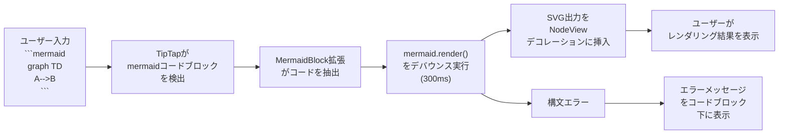
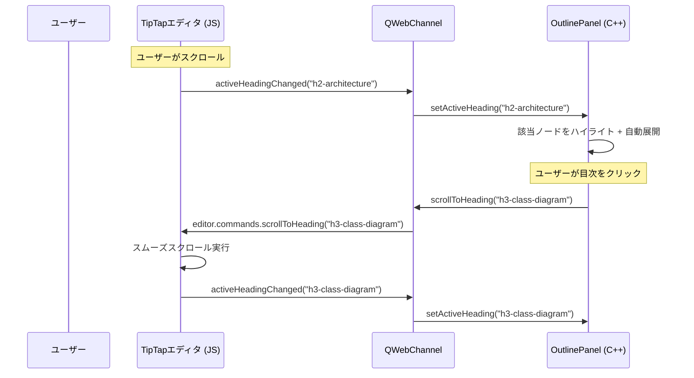
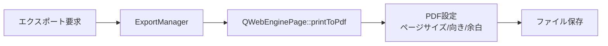
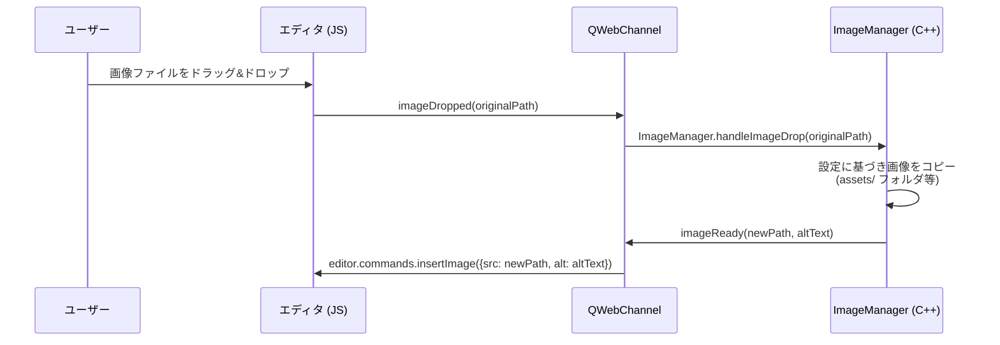
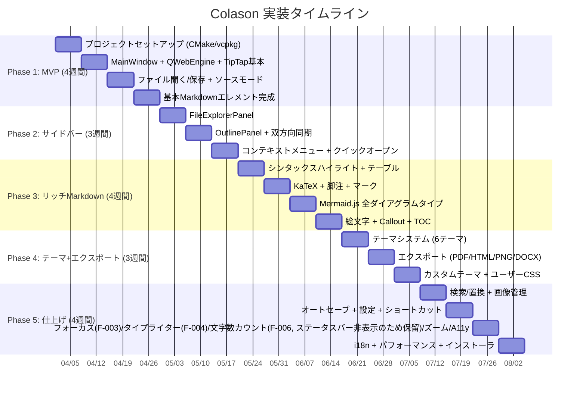

# Colason 機能詳細設計書

## 1. 概要

本書は、Colason (Typora風 WYSIWYG Markdownエディタ) の各機能の詳細設計を記述する。
アーキテクチャは C++ Qt6 + QWebEngine をベースとし、エディタエンジンには TipTap v2 (ProseMirror) を採用する。

各機能は要件定義書の要件IDに対応しており、以下のカテゴリに分類される。

| カテゴリ | 要件IDプレフィックス | 内容 |
|---|---|---|
| 基本機能 | F-001〜 | ファイル操作、編集、検索等 |
| Markdown要素 | M-001〜 | 見出し、リスト、テーブル、数式等 |
| ダイアグラム | D-001〜D-013 | Mermaid.js連携 |
| ナビゲーション | N-001〜 | エクスプローラ、目次パネル |
| ファイル管理 | FM-001〜 | オートセーブ、画像管理等 |
| エクスポート | E-001〜 | PDF/HTML/PNG/DOCX出力 |
| テーマ | T-001〜 | テーマシステム、カスタムCSS |

### 1.2 本書で未カバーの要件

以下の要件は本書では詳細設計を省略し、実装フェーズで対応する:

- **M-102, M-103**: js-sequence / flowchart.js互換 → Mermaid.jsの同等機能で代替検討
- **M-109**: インラインHTML → TipTapのHTMLサポートで対応
- **FM-007**: 内部ファイルリンク → Phase 5で実装
- **E-006**: インポート (.docx/.tex) → Pandoc連携、Phase 5で実装
- **NF-001〜NF-008**: 非機能要件 → 各フェーズで段階的に対応。パフォーマンス最適化はPhase 5で集中対応

---

## 2. エディタエンジン設計

### 2.1 TipTap構成

Colasonのエディタエンジンは、以下の構成で動作する。

- **TipTap v2** + **ProseMirror Core** をWYSIWYGエディタとして採用
- エディタは `QWebEngineView` 内の `index.html` にロードされる
- ビルドパイプライン:
  - **Vite** でTypeScript/CSSをバンドル
  - 出力先: `editor/dist/`
  - **本番ビルド**: Qt QRC (Qt Resource System) に埋め込み、`qrc:///editor/index.html` でアクセス
  - **開発ビルド**: ファイルシステムから直接ロード (`file:///` or Vite devサーバー)

### 2.2 TipTap拡張一覧

以下のTipTap拡張を使用し、Markdownの各要素に対応する。

| 拡張名 | 種類 | 対応要件 | 説明 | 状態 |
|---|---|---|---|---|
| StarterKit | 公式 | F-001 | 基本テキスト編集 (太字/斜体/リスト等) | **実装済み** |
| Heading | 公式 | M-001 | 見出し (levels: [1,2,3,4,5,6]) | **実装済み** |
| Table | 公式 | M-011 | GFMテーブル (resizable) | **実装済み** |
| TaskList / TaskItem | 公式 | M-004 | タスクリスト + チェックボックス (nested対応) | **実装済み** |
| CodeBlockLowlight | 公式 | M-006, M-007 | シンタックスハイライト付きコードブロック (lowlight/common) | **実装済み** |
| Image | 公式 | M-010 | 画像挿入・表示 (base64対応) | **実装済み** |
| Link | 公式 | M-010 | ハイパーリンク (autolink有効) | **実装済み** |
| Underline | 公式 | - | 下線 | **実装済み** |
| Subscript | 公式 | M-105 | 下付き文字 | **実装済み** |
| Superscript | 公式 | M-105 | 上付き文字 | **実装済み** |
| Highlight | 公式 | M-106 | ハイライト | **実装済み** |
| Placeholder | 公式 | - | 空エディタ時のプレースホルダ ("Start writing...") | **実装済み** |
| Typography | 公式 | - | スマート引用符等 | **実装済み** |
| MermaidBlock | **カスタム** | D-001〜D-013 | Mermaidダイアグラムノード | **実装済み** |
| KaTeXBlock | **カスタム** | M-100 | ブロック数式 ($$...$$) | **実装済み** |
| KaTeXInline | **カスタム** | M-100 | インライン数式 ($...$) | **実装済み** |
| FootnoteExtension | **カスタム** | M-012 | 脚注 | 未実装 |
| EmojiExtension | **カスタム** | M-107 | :emoji: オートコンプリート | 未実装 |
| CalloutBlock | **カスタム** | M-108 | > [!NOTE] 等のコールアウト | 未実装 |
| YAMLFrontMatter | **カスタム** | M-013 | YAML Front Matter表示 | 未実装 |
| TOCExtension | **カスタム** | M-104 | [toc]タグの自動目次生成 | 未実装 |
| ImageExtended | **カスタム** | FM-005 | ドラッグ&ドロップ、クリップボード貼り付け | 未実装 |

### 2.3 Markdownシリアライザ設計 (実装済み: `editor/src/source-mode.ts`)

ProseMirror Document と Markdown文字列の双方向変換を、カスタム軽量パーサー/シリアライザで実現する。

> **注**: `markdown-it` / `prosemirror-markdown` は使用せず、`source-mode.ts` 内の `simpleMarkdownToHtml()` と `htmlToSimpleMarkdown()` で直接変換を行う。

**Markdown → HTML → ProseMirror Document (パース)**

- `simpleMarkdownToHtml(md)`: Markdown文字列をHTMLに変換するカスタム関数
  - 見出し、コードブロック (言語指定対応)、引用、リスト (UL/OL/タスクリスト)、テーブル、水平線に対応
  - インライン書式: 太字、斜体、取り消し線、コード、マーク、上付き/下付き、リンク、画像
- TipTapの `editor.commands.setContent(html)` でProseMirror Documentに変換

**ProseMirror Document → HTML → Markdown (シリアライズ)**

- `htmlToSimpleMarkdown(html)`: TipTapのHTML出力をMarkdownに変換するカスタム関数
  - DOMParserでHTMLをパースし、`nodeToMarkdown()` で再帰的にMarkdownに変換
  - カスタムノードのシリアライズルール:
    - `<div data-type="mermaid-block">` → ` ```mermaid ... ``` `
    - `<pre><code class="language-xxx">` → ` ```xxx ... ``` `
    - `<mark>` → `==text==`
    - `<sup>` / `<sub>` → `^text^` / `~text~`
    - `<u>` → `<u>text</u>` (HTMLフォールバック)
    - テーブル → GFM形式テーブル

**ファイルI/Oとの統合**

- ファイル読み込み時: `colasonAPI.setContent()` がMarkdownかHTMLかを自動判定し、Markdownなら `simpleMarkdownToHtml()` で変換後にTipTapへ設定
- ファイル保存時: C++側が `colasonAPI.getMarkdown()` を非同期JS呼び出しし、`htmlToSimpleMarkdown()` で変換されたMarkdownをファイルに保存
- ソースモード切替: WYSIWYG→ソースは `htmlToSimpleMarkdown(editor.getHTML())`、ソース→WYSIWYGは `simpleMarkdownToHtml(cmText)` で変換

**変換の正確性保証**

- ラウンドトリップテスト: Markdown → HTML → Markdown で元の文字列と概ね一致することを検証
- GFM (GitHub Flavored Markdown) 互換性を優先

### 2.4 ソースモード (CodeMirror 6) (F-002)

TipTap WYSIWYGモードに加え、CodeMirror 6によるソースモードを提供する。

**構成**

- **CodeMirror 6** with `lang-markdown` 拡張
- シンタックスハイライト、行番号表示、括弧マッチ対応
- TipTapと同じ `QWebEngineView` 内に配置 (表示切替)

**切替フロー**

- `Ctrl+/` でTipTap WYSIWYG モード と CodeMirror ソースモード を切替
- WYSIWYG → ソース: `htmlToSimpleMarkdown(editor.getHTML())` でMarkdown文字列を取得 → CodeMirrorに設定
- ソース → WYSIWYG: CodeMirrorのテキストを取得 → `simpleMarkdownToHtml()` でHTMLに変換 → TipTapに反映
- 切替時にカーソル位置を可能な限り保持
- ファイル読み込み時は `simpleMarkdownToHtml()` でMarkdownをHTMLに変換してからTipTapにセットする (bridge.ts の setContent で自動判定)

**キーバインドモード** (実装済み: `editor/src/keybindings.ts`)

- `'default'` - 標準CodeMirrorキーバインド
- `'vim'` - Vimキーバインド (`@replit/codemirror-vim` 使用)
- `'emacs'` - Emacsキーバインド (基盤あり、未実装)

C++側から `setKeybinding(mode)` でランタイム切替可能。

### 2.5 Markdownペーストハンドラ (実装済み)

クリップボードからプレーンテキストを貼り付ける際、Markdownパターンを検出して自動的にWYSIWYG要素に変換する。

**検出対象パターン**

- `# ` 見出し (ATX形式)
- ` ``` ` コードブロック (フェンス)
- `- ` / `* ` / `+ ` 箇条書きリスト
- `1. ` 番号付きリスト
- `> ` 引用ブロック
- `[text](url)` リンク
- `---` / `***` / `___` 水平線
- `|...|` テーブル
- `**bold**` 太字
- `` 画像

**処理フロー**

1. `paste` イベントをキャッチ
2. `text/html` がクリップボードにあればTipTapのデフォルト処理に委譲
3. `text/plain` のみの場合、`looksLikeMarkdown()` でパターン検出
4. Markdownと判定されたら `simpleMarkdownToHtml()` でHTML変換 → `editor.commands.insertContent()` で挿入

---

## 3. Mermaid.js連携設計 (独自要件)

### 3.1 レンダリングパイプライン

ユーザーがMermaidコードブロックを入力してからレンダリング結果が表示されるまでのフローを以下に示す。



**処理の詳細**

1. ユーザーが ` ```mermaid ` で始まるコードブロックを入力
2. CodeBlockLowlightが通常のコードブロックとして検出する
3. **ProseMirror `appendTransaction` プラグイン**が `language: 'mermaid'` のコードブロックを検知し、自動的に `mermaidBlock` ノードに変換
4. MermaidBlock拡張のNodeViewがコード内容を抽出
5. **300msのデバウンス**を適用し、連続入力時の不要なレンダリングを抑制
6. `mermaid.render()` を実行してSVGを生成
7. 生成されたSVGをNodeView内のプレビュー領域に挿入
8. 構文エラー発生時は、エラーメッセージをコードブロック下部に赤字で表示

> **注**: HTMLパース時 (`setContent` やファイル読み込み時) は、MermaidBlockの `parseHTML` が `<pre><code class="language-mermaid">` と `<div data-type="mermaid-block">` の両方を認識する。`priority: 101` により CodeBlockLowlight (priority: 100) より先に評価される。

### 3.2 MermaidBlock TipTap拡張設計 (実装済み: `editor/src/extensions/mermaid-block.ts`)

```typescript
import { Node, mergeAttributes } from '@tiptap/core';
import { Plugin, PluginKey } from '@tiptap/pm/state';
import mermaid from 'mermaid';

const mermaidConvertPluginKey = new PluginKey('mermaidConvert');

const MermaidBlock = Node.create({
    name: 'mermaidBlock',
    group: 'block',
    atom: true,          // テキストコンテンツを持たないアトムノード
    defining: true,
    priority: 101,       // CodeBlockLowlight (100) より高い優先度

    addAttributes() {
        return {
            code: {
                default: 'graph TD\n    A-->B',
                parseHTML: (element: HTMLElement) => {
                    // <div data-type="mermaid-block"> からの読み込み
                    if (element.getAttribute('data-type') === 'mermaid-block') {
                        return element.getAttribute('code') || element.textContent || '';
                    }
                    // <pre><code class="language-mermaid"> からの読み込み
                    const code = element.querySelector('code');
                    return code?.textContent || element.textContent || '';
                },
            },
        };
    },

    parseHTML() {
        return [
            { tag: 'div[data-type="mermaid-block"]' },
            {
                tag: 'pre',
                getAttrs(node) {
                    const el = node as HTMLElement;
                    const code = el.querySelector('code');
                    if (code?.classList.contains('language-mermaid')
                        || el.getAttribute('data-language') === 'mermaid') {
                        return {};
                    }
                    return false;
                },
            },
        ];
    },

    renderHTML({ HTMLAttributes }) {
        return ['div', mergeAttributes(HTMLAttributes, { 'data-type': 'mermaid-block' })];
    },

    // CodeBlock (language: 'mermaid') を自動的に MermaidBlock に変換するプラグイン
    addProseMirrorPlugins() {
        const mermaidBlockType = this.type;
        return [
            new Plugin({
                key: mermaidConvertPluginKey,
                appendTransaction(transactions, _oldState, newState) {
                    if (!transactions.some(tr => tr.docChanged)) return null;
                    let tr = newState.tr;
                    let changed = false;
                    newState.doc.descendants((node, pos) => {
                        if (node.type.name === 'codeBlock' && node.attrs.language === 'mermaid') {
                            tr.replaceWith(pos, pos + node.nodeSize,
                                mermaidBlockType.create({ code: node.textContent }));
                            changed = true;
                            return false; // 位置ずれ防止のため最初の1つで停止
                        }
                    });
                    return changed ? tr : null;
                },
            }),
        ];
    },

    addNodeView() {
        return ({ node, getPos, editor }) => {
            // DOM構造:
            //   <div class="mermaid-block" data-type="mermaid-block">
            //     <textarea class="mermaid-code">  ← コードエディタ領域
            //     <div class="mermaid-preview">     ← SVGプレビュー領域
            //     <div class="mermaid-error">       ← エラー表示領域
            //   </div>

            // 初期表示: コード非表示、プレビューのみ表示
            // クリック時: コード表示 + プレビュー
            // blur時: コード非表示に戻る

            // コード変更時 (300msデバウンス):
            //   mermaid.render(uniqueId, code)
            //     .then(({ svg }) => { preview.innerHTML = svg; })
            //     .catch((err) => { error.textContent = err.message; });

            // キーボードイベントは stopPropagation() で TipTap への伝播を防止
        };
    },
});
```

**NodeViewの動作モード**

| 状態 | コード領域 | プレビュー領域 | 説明 |
|---|---|---|---|
| フォーカス時 | 表示 | 表示 | コード編集とプレビューを同時に確認 |
| 非フォーカス時 | 非表示 | 表示 | レンダリング結果のみ表示 |
| エラー時 | 表示 | 非表示 (エラー表示) | 構文エラーメッセージを表示 |

### 3.3 対応ダイアグラムタイプ (D-001〜D-010)

以下のMermaidダイアグラムタイプに対応する。

| 要件ID | ダイアグラムタイプ | Mermaid構文 | 説明 |
|---|---|---|---|
| D-001 | フローチャート | `flowchart TD/LR` (`graph TD/LR`) | フローチャート (上下/左右方向) |
| D-002 | シーケンス図 | `sequenceDiagram` | メッセージの送受信フロー |
| D-003 | ガントチャート | `gantt` | プロジェクトスケジュール |
| D-004 | クラス図 | `classDiagram` | UMLクラス図 |
| D-005 | 状態遷移図 | `stateDiagram-v2` | 状態マシン |
| D-006 | ER図 | `erDiagram` | エンティティリレーションシップ |
| D-007 | マインドマップ | `mindmap` | 階層構造の可視化 |
| D-008 | タイムライン | `timeline` | 時系列イベント |
| D-009 | パイチャート | `pie` | 円グラフ |
| D-010 | Gitグラフ | `gitGraph` | Gitブランチ/コミット履歴 |

### 3.4 Mermaid設定

```javascript
mermaid.initialize({
    startOnLoad: false,       // 手動レンダリング制御
    theme: 'default',         // テーマと同期 (後述)
    securityLevel: 'loose',   // HTMLラベル許可
    fontFamily: 'inherit',    // エディタフォントを継承
    flowchart: {
        htmlLabels: true,     // HTMLラベル使用
        curve: 'basis',       // 滑らかな曲線
    },
});
```

**セキュリティに関する注意事項**

- `securityLevel: 'loose'` を設定しているが、ユーザー自身のローカルドキュメントのみを対象とするため許容可能
- 外部ソースからのMermaidコードを自動実行しない

### 3.5 テーマ同期

Mermaidダイアグラムのテーマはエディタ全体のテーマと同期する。

| エディタテーマ | Mermaidテーマ |
|---|---|
| ライト系テーマ | `default` |
| ダーク系テーマ | `dark` |

**全6テーマでのスタイリング**

全6テーマ (Light, Dark, GitHub, Sepia, Nord, Dracula) の editorCSS に `mermaid-block`、`katex-block`、および `hljs` クラスのスタイルが含まれている。各テーマはそれぞれの配色に合わせた Mermaid / KaTeX / highlight.js のスタイル定義を提供する。

**同期メカニズム**

- `ThemeBridge` 経由でC++側のテーマ変更を検知
- テーマ変更時に `mermaid.initialize()` を新しいテーマ設定で再実行
- 既存のMermaidブロック全てを再レンダリング

### 3.6 SVGエクスポート (D-012)

Mermaidダイアグラムを個別にSVGまたはPNG形式でエクスポートする機能。

**エクスポートフロー**

1. ユーザーがダイアグラムのコンテキストメニューから「エクスポート」を選択
2. JS側: `XMLSerializer` でSVG DOM要素を文字列化
3. `EditorBridge.diagramExportReady(svgString, format)` でC++側に送信
4. C++側の処理:
   - **SVG形式**: SVG文字列をそのままファイルに保存
   - **PNG形式**: `QSvgRenderer` でSVGをパース → `QPainter` + `QImage` でラスタライズ → PNG保存

---

## 4. KaTeX連携設計

### 4.1 ブロック数式 ($$...$$)

**KaTeXBlock TipTap拡張**

- `$$` で囲まれたブロック数式を検出し、KaTeXでレンダリング
- NodeViewパターンはMermaidBlockと同様 (コード領域 + プレビュー領域)

**レンダリング処理**

```javascript
const html = katex.renderToString(code, {
    displayMode: true,      // ブロック数式モード (中央寄せ、大きいフォント)
    throwOnError: false,    // エラー時にフォールバック表示
    errorColor: '#cc0000',  // エラー箇所の色
});
```

**動作**

- フォーカス時: LaTeXソースコードを表示 (編集可能)
- 非フォーカス時: レンダリング結果のみ表示
- エラー時: KaTeXのエラー表示 (赤字の数式テキスト)

**テーマ対応**

全6テーマ (Light, Dark, GitHub, Sepia, Nord, Dracula) の editorCSS に `katex-block` クラスのスタイルが含まれており、各テーマの配色に合わせた数式表示を提供する。

### 4.2 インライン数式 ($...$)

**KaTeXInline TipTap拡張 (Inline Node)**

- 単一の `$` で囲まれたインライン数式を検出
- テキスト入力中に `$` デリミタを検出し自動変換

**レンダリング処理**

```javascript
const html = katex.renderToString(code, {
    displayMode: false,     // インライン数式モード
    throwOnError: false,
});
```

**自動変換ルール**

- InputRule: `$` + 数式テキスト + `$` を検出
- PasteRule: 貼り付けテキスト内のインライン数式も変換
- 逆方向変換: インライン数式ノードにカーソルを合わせるとLaTeXソースを表示

---

## 5. エクスプローラ・目次機能設計 (独自要件)

### 5.1 FileExplorerPanel (N-001, N-009, N-011)

ファイルエクスプローラパネルはQt C++側で実装する。

**UIコンポーネント**

- `QTreeView` + カスタム `FileSystemModel` (QFileSystemModel派生)
- Markdownファイル (`.md`, `.markdown`) をフィルタリング表示
- `QStackedWidget` によるページ切替:
  - **プレースホルダページ**: フォルダ未選択時に表示。「Open Folder...」ボタンでフォルダ選択ダイアログを起動
  - **エクスプローラページ**: フォルダ選択後のツリービュー表示
- フォルダ名ヘッダー: 選択中のフォルダ名を上部に表示

**FileIconProvider (カスタムアイコン)**

- `QAbstractFileIconProvider` を継承したカスタムアイコンプロバイダ
- SVG アイコンによるファイル種類の視覚的識別:
  - `file.svg`: 汎用ファイルアイコン
  - `file-text.svg`: テキスト/コードファイルアイコン (.md, .txt, .cpp 等)
  - `folder.svg`: フォルダアイコン (閉じた状態)
  - `folder-open.svg`: フォルダアイコン (開いた状態)

**ファイル監視**

- `QFileSystemWatcher` でフォルダ内のファイル変更 (追加/削除/変更) を監視
- 変更検知時にモデルを更新しツリーに反映

**ファイルオープン処理**

- ファイル選択時: `DocumentManager::openDocument(path)` → `EditorBridge::setContent(markdown)` でエディタに反映

**コンテキストメニュー**

- `QMenu` + `QAction` で以下の操作を提供:
  - 新規ファイル作成
  - 新規フォルダ作成
  - ファイル名変更
  - ファイル削除 (確認ダイアログ付き)
  - ファイルパスのコピー
  - OSのファイルマネージャで開く

**ドラッグ&ドロップ**

- `QAbstractItemView::DragDrop` モードで有効化
- ファイル/フォルダの移動をサポート
- 外部からのファイルドロップにも対応

### 5.2 OutlinePanel (N-003〜N-007)

ドキュメントの見出し構造を階層ツリーで表示する目次パネル。

**UIコンポーネント**

- `QTreeView` + `OutlineModel` (`QAbstractItemModel` 派生)
- 見出しレベル (H1〜H6) に応じたインデントで階層表示
- インデント: 12px
- `uniformRowHeights` 有効 (パフォーマンス向上)
- フォントサイズ: 12px

**データ受信**

- `OutlineBridge` 経由でJS側から `headingsChanged(jsonArray)` シグナルを受信
- JSON配列の各要素のフォーマット:

```json
{
    "id": "heading-abc123",
    "text": "見出しテキスト",
    "level": 2,
    "pos": 123
}
```

> `pos` はProseMirrorドキュメント内の位置 (整数) を示す。目次クリック時のスクロール先特定に使用する。

**階層ツリー構築アルゴリズム**

- level情報に基づき、親子関係を構築
- H1はルートノード、H2はH1の子、H3はH2の子... として配置
- 見出しレベルが飛んでいる場合 (例: H1 → H3) も適切にネスト

**見出しへのスクロール**

- 目次アイテムクリック時: `OutlineBridge::scrollToHeading(id)` → JS側で `editor.commands.scrollToHeading(id)` を実行
- スムーズスクロールで該当見出しへ移動

### 5.3 双方向スクロール同期

エディタのスクロールと目次パネルのハイライトを双方向で同期する。



**エディタスクロール → 目次ハイライト**

1. JS側: `IntersectionObserver` で現在ビューポート内の見出しを監視
2. 最上部に表示されている見出しのIDを `activeHeadingChanged(id)` で通知
3. C++側: 該当ノードをハイライト表示し、ツリーを自動展開

**目次クリック → エディタスクロール**

1. C++側: クリックされた見出しのIDを `scrollToHeading(id)` で送信
2. JS側: 該当要素までスムーズスクロール
3. スクロール完了後、`activeHeadingChanged` でフィードバック

**無限ループ防止**

- スクロール同期時にフラグを設定し、フィードバックによる再帰的なスクロールを抑制

### 5.4 目次フィルタリング (N-007)

**UI**

- `QLineEdit` を目次パネル上部に配置
- キーワード入力でリアルタイムフィルタリング

**フィルタリングロジック**

- `OutlineModel::setFilter(keyword)` で `QSortFilterProxyModel` を介したフィルタを適用
- 部分一致 (大文字/小文字区別なし) でマッチしないノードを非表示
- マッチしたノードの祖先ノードも表示 (階層構造を維持)
- フィルタクリア時 (空文字列) は全ノードを表示

---

## 6. エクスポートパイプライン設計

### 6.1 PDF出力 (E-001)



**実装詳細**

- `QWebEnginePage::printToPdf()` でChromiumのPDF出力機能を利用
- テーマCSSを含む完全なレンダリングをPDFに反映
- Mermaidダイアグラム、KaTeX数式もSVG/HTMLとして正確に出力

**PDF設定**

| 設定項目 | デフォルト値 | 説明 |
|---|---|---|
| ページサイズ | A4 | A4, Letter, Legal等 |
| 向き | 縦 | 縦 (Portrait) / 横 (Landscape) |
| 余白 | 20mm | 上下左右均等 |

**PDFアウトライン (ブックマーク)**

- H1/H2見出しからPDFアウトライン (しおり) を自動生成
- `QWebEnginePage` のPDF出力後、PDFライブラリでアウトラインを追加

### 6.2 HTML出力 (E-002, E-003)

**スタイル付きHTML (E-002)**

- テーマCSS + エディタHTML → 単一HTMLファイルとして出力
- CSSはインラインまたは `<style>` タグで埋め込み
- 外部リソース (画像等) は Base64エンコードで埋め込みまたは相対パス参照

**スタイルなしHTML (E-003)**

- 素のHTML (`<body>` 内のコンテンツのみ)
- テーマCSS適用なし
- JS側: `editor.getHTML()` でHTML取得 → Bridge → C++でファイル保存

### 6.3 PNG出力 (E-004)

**実装フロー**

1. HTMLコンテンツを一時的な `QWebEnginePage` にロード
2. ページ全体の高さを取得 (JavaScript経由)
3. `QWebEnginePage` を `QImage` にレンダリング
4. `QImage::save()` でPNG形式で保存

**設定**

- 解像度: 2x (Retinaディスプレイ相当) をデフォルト
- 幅: 設定可能 (デフォルト800px)

### 6.4 DOCX出力 (E-005)

**Pandoc外部プロセス経由**

- `QProcess` で Pandoc を起動
- Markdown → Pandoc → DOCX の変換パイプライン

**処理フロー**

1. エディタからMarkdown文字列を取得
2. 一時ファイルに書き込み
3. `QProcess` で `pandoc -f markdown -t docx -o output.docx input.md` を実行
4. 変換完了後、一時ファイルを削除

**Pandoc未インストール時**

- `QProcess::start()` が失敗した場合、エラーダイアログを表示
- ダイアログにPandocのインストール手順へのリンクを含める

---

## 7. オートセーブ・ドラフト復元設計

### 7.1 AutoSaveManager (FM-003)

**自動保存メカニズム**

- `QTimer` でインターバル実行 (デフォルト: 5分、設定で変更可能)
- `documentDirty` フラグが `true` の場合のみ保存を実行
- 保存対象: 既にファイルパスが確定しているドキュメントのみ (新規未保存ドキュメントは対象外)

**保存フロー**

1. タイマー発火
2. `documentDirty` チェック → `false` なら何もしない
3. `EditorBridge::getContent()` でMarkdown文字列を取得
4. C++側で `QFile` を使用してファイル書き込み
5. 保存完了後: `documentDirtyChanged(false)` シグナルを発行
6. コンソールログに記録

> **注記**: 保存形式はMarkdown。`colasonAPI.getMarkdown()` で `htmlToSimpleMarkdown()` を経由してMarkdown文字列を取得する。

### 7.2 DraftRecoveryManager (FM-004)

**ドラフト保存**

- ドラフト保存先: `~/.colason/drafts/` ディレクトリ
- 5秒ごとにダーティドキュメントのドラフトを一時ファイルとして保存
- ファイル名フォーマット: `{original-filename}-{timestamp}.md.draft`
- メタデータファイル (`.draft.meta`): 元ファイルパス、最終編集日時を記録

**復元フロー**

1. アプリ起動時: `~/.colason/drafts/` フォルダをスキャン
2. 未保存のドラフトが存在する場合、復元ダイアログを表示
3. ダイアログの選択肢:
   - **復元する**: ドラフト内容をエディタにロード
   - **破棄する**: ドラフトファイルを削除
   - **後で確認**: ダイアログを閉じ、次回起動時に再表示

**ドラフトのクリーンアップ**

- 正常保存完了時: 対応するドラフトを削除
- 正常終了時: 全ドラフトを削除
- 7日以上経過したドラフトは起動時に自動削除

---

## 8. 検索機能設計

### 8.1 ドキュメント内検索 (F-007)

**UI**

- `Ctrl+F`: エディタ上部にインライン検索バーを表示
- 検索バーコンポーネント:
  - 検索テキスト入力フィールド
  - オプションボタン: 大文字/小文字区別、正規表現、単語単位
  - 前へ / 次へ ナビゲーションボタン
  - マッチ件数表示 (例: "3/15")
  - 閉じるボタン (`Esc` でも閉じる)

**検索処理**

- `SearchBridge::find(text, options)` でJS側に検索リクエスト送信
- オプション:

```javascript
{
    caseSensitive: false,  // 大文字/小文字区別
    regex: false,          // 正規表現
    wholeWord: false,      // 単語単位
}
```

- JS側: TipTap検索拡張または ProseMirror Decoration でマッチ箇所をハイライト
- 現在のマッチ箇所は異なる色でハイライト (例: オレンジ背景 vs 黄色背景)
- 前へ / 次へ ボタンでマッチ間を移動

### 8.2 ドキュメント内置換 (F-007)

**UI**

- `Ctrl+H`: 検索バーに置換フィールドを追加表示
- 追加コンポーネント:
  - 置換テキスト入力フィールド
  - 「置換」ボタン (現在のマッチを置換して次へ移動)
  - 「全置換」ボタン (全マッチを一括置換)

**置換処理**

- JS側: ProseMirrorのトランザクションで置換を実行
- 正規表現モード時: キャプチャグループ (`$1`, `$2` 等) をサポート
- 全置換は単一のトランザクションで実行 (Undo一発で元に戻せる)

### 8.3 グローバル検索 (F-008)

**UI**

- `Ctrl+Shift+F`: サイドバーに検索パネルを表示
- 検索パネルコンポーネント:
  - 検索テキスト入力フィールド
  - ファイルフィルタ (glob パターン、例: `*.md`)
  - 除外フォルダ設定
  - 結果リスト (ファイル名 → マッチ行のツリー表示)

**検索処理 (C++側)**

- `QDirIterator` で対象フォルダを再帰的に走査
- 各ファイルの内容をテキスト検索
- 結果フォーマット: ファイル名、行番号、マッチ行のプレビュー

**結果表示**

- ファイルごとにグループ化して表示
- 各マッチ行にはキーワード周辺のコンテキストを表示
- マッチキーワードをハイライト
- 結果クリック: 該当ファイルを開き、該当行にカーソルを移動

---

## 9. 画像管理設計

### 9.1 画像挿入方法

Colasonは以下の3つの方法で画像を挿入できる。

| 方法 | 操作 | 説明 |
|---|---|---|
| ドラッグ&ドロップ | エディタにファイルをドロップ | ファイルシステムから直接 |
| クリップボード貼り付け | `Ctrl+V` | スクリーンショット等の画像データ |
| メニュー/ダイアログ | 挿入メニュー → 画像 | ファイル選択ダイアログ |

### 9.2 画像保存パス (FM-006)

**設定オプション**

| 設定 | 説明 | 例 |
|---|---|---|
| 相対パス (デフォルト) | ドキュメントからの相対パス | `assets/image.png` |
| 絶対パス | フルパス | `C:/Users/.../assets/image.png` |
| カスタムフォルダ | ユーザー指定のフォルダ | `~/images/colason/` |

**デフォルト動作**

- ドキュメントと同じフォルダの `assets/` サブフォルダに保存
- `assets/` フォルダが存在しない場合は自動作成
- ファイル名: 元のファイル名を保持 (クリップボード画像は `image-{timestamp}.png`)

**クリップボード画像の処理**

1. クリップボードからQImageを取得
2. PNG形式で `assets/` フォルダに保存
3. Markdownに相対パスを挿入: ``

### 9.3 画像ドロップ処理フロー



**詳細フロー**

1. ユーザーが画像ファイルをエディタ領域にドラッグ&ドロップ
2. JS側: ドロップイベントをキャッチし、元ファイルパスを `EditorBridge` 経由でC++に送信
3. C++側 `ImageManager`:
   - 設定に基づき画像を所定のフォルダにコピー
   - コピー先パスとalt テキスト (ファイル名から生成) を返却
4. JS側: `editor.commands.insertImage()` で画像ノードを挿入

**重複ファイル名の処理**

- 同名ファイルが存在する場合、サフィックスを追加: `image.png` → `image-1.png`

---

## 10. フェーズ別実装計画

以下のガントチャートに全体の実装タイムラインを示す。



**フェーズ概要**

| フェーズ | 期間 | 主要成果物 |
|---|---|---|
| Phase 1: MVP | 4週間 (04/01〜04/28) | 基本エディタ機能、ファイル操作、ソースモード |
| Phase 2: サイドバー | 3週間 (04/29〜05/19) | ファイルエクスプローラ、目次パネル |
| Phase 3: リッチMarkdown | 4週間 (05/20〜06/16) | Mermaid、KaTeX、全Markdown要素 |
| Phase 4: テーマ+エクスポート | 3週間 (06/17〜07/07) | テーマシステム、PDF/HTML/PNG/DOCXエクスポート |
| Phase 5: 仕上げ | 4週間 (07/08〜08/04) | 検索、画像管理、フォーカスモード (F-003)、タイプライターモード (F-004)、文字数カウント (F-006, ステータスバー非表示のため保留)、i18n、パフォーマンス最適化 |

---

## 10.5 DWM タイトルバーテーマ連動 (実装済み)

テーマ変更時に Windows DWM API でタイトルバーの背景色・テキスト色を自動切替する。

- `DWMWA_CAPTION_COLOR` (35): タイトルバー背景色
- `DWMWA_TEXT_COLOR` (36): タイトルバーテキスト色
- `DWMWA_USE_IMMERSIVE_DARK_MODE`: ダークモードフラグ

各テーマに対応する色は `MainWindow::applyTheme()` で設定。

---

## 11. テスト戦略

### 11.1 C++ユニットテスト

**テストフレームワーク**: Google Test (GTest)

**テスト対象クラス**

| クラス | テスト内容 |
|---|---|
| DocumentManager | ファイル読み込み/書き込み、文字コード検出、ダーティ状態管理 |
| FileManager | ファイルパス解決、一時ファイル管理、ファイル監視 |
| ThemeManager | テーマ切替、CSSロード、設定の永続化 |
| SearchManager | グローバル検索、ファイルフィルタリング、正規表現検索 |
| AutoSaveManager | タイマー動作、保存トリガー条件 |
| DraftRecoveryManager | ドラフト保存/読み込み/削除、メタデータ管理 |
| ExportManager | エクスポート設定、ファイル出力 |
| ImageManager | 画像コピー、パス解決、重複ファイル名処理 |
| OutlineModel | 階層ツリー構築、フィルタリング |

### 11.2 JSユニットテスト

**テストフレームワーク**: Vitest

**テスト対象**

| 対象 | テスト内容 |
|---|---|
| TipTap拡張 (各カスタム拡張) | ノード作成、属性設定、NodeView動作 |
| Markdownシリアライザ | Markdown → ProseMirror Doc 変換の正確性 |
| Markdownデシリアライザ | ProseMirror Doc → Markdown 変換の正確性 |
| ラウンドトリップ | Markdown → ProseMirror → Markdown の一致性 |
| MermaidBlock | レンダリング呼び出し、エラーハンドリング、デバウンス |
| KaTeXBlock / KaTeXInline | 数式レンダリング、エラーフォールバック |
| SearchBridge | 検索/置換のマッチング、ハイライト |

### 11.3 統合テスト

**QWebEngineブリッジ通信テスト**

- C++ → JS: `EditorBridge::setContent()` でMarkdownを設定し、正しくレンダリングされることを検証
- JS → C++: エディタ操作がBridge経由でC++側に正しく通知されることを検証
- 双方向: テーマ変更、見出し同期、検索等の双方向通信

**エンドツーエンドフローテスト**

| テストケース | フロー |
|---|---|
| ファイル操作 | ファイル開く → 編集 → 保存 → 再度開く → 内容一致確認 |
| Mermaidレンダリング | Mermaidコード入力 → SVGレンダリング確認 → エクスポート |
| エクスポート | ドキュメント作成 → PDF/HTML/PNG出力 → 出力ファイル検証 |
| オートセーブ | 編集 → タイマー発火 → 自動保存 → ファイル内容確認 |
| ドラフト復元 | 編集 → アプリ強制終了 → 再起動 → 復元ダイアログ → 内容復元確認 |
| 目次同期 | 見出し入力 → 目次更新確認 → 目次クリック → スクロール確認 |
