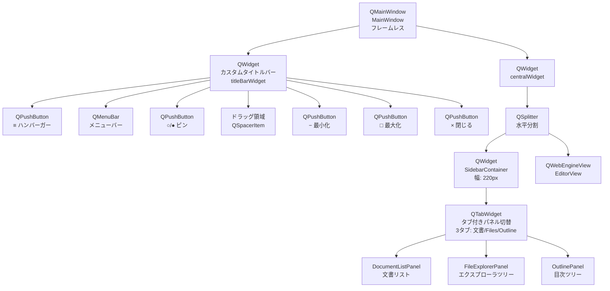
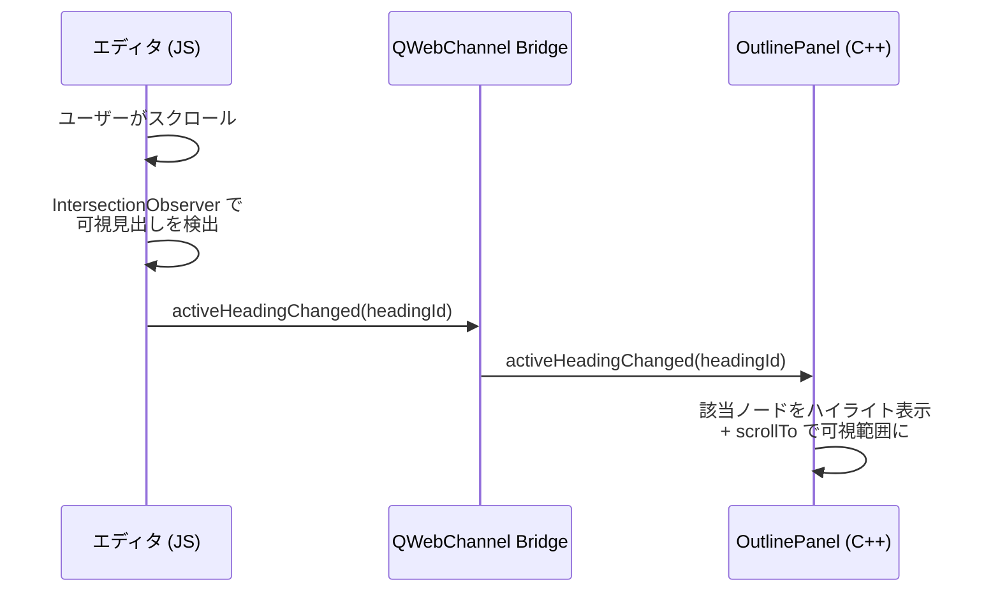
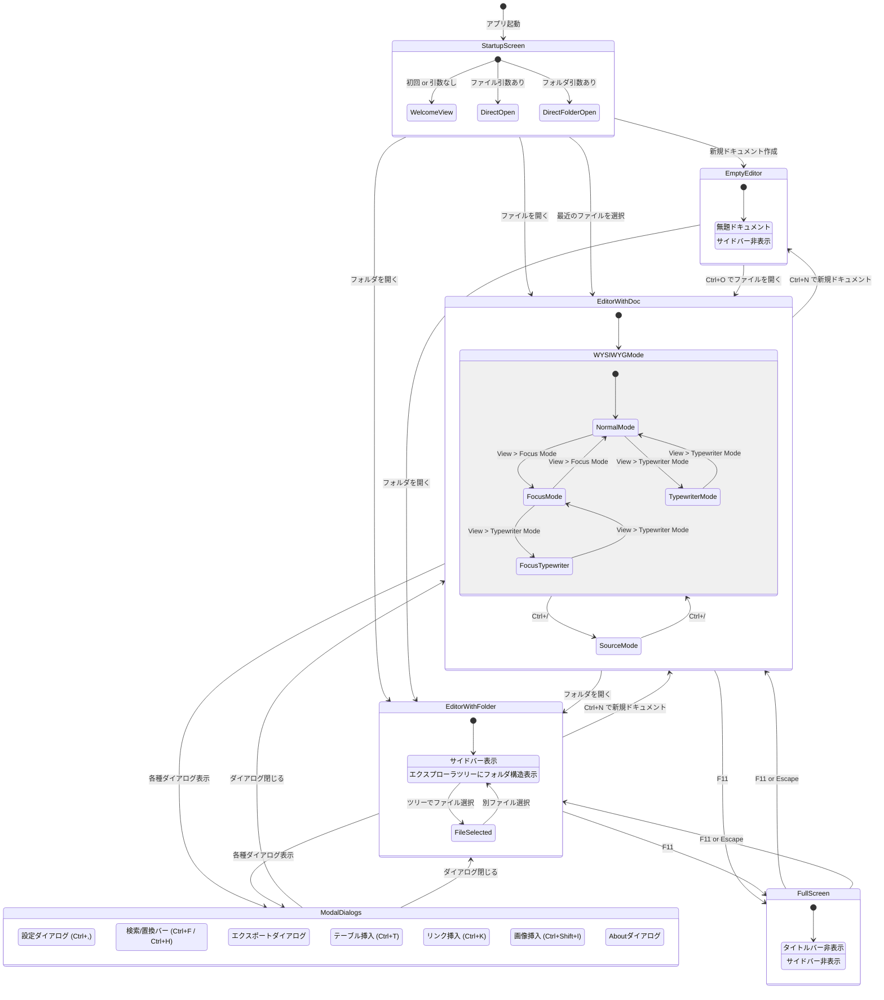
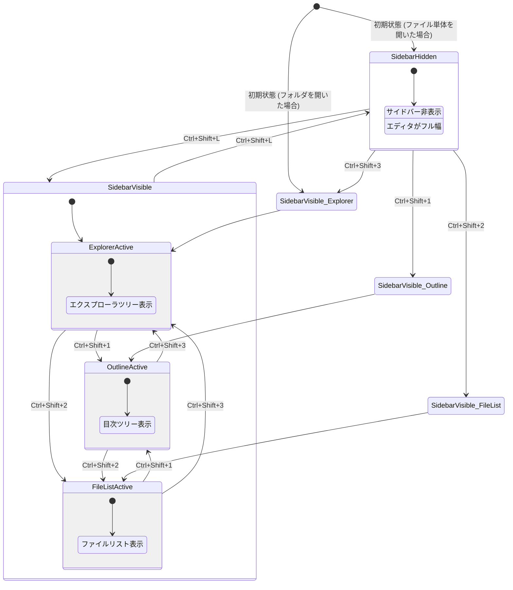
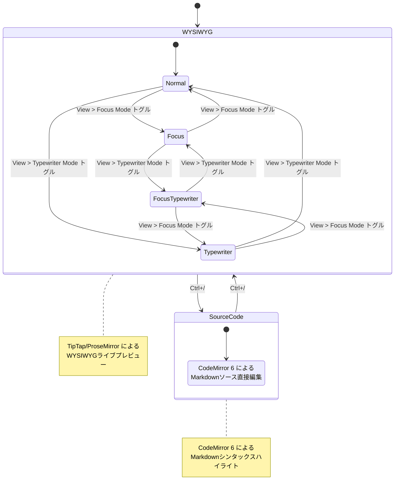
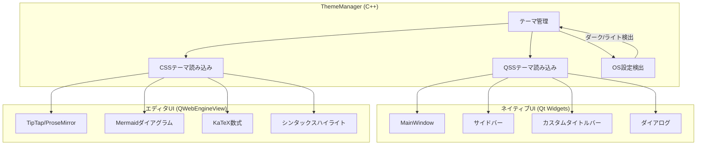
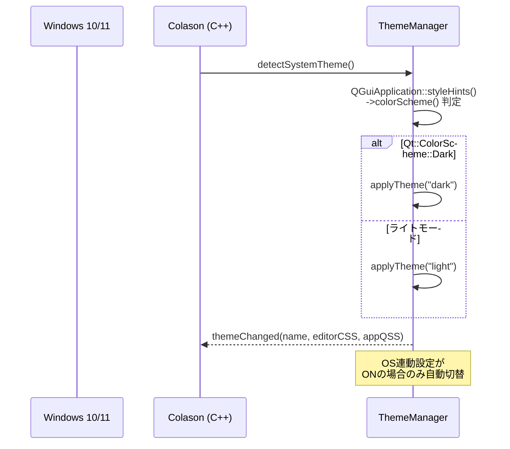
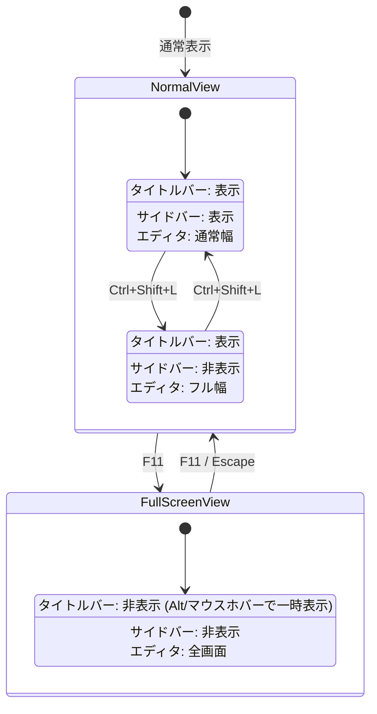
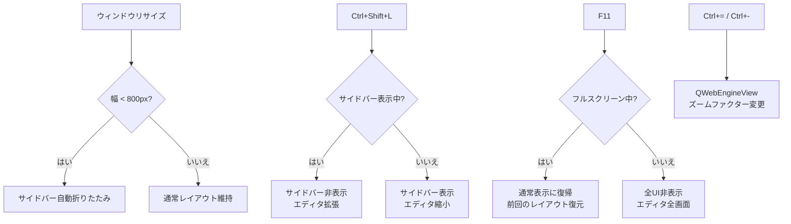

# Colason - UI設計書

> Typora互換 WYSIWYGマークダウンエディタのUI仕様

---

## 1. UI概要

### 1.1 設計思想

ColasonのUIは**Typoraの外観を完全に踏襲**する。以下の原則に基づいて設計する。

- **クリーン＆ミニマル**: 不要な装飾を排除し、エディタ中心のデザインとする
- **コンテンツファースト**: ドキュメント編集に集中できるよう、UIクロムを最小限に抑える
- **シームレスな切替**: WYSIWYG/ソースコード/フォーカス/タイプライターの各モードをスムーズに遷移
- **ネイティブ統合**: Qt Widgetsによるプラットフォームネイティブな操作感を提供
- **カスタマイズ性**: テーマ、フォント、ショートカット等をユーザーが自由に変更可能

### 1.2 構成技術

| 領域 | 技術 | 担当範囲 |
|------|------|----------|
| ネイティブUI | Qt6 Widgets + QSS + DWM API | MainWindow、サイドバー、カスタムタイトルバー（メニューバー＋ウィンドウコントロール）、ダイアログ |
| エディタUI | QWebEngineView + TipTap/ProseMirror | WYSIWYG編集、Markdown描画、ダイアグラム、数式 |
| ブリッジ | QWebChannel | C++ ↔ JavaScript 双方向UI状態同期 |

---

## 2. メインウィンドウレイアウト

### 2.1 全体構成図（ASCII Art）

```
┌──────────────────────────────────────────────────────────────┐
│  カスタムタイトルバー                                          │
│  [≡] File | Edit | Paragraph | Format | View | Help  [○]  ― □ × │
├────────┬─────────────────────────────────────────────────────┤
│ サイド  │                                                     │
│ バー    │         エディタエリア                                │
│ (220px) │                                                     │
│         │         QWebEngineView                              │
│ [+] タブ│                                                     │
│  バー   │         TipTap/ProseMirror WYSIWYG                  │
│         │                                                     │
│ ファイル│         - 見出し (H1〜H6)                            │
│ ツリー  │         - 段落・リスト                               │
│         │         - コードブロック (シンタックスハイライト)      │
│   or    │         - Mermaidダイアグラム                        │
│         │         - 数式 (KaTeX)                               │
│ 目次    │         - テーブル                                   │
│ ツリー  │         - 画像                                       │
│         │         - 引用・タスクリスト                          │
│   or    │         - 脚注・水平線                               │
│         │                                                     │
│ ファイル│                                                     │
│ リスト  │                                                     │
│         │                                                     │
└────────┴─────────────────────────────────────────────────────┘
```

> **注記**: Windowsネイティブタイトルバーは非表示。カスタムタイトルバー (titleBarWidget) がフレームレスウィンドウの上端に配置される（空き領域ドラッグでウィンドウ移動、ダブルクリックで最大化/復元）。

### 2.2 ウィジェット階層図



> **注記**: Windowsネイティブタイトルバーは `WM_NCCALCSIZE` ハンドリングで除去。`DwmExtendFrameIntoClientArea` でウィンドウシャドウを維持。`WM_NCHITTEST` でリサイズ境界・ドラッグ領域を制御。ウィンドウ制御ボタンのアイコンには Segoe MDL2 Assets フォントを使用。

### 2.3 レイアウト詳細

| コンポーネント | ウィジェット | 配置 | サイズ |
|----------------|-------------|------|--------|
| カスタムタイトルバー | QWidget (titleBarWidget) | ウィンドウ上端 | 高さ: 32px |
| ハンバーガーボタン | QPushButton (≡) | タイトルバー左端 | 46x32px |
| メニューバー | QMenuBar | タイトルバー (ハンバーガーの右) | 幅: コンテンツ依存 |
| ピンボタン | QPushButton (○/●) | メニューバーの右 | 32x32px |
| ウィンドウ制御ボタン | QPushButton (−/□/×) | タイトルバー右端 | 各46x32px |
| サイドバー | QWidget + QSplitter左 | 左側 | 幅: 220px (デフォルト)、最小: 160px、最大: 400px |
| エディタエリア | QWebEngineView + QSplitter右 | 右側 | 幅: 残り全域 (flex) |
| メイン分割 | QSplitter (Horizontal) | 中央 | サイドバーとエディタを水平分割 |

### 2.4 ウィンドウタイトル表示

Typoraと同様、タイトルバーにはアプリ名を表示せず、ファイル名のみを表示する。

| 状態 | タイトル表示 | 例 |
|------|-------------|-----|
| 新規ドキュメント | `untitled` | `untitled` |
| ファイルオープン済み | `{filename}` | `README.md` |
| 未保存変更あり | `* {filename}` | `* README.md` |

### 2.5 DWM タイトルバー色テーマ連動

Windows DWM API (`DWMWA_CAPTION_COLOR`, `DWMWA_TEXT_COLOR`, `DWMWA_USE_IMMERSIVE_DARK_MODE`) を使用して、テーマ変更時にタイトルバーの背景色・テキスト色を連動させる。

| テーマ | キャプション色 | テキスト色 | ダークモード |
|--------|-------------|-----------|------------|
| light | #fafbfc | #24292e | OFF |
| dark | #2b2b2b | #bbbbbb | ON |
| github | #24292f | #ffffff | ON |
| sepia | #d6c9a8 | #3d2b1f | OFF |
| nord | #2e3440 | #d8dee9 | ON |
| dracula | #21222c | #f8f8f2 | ON |

### 2.6 QSplitter設定


```cpp
// MainWindow コンストラクタ内
QSplitter* splitter = new QSplitter(Qt::Horizontal, this);
splitter->addWidget(sidebarContainer);  // 左: サイドバー
splitter->addWidget(editorView);        // 右: エディタ
splitter->setSizes({220, 1000});        // 初期幅
splitter->setCollapsible(0, true);      // サイドバー折りたたみ可
splitter->setCollapsible(1, false);     // エディタは折りたたみ不可
splitter->setHandleWidth(1);            // 境界線1px
setCentralWidget(splitter);
```

---

## 3. サイドバー設計

### 3.1 サイドバーコンテナ (SidebarContainer)

#### 構造

```
┌────────────────┐
│ [文書][Files][Outline] │ ← QTabBar (表示状態、テキストラベル)
├────────────────┤
│                  │
│  各パネル         │ ← QTabWidgetの内部QStackedWidget
│  (DocumentList   │    タブ切替でパネル変更
│   / FileExplorer │
│   / Outline)     │
│                  │
└────────────────┘
```

#### タブバー仕様

タブバーは**表示状態**で、上部に3タブを水平配置する (QTabWidget + QTabWidget::North)。documentMode有効。

| タブ | ラベル | インデックス | パネル |
|------|--------|-------------|--------|
| 文書 | "文書" | 0 | DocumentListPanel |
| Files | "Files" | 1 | FileExplorerPanel |
| Outline | "Outline" | 2 | OutlinePanel |

#### サイドバー表示制御

| 操作 | ショートカット | 動作 |
|------|---------------|------|
| サイドバー表示/非表示トグル | Ctrl+Shift+L | サイドバー全体の表示/非表示をアニメーション付きで切替 |
| パネル切替 | Ctrl+Shift+1/2/3 | サイドバーが非表示の場合は表示してから該当パネルに切替 |

### 3.2 エクスプローラツリー (FileExplorerPanel)

#### 全体構造

QStackedWidgetによる2ページ構成:

| ページ | インデックス | 表示条件 |
|--------|-------------|---------|
| プレースホルダ | 0 | フォルダ未オープン時 (初期状態) |
| エクスプローラ | 1 | フォルダオープン後 |

#### レイアウト (プレースホルダページ)

```
┌────────────────────────┐
│                          │
│   No folder opened       │ ← QLabel (#filePlaceholder)
│                          │
│   [Open Folder...]       │ ← QPushButton (#openFolderBtn, 幅140px固定)
│                          │
│                          │
└────────────────────────┘
```

- マージン: 20, 40, 20, 20
- テキスト中央揃え、ワードラップ有効
- ボタンクリック → `openFolderRequested` シグナル発火

#### レイアウト (エクスプローラページ)

```
┌────────────────────────┐
│ PROJECTNAME              │ ← QLabel (#folderHeader) フォルダ名を大文字表示
├────────────────────────┤
│ > src/                  │ ← QTreeView + QFileSystemModel
│   > components/         │    カスタムFileIconProvider使用
│     main.md        ●    │ ← ● = 現在開いているファイル
│     readme.md           │
│   > docs/               │
│     guide.md            │
│   > images/             │
│     photo.png           │
│ > tests/                │
│   test_parser.md        │
│ notes.md                │
│ TODO.md                 │
└────────────────────────┘
```

#### フォルダヘッダー仕様

| 要素 | 説明 |
|------|------|
| フォルダ名 | QLabel (#folderHeader)。現在のルートフォルダ名を`toUpper()`で大文字表示 |
| マージン | 10, 6, 10, 6 |
| スタイル | QSSで制御 (font-size: 11px, font-weight: 700, letter-spacing: 1px) |

#### カスタムアイコン (FileIconProvider)

`QAbstractFileIconProvider` のサブクラスとしてSVGアイコンを提供する。

| アイコン | リソースパス | 対象 | 色 |
|---------|-------------|------|-----|
| file.svg | `:/icons/file.svg` | バイナリ等のその他ファイル | グレー |
| file-text.svg | `:/icons/file-text.svg` | テキスト系ファイル | ブルー |
| folder.svg | `:/icons/folder.svg` | フォルダ (閉じ) | ゴールド |
| folder-open.svg | `:/icons/folder-open.svg` | フォルダ (開き) | ゴールド |

**テキストファイル判定**: 以下の拡張子は `file-text.svg` (ブルーアイコン) を使用:
`.md`, `.markdown`, `.txt`, `.json`, `.yaml`, `.yml`, `.toml`, `.xml`, `.html`, `.css`, `.js`, `.ts`, `.cpp`, `.h`, `.py`, `.rs`, `.go`, `.java`

#### ツリービュー仕様

| 項目 | 仕様 |
|------|------|
| ウィジェット | QTreeView + QFileSystemModel + カスタムFileIconProvider |
| インデンテーション | 12px |
| ブランチインジケータ | カスタムSVGシェブロン (chevron-right/down-dark/light.svg、テーマによりQSSで切替) |
| ヘッダー | 非表示 (名前列のみ表示、サイズ/種類/日付列は非表示) |
| uniformRowHeights | 有効 |
| アニメーション | 有効 |
| 選択モード | SingleSelection |
| 編集トリガー | NoEditTriggers |
| フォーカスポリシー | NoFocus |
| フィルタ | AllDirs + Files + NoDotAndDotDot |
| クリック | ファイルクリックで `fileSelected` シグナル発火 |

#### コンテキストメニュー

| メニュー項目 | ショートカット | 動作 |
|-------------|---------------|------|
| 新規ファイル | - | 選択フォルダ内に新規.mdファイル作成 |
| 新規フォルダ | - | 選択フォルダ内にサブフォルダ作成 |
| --- | - | セパレータ |
| ファイル名変更 | F2 | インライン編集モードでリネーム |
| 削除 | Delete | 確認ダイアログ後にごみ箱へ移動 |
| --- | - | セパレータ |
| エクスプローラで表示 | - | OSのファイルエクスプローラで該当パスを開く |
| パスをコピー | - | ファイルの絶対パスをクリップボードへ |
| 相対パスをコピー | - | ルートフォルダからの相対パスをクリップボードへ |
| --- | - | セパレータ |
| コピー | Ctrl+C | ファイルをクリップボードにコピー |
| 貼り付け | Ctrl+V | クリップボードのファイルを貼り付け |

### 3.3 目次（アウトライン）ツリー (OutlinePanel)

#### レイアウト

```
┌────────────────────────┐
│ [検索...            ]   │ ← フィルタ入力欄 (QLineEdit)
├────────────────────────┤
│ H1 はじめに         ●   │ ← ● = 現在スクロール位置の見出し
│   H2 背景               │    QTreeWidget
│   H2 目的               │
│ H1 設計方針              │
│   H2 アーキテクチャ      │
│     H3 フロントエンド    │
│     H3 バックエンド      │
│   H2 データモデル        │
│ H1 実装                  │
│   H2 Phase 1            │
│   H2 Phase 2            │
│ H1 まとめ               │
└────────────────────────┘
```

#### フィルタ入力欄

| 項目 | 仕様 |
|------|------|
| ウィジェット | QLineEdit (プレースホルダ: "見出しを検索...") |
| フィルタ動作 | インクリメンタルサーチ。キーワードに部分一致する見出しのみ表示 |
| クリアボタン | 入力欄右端の x ボタンで検索文字列をクリア |
| フィルタ対象 | 見出しテキストの部分一致 (大文字小文字区別なし) |

#### ツリービュー仕様

| 項目 | 仕様 |
|------|------|
| ウィジェット | QTreeWidget (QTreeWidgetItem ベースのスタック構築) |
| 階層構造 | H1をルートレベル、H2をH1の子、H3をH2の子... と階層表示 |
| インデンテーション | 12px |
| uniformRowHeights | 有効 |
| フォントサイズ | 12px (QSSで制御) |
| ブランチインジケータ | カスタムSVGシェブロン (テーマにより dark/light 切替) |
| 現在位置ハイライト | `setActiveHeading(id)` で該当ノードを選択状態 + scrollToItem |
| クリック遷移 | 見出しクリックで `headingClicked(id)` シグナル → エディタ内スムーズスクロール |
| 折りたたみ/展開 | 子見出しを持つノードは折りたたみ可。デフォルトは全展開 (`expandAll()`) |
| 自動リフレッシュ | エディタ内の見出し変更時にQWebChannel経由で `updateHeadings(json)` を呼び出し |
| フォーカスポリシー | NoFocus |
| ヘッダー | 非表示 |
| アニメーション | 有効 |
| データ形式 | JSON配列 (`[{id, text, level}, ...]`) をパースしてツリー構築 |

#### 現在位置ハイライトの仕組み



### 3.4 ファイルリスト (DocumentListPanel)

#### レイアウト

```
┌────────────────────────┐
│ [検索...            ]   │ ← フィルタ入力欄
├────────────────────────┤
│ ┌──────────────────┐   │
│ │ README.md         │   │ ← QListView
│ │ 2026-03-19 14:30  │   │    ファイル名 + 更新日
│ │ プロジェクト概要... │   │    + プレビュー (最初の2行)
│ └──────────────────┘   │
│ ┌──────────────────┐   │
│ │ guide.md          │   │
│ │ 2026-03-18 09:15  │   │
│ │ 本ガイドでは...   │   │
│ └──────────────────┘   │
│ ┌──────────────────┐   │
│ │ notes.md          │   │
│ │ 2026-03-17 16:45  │   │
│ │ 会議メモ...       │   │
│ └──────────────────┘   │
└────────────────────────┘
```

#### 仕様

| 項目 | 仕様 |
|------|------|
| ウィジェット | QListWidget + カスタムデリゲート |
| 表示対象 | 現在開いているフォルダ内のMarkdownファイル (再帰なし、直下のみ) |
| 表示内容 | ファイル名、最終更新日時、ファイル先頭2行のプレビュー |
| ソート | 更新日時降順 (デフォルト) / ファイル名昇順 をトグル可 |
| フィルタ | インクリメンタルサーチでファイル名・プレビュー文字列を絞り込み |
| ダブルクリック | ファイルをエディタで開く |
| コンテキストメニュー | エクスプローラツリーと同等のメニュー |

---

## 4. 画面遷移図

### 4.1 メイン画面遷移



### 4.2 サイドバー状態遷移



### 4.3 エディタモード遷移



---

## 5. メニューバー完全構造

### 5.1 File メニュー

| メニュー項目 | ショートカット | 動作 |
|-------------|---------------|------|
| New | Ctrl+N | 新規ドキュメントを作成 |
| New Window | Ctrl+Shift+N | 新しいウィンドウを開く |
| --- | - | セパレータ |
| Open... | Ctrl+O | ファイルを開くダイアログ |
| Open Folder... | - | フォルダを開くダイアログ |
| Open Recent | > | サブメニュー: 最近使ったファイル/フォルダの一覧 (最大10件) |
| --- | - | セパレータ |
| Save | Ctrl+S | 現在のドキュメントを保存 |
| Save As... | Ctrl+Shift+S | 名前を付けて保存ダイアログ |
| --- | - | セパレータ |
| Export | > | サブメニュー (下記) |
| - PDF... | - | PDF形式でエクスポート |
| - HTML (スタイル付き)... | - | テーマCSS込みのHTMLエクスポート |
| - HTML (プレーン)... | - | 素のHTMLエクスポート |
| - PNG... | - | ドキュメント全体を画像化 |
| - Word (.docx)... | - | DOCX形式でエクスポート (Pandoc連携) |
| --- | - | セパレータ |
| Preferences... | Ctrl+, | 設定ダイアログを開く |
| --- | - | セパレータ |
| Close | Ctrl+W | 現在のドキュメントを閉じる |
| Quit | Ctrl+Q | アプリケーションを終了 |

### 5.2 Edit メニュー

| メニュー項目 | ショートカット | 動作 |
|-------------|---------------|------|
| Undo | Ctrl+Z | 元に戻す |
| Redo | Ctrl+Y | やり直し |
| --- | - | セパレータ |
| Cut | Ctrl+X | 選択範囲を切り取り |
| Copy | Ctrl+C | 選択範囲をコピー |
| Paste | Ctrl+V | 貼り付け |
| --- | - | セパレータ |
| Copy as Markdown | - | 選択範囲をMarkdownテキストとしてコピー |
| Copy as HTML | - | 選択範囲をHTML形式でコピー |
| --- | - | セパレータ |
| Select All | Ctrl+A | ドキュメント全体を選択 |
| --- | - | セパレータ |
| Find... | Ctrl+F | 検索バーを表示 |
| Replace... | Ctrl+H | 検索 + 置換バーを表示 |
| Find in Folder... | Ctrl+Shift+F | フォルダ横断検索を表示 |

### 5.3 Paragraph メニュー

| メニュー項目 | ショートカット | 動作 |
|-------------|---------------|------|
| Heading 1 | Ctrl+1 | 見出しレベル1 に変更 |
| Heading 2 | Ctrl+2 | 見出しレベル2 に変更 |
| Heading 3 | Ctrl+3 | 見出しレベル3 に変更 |
| Heading 4 | Ctrl+4 | 見出しレベル4 に変更 |
| Heading 5 | Ctrl+5 | 見出しレベル5 に変更 |
| Heading 6 | Ctrl+6 | 見出しレベル6 に変更 |
| Paragraph | Ctrl+0 | 通常段落に変更 |
| --- | - | セパレータ |
| Increase Heading Level | - | 見出しレベルを1段上げる (H2 → H1) |
| Decrease Heading Level | - | 見出しレベルを1段下げる (H1 → H2) |
| --- | - | セパレータ |
| Table | Ctrl+T | テーブル挿入ダイアログ |
| Code Block | Ctrl+Shift+K | コードブロック挿入 |
| Math Block | Ctrl+Shift+M | 数式ブロック挿入 |
| Quote | Ctrl+Shift+Q | 引用ブロック挿入/トグル |
| --- | - | セパレータ |
| Ordered List | Ctrl+Shift+[ | 順序付きリスト挿入/トグル |
| Unordered List | Ctrl+Shift+] | 箇条書きリスト挿入/トグル |
| Task List | Ctrl+Shift+X | タスクリスト挿入/トグル |
| --- | - | セパレータ |
| Horizontal Rule | - | 水平線を挿入 |

### 5.4 Format メニュー

| メニュー項目 | ショートカット | 動作 |
|-------------|---------------|------|
| Bold | Ctrl+B | 太字トグル |
| Italic | Ctrl+I | 斜体トグル |
| Underline | Ctrl+U | 下線トグル |
| Strikethrough | Alt+Shift+5 | 取り消し線トグル |
| --- | - | セパレータ |
| Highlight | - | ハイライトトグル |
| Superscript | - | 上付き文字トグル |
| Subscript | - | 下付き文字トグル |
| --- | - | セパレータ |
| Inline Code | Ctrl+` | インラインコードトグル |
| Inline Math | - | インライン数式トグル |
| --- | - | セパレータ |
| Hyperlink... | Ctrl+K | リンク挿入ダイアログ |
| Image... | Ctrl+Shift+I | 画像挿入ダイアログ |
| --- | - | セパレータ |
| Clear Format | - | 選択範囲の書式をクリア |

### 5.5 View メニュー

| メニュー項目 | ショートカット | 動作 |
|-------------|---------------|------|
| Toggle Sidebar | Ctrl+Shift+L | サイドバーの表示/非表示 |
| --- | - | セパレータ |
| Outline | Ctrl+Shift+1 | サイドバーをアウトラインパネルに切替 |
| File List | Ctrl+Shift+2 | サイドバーをファイルリストパネルに切替 |
| File Tree | Ctrl+Shift+3 | サイドバーをエクスプローラツリーに切替 |
| --- | - | セパレータ |
| Source Code Mode | Ctrl+/ | WYSIWYG ↔ ソースコードモード切替 |
| Focus Mode | - | フォーカスモードのトグル |
| Typewriter Mode | - | タイプライターモードのトグル |
| --- | - | セパレータ |
| Theme | > | サブメニュー: テーマ切替 (Light, Dark, GitHub, Sepia, Nord, Dracula) |
| --- | - | セパレータ |
| Zoom In | Ctrl+= | エディタのズームイン (10%刻み) |
| Zoom Out | Ctrl+- | エディタのズームアウト (10%刻み) |
| Reset Zoom | Ctrl+Shift+0 | ズームを100%にリセット |
| --- | - | セパレータ |
| Full Screen | F11 | フルスクリーン表示トグル |
| Toggle Dev Tools | F12 | QWebEngine開発者ツールの表示/非表示 |

> **注記**: Ctrl+0 はParagraphメニューの「段落に変更」と競合するため、ズームリセットはCtrl+Shift+0に割り当てる。

### 5.6 テーマサブメニュー (View > Theme)

テーマ選択は View メニュー内のサブメニューとして提供される。独立した "Themes" メニューは廃止。

| メニュー項目 | 動作 |
|-------------|------|
| Light | ライトテーマ |
| Dark | ダークテーマ |
| GitHub | GitHubスタイルテーマ |
| Sepia | セピアトーンテーマ |
| Nord | Nordカラースキーム |
| Dracula | Draculaカラースキーム |

テーマ選択時は `MainWindow::changeTheme(themeName)` → `PreferencesManager::setTheme()` → `ThemeManager::applyTheme()` のフローでQSSとエディタCSSの両方が更新される。選択は `settings.json` に永続化される。

### 5.7 Help メニュー

| メニュー項目 | ショートカット | 動作 |
|-------------|---------------|------|
| About Colason | - | Aboutダイアログを表示 |
| Check for Updates | - | アップデート確認を実行 |
| Open Documentation | - | ブラウザでオンラインドキュメントを開く |
| Toggle Developer Tools | F12 | QWebEngine開発者ツール表示/非表示 |

---

## 6. ダイアログ設計

### 6.1 設定ダイアログ (PreferencesDialog)

#### レイアウト

```
┌──────────────────────────────────────────────────────┐
│  設定                                          [X]   │
├──────────┬───────────────────────────────────────────┤
│          │                                           │
│ 全般     │  [現在のタブの設定項目]                     │
│ エディタ  │                                           │
│ 外観     │  ...                                      │
│ ファイル  │                                           │
│ ショート  │                                           │
│ カット   │                                           │
│          │                                           │
├──────────┴───────────────────────────────────────────┤
│                              [キャンセル] [適用] [OK]  │
└──────────────────────────────────────────────────────┘
```

#### 構成: QDialog + QListWidget (左タブ) + QStackedWidget (右コンテンツ)

#### 6.1.1 全般タブ

| 設定項目 | ウィジェット | デフォルト値 | 説明 |
|---------|-------------|-------------|------|
| 言語 | QComboBox | 日本語 | アプリケーション表示言語 (日本語/English) |
| 起動時動作 | QComboBox | 前回のファイルを復元 | 新規ドキュメント / 前回のファイルを復元 / 何もしない |
| アップデート自動確認 | QCheckBox | ON | 起動時にアップデートを確認 |
| ウィンドウ状態復元 | QCheckBox | ON | 前回のウィンドウサイズ・位置を復元 |

#### 6.1.2 エディタタブ

| 設定項目 | ウィジェット | デフォルト値 | 説明 |
|---------|-------------|-------------|------|
| フォントファミリー | QFontComboBox | システムデフォルト | エディタのフォント |
| フォントサイズ | QSpinBox | 16px | エディタのフォントサイズ (8〜72px) |
| 行の高さ | QDoubleSpinBox | 1.6 | 行間倍率 (1.0〜3.0) |
| タブ幅 | QSpinBox | 4 | タブ文字の幅 (スペース数) |
| 自動ペア括弧 | QCheckBox | ON | `(`入力時に自動で`)` を挿入 |
| 自動ペア引用符 | QCheckBox | ON | `"`入力時に自動で`"` を挿入 |
| 自動ペアMarkdown記号 | QCheckBox | ON | `*`入力時に自動で`*` を挿入 |
| スペルチェック | QCheckBox | OFF | スペルチェック有効/無効 |
| スペルチェック言語 | QComboBox | English | スペルチェック対象言語 |

#### 6.1.3 外観タブ

| 設定項目 | ウィジェット | デフォルト値 | 説明 |
|---------|-------------|-------------|------|
| テーマ | QComboBox | GitHub Light | テーマ選択 (組み込み + カスタム) |
| OS設定に連動 | QCheckBox | ON | OSダーク/ライトモードに自動追従 |
| カスタムCSS | QPlainTextEdit + ファイル参照 | 空 | ユーザーカスタムCSS (全テーマ共通) |
| サイドバーデフォルト幅 | QSpinBox | 220px | サイドバーの初期幅 (160〜400px) |
| エディタ最大幅 | QSpinBox | 800px | エディタコンテンツの最大幅 (0=無制限) |

#### 6.1.4 ファイルタブ

| 設定項目 | ウィジェット | デフォルト値 | 説明 |
|---------|-------------|-------------|------|
| オートセーブ | QCheckBox | ON | 自動保存の有効/無効 |
| オートセーブ間隔 | QSpinBox | 300秒 | 自動保存のインターバル (30〜3600秒) |
| 画像保存パス | QLineEdit + 参照ボタン | ./assets | 挿入画像の保存先パス |
| 画像パス種別 | QComboBox | 相対パス | 相対パス / 絶対パス |
| デフォルトエンコーディング | QComboBox | UTF-8 | ファイル保存時の文字エンコーディング |
| 改行コード | QComboBox | OS依存 | LF / CRLF / OS依存 |
| 隠しファイル表示 | QCheckBox | OFF | .git等の隠しファイルをツリーに表示 |

#### 6.1.5 ショートカットタブ

| 設定項目 | ウィジェット | 説明 |
|---------|-------------|------|
| ショートカット一覧 | QTableView | コマンド名 / 現在のキー / デフォルトキー の3列表示 |
| キー入力欄 | QKeySequenceEdit | テーブル行選択時にキーバインドを入力・変更 |
| リセットボタン | QPushButton | 選択したショートカットをデフォルトに戻す |
| 全リセットボタン | QPushButton | すべてのショートカットをデフォルトに戻す |
| 競合警告 | QLabel (赤字) | 入力したキーが他のコマンドと競合する場合に警告表示 |

### 6.2 検索/置換バー (FindReplaceBar)

> ダイアログではなく、エディタ上部にインライン表示されるバー形式。

#### 検索モード (Ctrl+F)

```
┌─────────────────────────────────────────────────────────────────┐
│ [検索テキスト                   ] [Aa] [.*] [<] [>]  3/15  [X] │
└─────────────────────────────────────────────────────────────────┘
```

| 要素 | 説明 |
|------|------|
| 検索テキスト入力 | QLineEdit。リアルタイムで検索実行 |
| [Aa] | 大文字小文字区別トグルボタン |
| [.*] | 正規表現モードトグルボタン |
| [<] | 前の一致に移動 (Shift+Enter でも可) |
| [>] | 次の一致に移動 (Enter でも可) |
| 3/15 | 現在のマッチ位置 / 総マッチ数 |
| [X] | 検索バーを閉じる (Escape でも可) |

#### 置換モード (Ctrl+H)

```
┌─────────────────────────────────────────────────────────────────┐
│ [検索テキスト                   ] [Aa] [.*] [<] [>]  3/15  [X] │
│ [置換テキスト                   ] [置換] [全置換]                 │
└─────────────────────────────────────────────────────────────────┘
```

| 要素 | 説明 |
|------|------|
| 置換テキスト入力 | QLineEdit。置換文字列を入力 |
| [置換] | 現在のマッチを置換して次のマッチに移動 |
| [全置換] | すべてのマッチを一括置換 |

#### 検索/置換の実装方針

検索/置換はQWebChannel経由でJavaScript側のTipTap/ProseMirror検索APIを呼び出す。検索バーのUI自体はQt Widgets (QWidget) でエディタ上部にオーバーレイ表示する。

### 6.3 エクスポートダイアログ (ExportDialog)

#### レイアウト

```
┌────────────────────────────────────────────┐
│  エクスポート                         [X]   │
├────────────────────────────────────────────┤
│                                            │
│  出力形式:  [PDF           v]              │
│                                            │
│  出力先:    [C:/Users/.../out.pdf  ] [...]  │
│                                            │
│  ── オプション ──────────────────           │
│                                            │
│  ページサイズ:  [A4            v]           │
│  ページの向き:  (●) 縦  ( ) 横             │
│  余白:          [20   ] mm                 │
│                                            │
│            [キャンセル]  [エクスポート]       │
└────────────────────────────────────────────┘
```

#### 形式ごとのオプション

| 出力形式 | オプション |
|---------|-----------|
| PDF | ページサイズ (A4/Letter/A3/Legal)、ページの向き (縦/横)、余白 (mm) |
| HTML (スタイル付き) | テーマCSS埋め込み ON/OFF |
| HTML (プレーン) | なし |
| PNG | 背景色 (透明/白/テーマ背景色)、解像度 (1x/2x/3x) |
| Word (.docx) | Pandocパス設定 (未設定時はエラーメッセージ表示) |

### 6.4 テーブル挿入ダイアログ (InsertTableDialog)

#### レイアウト

```
┌────────────────────────────────┐
│  テーブルの挿入           [X]   │
├────────────────────────────────┤
│                                │
│  行数:    [3      ] (1〜100)   │
│  列数:    [3      ] (1〜20)    │
│                                │
│  列の配置:                      │
│    列1: [左揃え    v]           │
│    列2: [中央揃え  v]           │
│    列3: [左揃え    v]           │
│                                │
│  ヘッダー行を含む: [v]          │
│                                │
│       [キャンセル]  [挿入]      │
└────────────────────────────────┘
```

| 設定項目 | ウィジェット | デフォルト値 | 範囲 |
|---------|-------------|-------------|------|
| 行数 | QSpinBox | 3 | 1〜100 |
| 列数 | QSpinBox | 3 | 1〜20 |
| 列の配置 | QComboBox (列数分) | 左揃え | 左揃え/中央揃え/右揃え |
| ヘッダー行 | QCheckBox | ON | - |

### 6.5 リンク挿入ダイアログ (InsertLinkDialog)

#### レイアウト

```
┌────────────────────────────────────┐
│  リンクの挿入                 [X]   │
├────────────────────────────────────┤
│                                    │
│  表示テキスト:  [リンクテキスト   ]  │
│  URL:           [https://...     ]  │
│  タイトル:      [ツールチップ    ]   │
│                                    │
│          [キャンセル]  [挿入]       │
└────────────────────────────────────┘
```

| 設定項目 | ウィジェット | 説明 |
|---------|-------------|------|
| 表示テキスト | QLineEdit | リンクの表示テキスト。選択テキストがあれば自動入力 |
| URL | QLineEdit | リンク先URL。バリデーション付き |
| タイトル | QLineEdit | HTMLのtitle属性 (ツールチップ)。任意 |

### 6.6 画像挿入ダイアログ (InsertImageDialog)

#### レイアウト

```
┌──────────────────────────────────────┐
│  画像の挿入                     [X]   │
├──────────────────────────────────────┤
│                                      │
│  パス/URL:  [/path/to/image   ] [...]│
│  Alt Text:  [画像の説明         ]     │
│                                      │
│  ── サイズ設定 (任意) ──              │
│  幅:   [     ] px                    │
│  高さ: [     ] px                    │
│  [v] 縦横比を維持                     │
│                                      │
│          [キャンセル]  [挿入]         │
└──────────────────────────────────────┘
```

| 設定項目 | ウィジェット | 説明 |
|---------|-------------|------|
| パス/URL | QLineEdit + QPushButton (参照) | ローカルファイルパスまたはURL |
| 参照ボタン | QPushButton | QFileDialogで画像ファイルを選択 (png, jpg, gif, svg, webp) |
| Alt Text | QLineEdit | 画像の代替テキスト |
| 幅 | QSpinBox | 画像の表示幅 (px)。空=原寸 |
| 高さ | QSpinBox | 画像の表示高さ (px)。空=原寸 |
| 縦横比維持 | QCheckBox (デフォルトON) | 幅/高さの一方を変更すると他方を自動計算 |

### 6.7 Aboutダイアログ (AboutDialog)

#### レイアウト

```
┌──────────────────────────────────┐
│                                  │
│        [アプリロゴ画像]           │
│                                  │
│          Colason                 │
│        Version 1.0.0             │
│                                  │
│  Typora互換 WYSIWYGマークダウン   │
│  エディタ                         │
│                                  │
│  ────────────────────────        │
│                                  │
│  License: MIT License            │
│  Qt Version: 6.8.x              │
│  Compiler: MSVC 19.x            │
│  Build Date: 2026-XX-XX         │
│                                  │
│  Copyright (c) 2026 Colason     │
│  Contributors                    │
│                                  │
│            [OK]                  │
└──────────────────────────────────┘
```

| 表示項目 | 内容 |
|---------|------|
| ロゴ | アプリケーションアイコン (128x128px) |
| アプリ名 | "Colason" |
| バージョン | セマンティックバージョニング (例: 1.0.0) |
| 説明 | "Typora互換 WYSIWYGマークダウンエディタ" |
| ライセンス | MIT License |
| Qt バージョン | 実行時の Qt バージョン (QT_VERSION_STR) |
| コンパイラ | ビルド時のコンパイラ情報 |
| ビルド日 | ビルド日時 (__DATE__) |
| 著作権 | コピーライト表記 |

---

## 7. テーマシステムUI仕様

### 7.1 二層テーマアーキテクチャ

Colasonはネイティブ部分 (Qt Widgets) とエディタ部分 (QWebEngineView) で異なるテーマ機構を使用する。



### 7.2 ネイティブ部分テーマ (QSS)

テーマのQSSスタイルは `ThemeManager.cpp` 内にC++文字列リテラルとして定義されている（外部ファイルではない）。

各テーマ (light, dark, github, sepia, nord, dracula) は、以下の要素のスタイルを定義:

- QMainWindow、QMenuBar、QMenu の背景色・テキスト色
- QSplitter のハンドル色
- サイドバーの背景色、ボーダー色
- QTreeView、QListView のアイテム色、選択色、ホバー色
- QDialog 全般のスタイル
- QScrollBar のスタイル
- #folderHeader、#filePlaceholder、#openFolderBtn のスタイル

### 7.3 エディタ部分テーマ (CSS)

エディタCSSテーマも `ThemeManager.cpp` 内にC++文字列リテラルとして定義されている。各テーマの `editorCSS` 文字列が `colasonAPI.setTheme()` 経由でQWebEngineViewに注入される。

エディタCSSで制御する要素:

- ドキュメントの背景色・テキスト色
- 見出し (H1〜H6) のスタイル
- コードブロックの背景色、ボーダー色 (hljs シンタックスハイライト含む)
- 引用ブロックのボーダー色、背景色
- リンクの色
- テーブルのボーダー色、ストライプ色
- Mermaidダイアグラムブロックのスタイル
- KaTeX数式ブロック/インラインのスタイル
- 選択範囲のハイライト色
- カーソル色

### 7.4 テーマが含むスタイル要素

全6テーマは以下のすべてのスタイル要素を含む:

#### エディタCSS (editorCSS)

| カテゴリ | セレクタ例 | 説明 |
|---------|-----------|------|
| 基本スタイル | `body`, `.tiptap h1`〜`h6`, `.tiptap a`, `.tiptap code/pre` | テキスト色、背景色、見出し、リンク、コード |
| 引用・テーブル | `.tiptap blockquote`, `.tiptap th/td` | 引用ブロック、テーブルのボーダー・背景 |
| highlight.js コードシンタックス | `.hljs`, `.hljs-keyword`, `.hljs-string`, `.hljs-comment`, `.hljs-number`, `.hljs-function`, `.hljs-title`, `.hljs-built_in` | コードブロック内シンタックスハイライト色 |
| Mermaidブロック | `.mermaid-block`, `.mermaid-block .mermaid-code`, `.mermaid-block .mermaid-error` | Mermaidダイアグラムの枠、コード表示、エラー表示 |
| KaTeXブロック | `.katex-block`, `.katex-block .katex-code`, `.katex-inline:hover` | 数式ブロックの枠、コード表示、インラインホバー |

#### ネイティブQSS (appQSS)

| カテゴリ | セレクタ例 | 説明 |
|---------|-----------|------|
| メインウィンドウ | `QMainWindow`, `QMenuBar`, `QMenu`, `#titleBarWidget` | ウィンドウ、メニュー、カスタムタイトルバーの色 |
| スプリッター | `QSplitter::handle` | 境界線の色 |
| タブウィジェット | `QTabWidget::pane`, `QTabBar::tab` | サイドバータブのスタイル (font-size: 11px, font-weight: 600, uppercase) |
| ツリービュー | `QTreeView`, `QTreeWidget` とそのサブセレクタ | ファイルツリー/目次ツリーのスタイル (font-size: 12px) |
| ブランチインジケータ | `QTreeView::branch:has-children:closed/open` | カスタムSVGシェブロン (ライト系テーマ: `chevron-right/down-dark.svg`, ダーク系テーマ: `chevron-right/down-light.svg`) |
| リストウィジェット | `QListWidget` | 文書リストのスタイル |
| 文書リスト項目 | `#docIndex`, `#docExt`, `#docTitle`, `#docPreview` | DocumentListPanelの各要素スタイル |
| 入力欄 | `QLineEdit` | テキスト入力のスタイル |
| スクロールバー | `QScrollBar:vertical/horizontal` | スクロールバーの外観 |

#### LightテーマとDarkテーマの追加スタイル

LightテーマとDarkテーマのみ、以下のFileExplorerPanel関連の追加QSSスタイルを含む:

| セレクタ | 説明 |
|---------|------|
| `#folderHeader` | フォルダ名ヘッダー (font-size: 11px, font-weight: 700, letter-spacing: 1px) |
| `#filePlaceholder` | 「No folder opened」ラベル (font-size: 12px) |
| `#openFolderBtn` | 「Open Folder...」ボタン (border-radius: 6px, padding: 5px 12px) |
| `#openFolderBtn:hover` | ボタンホバー時のハイライト |

### 7.5 OS連動自動切替



### 7.6 カスタムテーマ

| 項目 | 仕様 |
|------|------|
| テーマフォルダ | `~/.colason/themes/` |
| ファイル形式 | CSS ファイル (エディタテーマ) |
| ユーザーCSS上書き | `~/.colason/themes/base.user.css` (全テーマ共通カスタマイズ) |
| テーマインストール | Themes > Install Theme... からCSSファイルを選択 → テーマフォルダにコピー |
| テーマフォルダオープン | Themes > Open Themes Folder... でOSエクスプローラを開く |

### 7.7 テーマ切替UI

Themesメニューはラジオボタン (QActionGroup) で排他選択。組み込みテーマとカスタムテーマの両方を一覧表示する。

テーマ選択時の適用フロー:

1. `ThemeManager::setTheme(themeName)` を呼び出し
2. `themeChanged(name, editorCSS, appQSS)` シグナルが発火
3. MainWindowが受信し、`qApp->setStyleSheet(appQSS)` でネイティブUI適用
4. QWebChannel経由でエディタに `editorCSS` を通知
5. 設定ファイルにテーマ名を保存

---

## 8. レスポンシブ動作

### 8.1 サイドバーのリサイズ

| 項目 | 仕様 |
|------|------|
| リサイズ方法 | QSplitterのハンドルをドラッグ |
| 最小幅 | 160px |
| 最大幅 | 400px |
| デフォルト幅 | 220px |
| 折りたたみ | QSplitter::setCollapsible(0, true) で幅0に折りたたみ可 |
| 折りたたみアニメーション | QPropertyAnimation でスムーズに開閉 (200ms) |

### 8.2 ウィンドウサイズ変更

| 項目 | 仕様 |
|------|------|
| 最小ウィンドウサイズ | 640 x 480 px |
| デフォルトウィンドウサイズ | 1280 x 800 px |
| サイズ変更時の挙動 | エディタエリアがflex伸縮。サイドバー幅は固定 |
| ウィンドウ状態保存 | 終了時にQSettings でウィンドウジオメトリを保存 |
| ウィンドウ状態復元 | 起動時にQMainWindow::restoreGeometry() で復元 |

### 8.3 フルスクリーンモード

| 項目 | 仕様 |
|------|------|
| トリガー | F11キー または View > Full Screen |
| 動作 | サイドバーを隠し、エディタを全画面表示 |
| 復帰 | F11キー または Escapeキー |
| メニュー非表示時の操作 | Alt キーで一時的にメニューバーを表示 |
| マウスホバーアクセス | 画面上端にマウスを移動すると一時的にメニューバーを表示 |



### 8.4 ズーム機能

| 操作 | ショートカット | 動作 |
|------|---------------|------|
| ズームイン | Ctrl+= | エディタのズームレベルを10%増加 |
| ズームアウト | Ctrl+- | エディタのズームレベルを10%減少 |
| ズームリセット | Ctrl+Shift+0 | ズームを100%にリセット |
| ズーム範囲 | - | 50%〜300% |

ズームはQWebEngineView::setZoomFactor() で制御する。ネイティブUI (サイドバー等) のサイズは変更しない。

### 8.5 レスポンシブ挙動まとめ



---

## 9. ステータスバー

> **注**: ステータスバーは現在非表示 (`statusBar()->hide()`)。Typoraの実装に合わせ、ステータスバーなしのミニマルなUIとしている。将来的に軽量な情報表示が必要になった場合に再実装を検討する。

---

## 10. キーボードショートカット全一覧

### 10.1 ファイル操作

| 操作 | ショートカット |
|------|---------------|
| 新規ドキュメント | Ctrl+N |
| 新規ウィンドウ | Ctrl+Shift+N |
| ファイルを開く | Ctrl+O |
| 保存 | Ctrl+S |
| 名前を付けて保存 | Ctrl+Shift+S |
| 設定 | Ctrl+, |
| 閉じる | Ctrl+W |
| 終了 | Ctrl+Q |

### 10.2 編集操作

| 操作 | ショートカット |
|------|---------------|
| 元に戻す | Ctrl+Z |
| やり直し | Ctrl+Y |
| 切り取り | Ctrl+X |
| コピー | Ctrl+C |
| 貼り付け | Ctrl+V |
| 全選択 | Ctrl+A |
| 検索 | Ctrl+F |
| 置換 | Ctrl+H |
| フォルダ内検索 | Ctrl+Shift+F |
| クイックオープン | Ctrl+P |

### 10.3 段落操作

| 操作 | ショートカット |
|------|---------------|
| 見出し1 | Ctrl+1 |
| 見出し2 | Ctrl+2 |
| 見出し3 | Ctrl+3 |
| 見出し4 | Ctrl+4 |
| 見出し5 | Ctrl+5 |
| 見出し6 | Ctrl+6 |
| 段落 | Ctrl+0 |
| テーブル挿入 | Ctrl+T |
| コードブロック | Ctrl+Shift+K |
| 数式ブロック | Ctrl+Shift+M |
| 引用 | Ctrl+Shift+Q |
| 順序付きリスト | Ctrl+Shift+[ |
| 箇条書きリスト | Ctrl+Shift+] |
| タスクリスト | Ctrl+Shift+X |

### 10.4 書式操作

| 操作 | ショートカット |
|------|---------------|
| 太字 | Ctrl+B |
| 斜体 | Ctrl+I |
| 下線 | Ctrl+U |
| 取り消し線 | Alt+Shift+5 |
| インラインコード | Ctrl+` |
| リンク挿入 | Ctrl+K |
| 画像挿入 | Ctrl+Shift+I |

### 10.5 表示操作

| 操作 | ショートカット |
|------|---------------|
| サイドバー表示/非表示 | Ctrl+Shift+L |
| アウトライン | Ctrl+Shift+1 |
| ファイルリスト | Ctrl+Shift+2 |
| ファイルツリー | Ctrl+Shift+3 |
| ソースコードモード切替 | Ctrl+/ |
| ズームイン | Ctrl+= |
| ズームアウト | Ctrl+- |
| ズームリセット | Ctrl+Shift+0 |
| フルスクリーン | F11 |
| 開発者ツール | F12 |

### 10.6 ショートカット競合回避

| 競合パターン | 解決策 |
|-------------|--------|
| Ctrl+0 (段落) vs Ctrl+0 (ズームリセット) | ズームリセットを Ctrl+Shift+0 に変更 |
| F12 (開発者ツール) | View と Help の両方に配置するが、QAction は共通 |
| Ctrl+Shift+I (画像挿入) | ブラウザのDev Tools起動と競合しないよう QWebEngine側で無効化 |

---

## 11. アクセシビリティ

### 11.1 キーボード操作

| 操作 | 動作 |
|------|------|
| Tab | フォーカス移動 (メニュー → サイドバー → エディタ) |
| Shift+Tab | 逆順フォーカス移動 |
| Alt | メニューバーをアクティブにする |
| Alt+F4 | アプリケーション終了 |
| Escape | ダイアログ/検索バーを閉じる、フルスクリーンから復帰 |

### 11.2 スクリーンリーダー対応

- すべてのウィジェットにaccessibleName/accessibleDescriptionを設定
- QTreeViewの各ノードにロール情報を付与

---

## 12. 初期ウィンドウサイズ・位置

| 項目 | 値 |
|------|-----|
| デフォルト幅 | 1280px |
| デフォルト高さ | 800px |
| 最小幅 | 640px |
| 最小高さ | 480px |
| 初期位置 | 画面中央 |
| DPI対応 | Qt::AA_EnableHighDpiScaling 有効 (HiDPI対応) |
| マルチモニタ | 前回表示していたモニタに復元。モニタが存在しない場合はプライマリモニタ中央に配置 |
